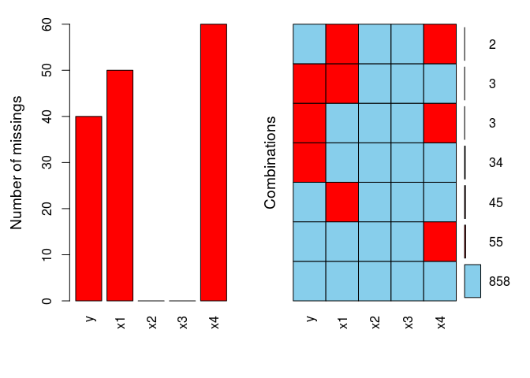

利用R语言处理缺失值的方法
================

**概述：**很多统计模型都是基于没有缺失值的数据集，然而在实际应用中，总会出现某些原因导致数据的缺失，本文将从三个角度来解决缺失值的问题。

**首先了解一下处理缺失值的一般步骤：**

1.  识别缺失值；
2.  检测导致缺失数据的原因；
3.  删除包含缺失值的观测或用合理的值代替缺失值。

**第一步**对缺失值的识别是非常简单的，可以使用is.na()、is.nan()、和is.infinite()函数来鉴别数据集中是否存在缺失；

**第二步**需要根据实际的场景业务去理解缺失的原因，如敏感数据导致用户不填或网络、机器故障导致数据断层等；

**第三步**是处理缺失的重要步骤，一般可以通过推理法、行删除法和多重插补法进行处理。

**一、识别缺失值**
------------------

上面提到可以使用is.na()、is.nan()、和is.infinite()来鉴别数据集中是否存在缺失，**但该方法返回的是所有向量或数据框中每一个元素是否为缺失值**，显然数据量非常大的话该方法返回的结果就不太容易接受。个人觉得可以使用**mice包中的md.pattern()函数**来发现数据集中缺失值的模式。**但该方法只能识别R中的NA和NaN为缺失值**，而不能将Inf和Inf视为缺失值，处理的办法可以用NA替代这些值。

**例子**

``` r
#创建数据集
set.seed(1234)
x1 <- runif(n = 1000, min = 1, max = 15)
x2 <- 100*rnorm(n = 1000) + 10
x3 <- rt(n = 1000, df = 3)
x4 <- rf(n = 1000, df1 = 2, df2 = 3)
y <- 2*x1 - 0.3*x2 + 0.6*x3 - 1.2*x4 + rnorm(1000)
nonemiss.df <- data.frame(y = y, x1 = x1, x2 = x2, x3 = x3, x4 = x4)

#随机将y，x3和x4列的某些观测设为缺失值
set.seed(1234)
miss.df <- data.frame(y = y, x1 = x1, x2 = x2, x3 = x3, x4 = x4)
miss.df[sample(1:nrow(miss.df), 40),1] <- NA
miss.df[sample(1:nrow(miss.df), 50),2] <- NA
miss.df[sample(1:nrow(miss.df), 60),5] <- NA

#用mice包中的md.pattern()函数探索缺失值的模式
library(mice)
md.pattern(miss.df)
```

    ##     x2 x3  y x1 x4    
    ## 858  1  1  1  1  1   0
    ##  34  1  1  0  1  1   1
    ##  45  1  1  1  0  1   1
    ##  55  1  1  1  1  0   1
    ##   3  1  1  0  0  1   2
    ##   3  1  1  0  1  0   2
    ##   2  1  1  1  0  0   2
    ##      0  0 40 50 60 150

结果返回了数据集中缺失值的情况，0表示列中存在缺失值，1表示列中不存在缺失值。 **第一行**描述数据集中没有缺失值的模式； **第二行至倒数第二行**反映了某些列中会存在缺失值； **第一列**表示缺失值的观测数量（排除第一个值，即858）； **最后一列**表示缺失值的变量个数； **最后一行**给出每个变量缺失值的个数。 通过这张缺失值模式表能够清楚的发现哪些变量存在缺失值，而这些变量又包含了多少数量的缺失。 还可以通过**可视化的方法**来探索数据集中存在缺失值的情况，比如使用**VIM包中的aggr()函数**。

**例子**

``` r
library(VIM)
```

    ## Loading required package: colorspace

    ## Loading required package: grid

    ## Loading required package: data.table

    ## VIM is ready to use. 
    ##  Since version 4.0.0 the GUI is in its own package VIMGUI.
    ## 
    ##           Please use the package to use the new (and old) GUI.

    ## Suggestions and bug-reports can be submitted at: https://github.com/alexkowa/VIM/issues

    ## 
    ## Attaching package: 'VIM'

    ## The following object is masked from 'package:datasets':
    ## 
    ##     sleep

``` r
aggr(miss.df, prop = FALSE, numbers = TRUE)
```



图中能非常直观的反映哪些变量存在缺失值及缺失情况如何。

**二、缺失数据处理方法**
------------------------

**推理法**

**该方法根据变量间的数学或逻辑关系进行填补或恢复缺失值**，如根据某几个变量间的关系来推断缺失值可能的值；根据姓名来推断缺失的性别或根据购买的产品特征推断用户可能所属的年龄段等。

**行删除法** 数据集中含有一个或多个缺失值的任意一行都会被删除，**一般假定缺失数据是完全随机产生的，且缺失的量仅仅是数据集中的一小部分**，可以考虑使用该方法进行缺失值的处理。

**多重插补法** 该方法是一种**基于重复模拟的处理缺失值的方法**，它将从一个含缺失值的数据集中生成一组完整的数据集，这些**缺失值都是通过蒙特卡洛方法进行替补**。替补方法有很多，如**贝叶斯线性回归法、自助线性回归法、Logist回归法和线性判别分析法等**。

关于多重插补法可以使用**mice包中的mice()函数**（有关该函数的详细说明可以查看R的帮助文档），该包实现多重插补法并将完整数据集应用到统计模型中的**思路**如下： 1. mice()函数从一个含缺失值的数据框开始，返回一个包含多个完整数据集对象（默认可以模拟参数5个完整的数据集）； 2. with()函数可依次对每个完整数据集应用统计建模； 3. pool()函数将with()生成的单独结果整合到一起。

**例子**

``` r
library(mice)
im <- mice(data = miss.df, m = 10, method = 'pmm')
```

    ## 
    ##  iter imp variable
    ##   1   1  y  x1  x4
    ##   1   2  y  x1  x4
    ##   1   3  y  x1  x4
    ##   1   4  y  x1  x4
    ##   1   5  y  x1  x4
    ##   1   6  y  x1  x4
    ##   1   7  y  x1  x4
    ##   1   8  y  x1  x4
    ##   1   9  y  x1  x4
    ##   1   10  y  x1  x4
    ##   2   1  y  x1  x4
    ##   2   2  y  x1  x4
    ##   2   3  y  x1  x4
    ##   2   4  y  x1  x4
    ##   2   5  y  x1  x4
    ##   2   6  y  x1  x4
    ##   2   7  y  x1  x4
    ##   2   8  y  x1  x4
    ##   2   9  y  x1  x4
    ##   2   10  y  x1  x4
    ##   3   1  y  x1  x4
    ##   3   2  y  x1  x4
    ##   3   3  y  x1  x4
    ##   3   4  y  x1  x4
    ##   3   5  y  x1  x4
    ##   3   6  y  x1  x4
    ##   3   7  y  x1  x4
    ##   3   8  y  x1  x4
    ##   3   9  y  x1  x4
    ##   3   10  y  x1  x4
    ##   4   1  y  x1  x4
    ##   4   2  y  x1  x4
    ##   4   3  y  x1  x4
    ##   4   4  y  x1  x4
    ##   4   5  y  x1  x4
    ##   4   6  y  x1  x4
    ##   4   7  y  x1  x4
    ##   4   8  y  x1  x4
    ##   4   9  y  x1  x4
    ##   4   10  y  x1  x4
    ##   5   1  y  x1  x4
    ##   5   2  y  x1  x4
    ##   5   3  y  x1  x4
    ##   5   4  y  x1  x4
    ##   5   5  y  x1  x4
    ##   5   6  y  x1  x4
    ##   5   7  y  x1  x4
    ##   5   8  y  x1  x4
    ##   5   9  y  x1  x4
    ##   5   10  y  x1  x4

``` r
fit <- with(data = im, expr = lm(y ~ x1 + x2 + x3 + x4))
pooled <- pool(object = fit)
summary(pooled)
```

    ##                      est           se             t       df  Pr(>|t|)
    ## (Intercept)  0.003220547 0.0743161391    0.04333577 630.5617 0.9654476
    ## x1           2.005733784 0.0080214686  250.04570778 755.1554 0.0000000
    ## x2          -0.299941889 0.0003801447 -789.02034772 148.0581 0.0000000
    ## x3           0.614954378 0.0197767380   31.09483365 517.8230 0.0000000
    ## x4          -1.206056536 0.0048810641 -247.08885425 702.5819 0.0000000
    ##                  lo 95      hi 95 nmis        fmi     lambda
    ## (Intercept) -0.1427165  0.1491576   NA 0.07042508 0.06748135
    ## x1           1.9899868  2.0214808   50 0.05138576 0.04887672
    ## x2          -0.3006931 -0.2991907    0 0.23198514 0.22168024
    ## x3           0.5761019  0.6538069    0 0.08988103 0.08637263
    ## x4          -1.2156398 -1.1964733   60 0.05926748 0.05659336

结果给出了线性模型在填补缺失值后的数据集的返回结果。

``` r
#为了比较，同样将缺失数据集应用到线性模型中：
lm.fit <- lm(y ~ x1 + x2 + x3 + x4, data = miss.df)
summary(lm.fit)
```

    ## 
    ## Call:
    ## lm(formula = y ~ x1 + x2 + x3 + x4, data = miss.df)
    ## 
    ## Residuals:
    ##     Min      1Q  Median      3Q     Max 
    ## -3.2114 -0.6782  0.0237  0.6604  3.5705 
    ## 
    ## Coefficients:
    ##               Estimate Std. Error  t value Pr(>|t|)    
    ## (Intercept)  0.0141706  0.0758362    0.187    0.852    
    ## x1           2.0028833  0.0083552  239.718   <2e-16 ***
    ## x2          -0.2999110  0.0003584 -836.905   <2e-16 ***
    ## x3           0.6179078  0.0200083   30.883   <2e-16 ***
    ## x4          -1.2042557  0.0051187 -235.265   <2e-16 ***
    ## ---
    ## Signif. codes:  0 '***' 0.001 '**' 0.01 '*' 0.05 '.' 0.1 ' ' 1
    ## 
    ## Residual standard error: 0.9951 on 853 degrees of freedom
    ##   (142 observations deleted due to missingness)
    ## Multiple R-squared:  0.999,  Adjusted R-squared:  0.999 
    ## F-statistic: 2.111e+05 on 4 and 853 DF,  p-value: < 2.2e-16

发现缺失数据集和多重插补数据集应用到线性回归后的**参数估计基本一致**，这**主要是因为缺失值是完全随机产生的**。如果缺失值不是随机产生的，且缺失比重比较大的话，就不适合使用行删除法，而强烈建议使用多重插补法。

还有一种比较**传统的方**法是**用均值或中位数来替换缺失值**，如果缺失数据量比较大的话，该方法可能会低估标准差和曲解变量间的相关性，导致错误的统计检验和P值。

这里再介绍一个可以处理缺失值的R包，**Hmisc包可以支持简单插补、多重插补和典型变量插补的方法**，读者可以自行了解该包中的相关知识。
