probability demo with r
================

一、随机事件与概率
------------------

``` r
# install.packages("prob") 
library(prob)  #load the package
```

### 样本空间

考虑投掷硬币的随机实验，结果是H和T.我们可以使用**tosscoin函数**快速设置样本空间：

``` r
tosscoin(1) # 抛一次硬币
```

    ##   toss1
    ## 1     H
    ## 2     T

``` r
tosscoin(3) # 抛三次硬币
```

    ##   toss1 toss2 toss3
    ## 1     H     H     H
    ## 2     T     H     H
    ## 3     H     T     H
    ## 4     T     T     H
    ## 5     H     H     T
    ## 6     T     H     T
    ## 7     H     T     T
    ## 8     T     T     T

``` r
rolldie(1) # 抛一次多面体（默认为六面体）
```

    ##   X1
    ## 1  1
    ## 2  2
    ## 3  3
    ## 4  4
    ## 5  5
    ## 6  6

``` r
cards() # 抽一张扑克牌
```

    ##    rank    suit
    ## 1     2    Club
    ## 2     3    Club
    ## 3     4    Club
    ## 4     5    Club
    ## 5     6    Club
    ## 6     7    Club
    ## 7     8    Club
    ## 8     9    Club
    ## 9    10    Club
    ## 10    J    Club
    ## 11    Q    Club
    ## 12    K    Club
    ## 13    A    Club
    ## 14    2 Diamond
    ## 15    3 Diamond
    ## 16    4 Diamond
    ## 17    5 Diamond
    ## 18    6 Diamond
    ## 19    7 Diamond
    ## 20    8 Diamond
    ## 21    9 Diamond
    ## 22   10 Diamond
    ## 23    J Diamond
    ## 24    Q Diamond
    ## 25    K Diamond
    ## 26    A Diamond
    ## 27    2   Heart
    ## 28    3   Heart
    ## 29    4   Heart
    ## 30    5   Heart
    ## 31    6   Heart
    ## 32    7   Heart
    ## 33    8   Heart
    ## 34    9   Heart
    ## 35   10   Heart
    ## 36    J   Heart
    ## 37    Q   Heart
    ## 38    K   Heart
    ## 39    A   Heart
    ## 40    2   Spade
    ## 41    3   Spade
    ## 42    4   Spade
    ## 43    5   Spade
    ## 44    6   Spade
    ## 45    7   Spade
    ## 46    8   Spade
    ## 47    9   Spade
    ## 48   10   Spade
    ## 49    J   Spade
    ## 50    Q   Spade
    ## 51    K   Spade
    ## 52    A   Spade

让我们的抽样框中简单地包含三个球，分别标记为1，2和3。我们将从中**有放回**的抽取两次样品：

``` r
urnsamples(1:3, size = 2, replace = TRUE, ordered = TRUE)
```

    ##   X1 X2
    ## 1  1  1
    ## 2  2  1
    ## 3  3  1
    ## 4  1  2
    ## 5  2  2
    ## 6  3  2
    ## 7  1  3
    ## 8  2  3
    ## 9  3  3

这个实验相当于抛一个三边模具两次，我们可以用**rolldie函数**完成：

``` r
rolldie(2, nsides = 3)
```

    ##   X1 X2
    ## 1  1  1
    ## 2  2  1
    ## 3  3  1
    ## 4  1  2
    ## 5  2  2
    ## 6  3  2
    ## 7  1  3
    ## 8  2  3
    ## 9  3  3

### 随机事件

``` r
S1 <- tosscoin(2, makespace = TRUE) # 抛两次硬币的情况
S1[1:3, ] # 前三种情况
```

    ##   toss1 toss2 probs
    ## 1     H     H  0.25
    ## 2     T     H  0.25
    ## 3     H     T  0.25

``` r
S1[c(2,4),] # 第二和第四种情况
```

    ##   toss1 toss2 probs
    ## 2     T     H  0.25
    ## 4     T     T  0.25

``` r
S2 <- cards() # # 抽一张扑克牌的情况
subset(S2,suit=="Heart") # 抽取S2中的所有红心牌
```

    ##    rank  suit
    ## 27    2 Heart
    ## 28    3 Heart
    ## 29    4 Heart
    ## 30    5 Heart
    ## 31    6 Heart
    ## 32    7 Heart
    ## 33    8 Heart
    ## 34    9 Heart
    ## 35   10 Heart
    ## 36    J Heart
    ## 37    Q Heart
    ## 38    K Heart
    ## 39    A Heart

``` r
subset(S2, rank %in% 7:9) # 抽取S2中的所有7、8、9号牌
```

    ##    rank    suit
    ## 6     7    Club
    ## 7     8    Club
    ## 8     9    Club
    ## 19    7 Diamond
    ## 20    8 Diamond
    ## 21    9 Diamond
    ## 32    7   Heart
    ## 33    8   Heart
    ## 34    9   Heart
    ## 45    7   Spade
    ## 46    8   Spade
    ## 47    9   Spade

``` r
subset(rolldie(3), 
       X1 + X2 + X3 > 16) # 抛三次六面体数值之和大于16的情况
```

    ##     X1 X2 X3
    ## 180  6  6  5
    ## 210  6  5  6
    ## 215  5  6  6
    ## 216  6  6  6

``` r
A = subset(S2, suit == "Heart") # 抽取S2中的所有红心牌
B = subset(S2, rank %in% 7:9) # 抽取S2中的所有7、8、9号牌

union(A,B) # A和B的并集
```

    ##    rank    suit
    ## 6     7    Club
    ## 7     8    Club
    ## 8     9    Club
    ## 19    7 Diamond
    ## 20    8 Diamond
    ## 21    9 Diamond
    ## 27    2   Heart
    ## 28    3   Heart
    ## 29    4   Heart
    ## 30    5   Heart
    ## 31    6   Heart
    ## 32    7   Heart
    ## 33    8   Heart
    ## 34    9   Heart
    ## 35   10   Heart
    ## 36    J   Heart
    ## 37    Q   Heart
    ## 38    K   Heart
    ## 39    A   Heart
    ## 45    7   Spade
    ## 46    8   Spade
    ## 47    9   Spade

``` r
intersect(A,B) # A和B的交集
```

    ##    rank  suit
    ## 32    7 Heart
    ## 33    8 Heart
    ## 34    9 Heart

``` r
setdiff(B,A) # B中排除A
```

    ##    rank    suit
    ## 6     7    Club
    ## 7     8    Club
    ## 8     9    Club
    ## 19    7 Diamond
    ## 20    8 Diamond
    ## 21    9 Diamond
    ## 45    7   Spade
    ## 46    8   Spade
    ## 47    9   Spade

``` r
setdiff(S2,A) # S2中排除A
```

    ##    rank    suit
    ## 1     2    Club
    ## 2     3    Club
    ## 3     4    Club
    ## 4     5    Club
    ## 5     6    Club
    ## 6     7    Club
    ## 7     8    Club
    ## 8     9    Club
    ## 9    10    Club
    ## 10    J    Club
    ## 11    Q    Club
    ## 12    K    Club
    ## 13    A    Club
    ## 14    2 Diamond
    ## 15    3 Diamond
    ## 16    4 Diamond
    ## 17    5 Diamond
    ## 18    6 Diamond
    ## 19    7 Diamond
    ## 20    8 Diamond
    ## 21    9 Diamond
    ## 22   10 Diamond
    ## 23    J Diamond
    ## 24    Q Diamond
    ## 25    K Diamond
    ## 26    A Diamond
    ## 40    2   Spade
    ## 41    3   Spade
    ## 42    4   Spade
    ## 43    5   Spade
    ## 44    6   Spade
    ## 45    7   Spade
    ## 46    8   Spade
    ## 47    9   Spade
    ## 48   10   Spade
    ## 49    J   Spade
    ## 50    Q   Spade
    ## 51    K   Spade
    ## 52    A   Spade

### 计算概率

**生日问题**

假设在一个房间里有n个人在一起。每个人轮流公布他/她的生日的日期，求至少有两个人生日相同的概率是多少？

**pbirthday**计算广义生日悖论问题中生日重合的概率，这里用**sapply函数**将pbirthday应用到人数向量中。

``` r
g <- sapply(1:50, pbirthday)
plot (1:50 , g,
      xlab = "Number of people in room ",
      ylab = "Prob (at least one match )",
      main = "The Birthday Problem")
abline (h = 0.5)
abline (v = 23, lty = 2) # 虚线
```

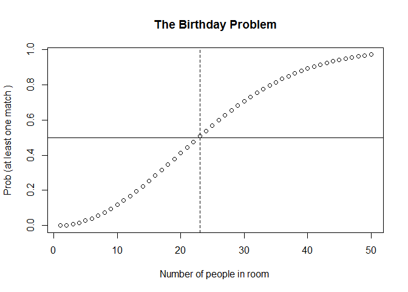

或者可以自己写计算概率的函数：

``` r
prob.birth<-function(n)
  {if( n< 365) 
    return(1-choose(365,n)*factorial(n)/365^n)
  else
    return(1)
  }

g2 <- sapply(1:50, prob.birth)
plot (1:50 , g2,
      xlab = "Number of people in room ",
      ylab = "Prob (at least one match )",
      main = "The Birthday Problem")
abline (h = 0.5)
abline (v = 23, lty = 2) # 虚线
```


如果你要计算至少有一个人和你生日相同的概率：

``` r
q.birth<-function(n){return(1-(364/365)^n)}
x <- 0:50
z <- NULL
for(i in 1:length(x))z[i]<-q.birth(x[i])
plot(x,z,
     xlab = "Number of people in room ",
     ylab = "Prob (at least one match with you)",
     main = "The Birthday Problem")
points(x,z)
```

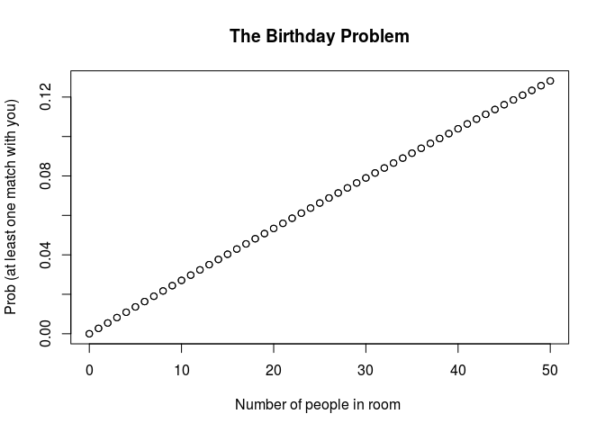

**Buffon投针试验**

``` r
# 绘制空白图形
plot(c(0,2),c(0,2),type='n',main='布丰投针实验',xlab='X',ylab='Y')
# 增加平行线
abline(h=0.5)
abline(h=1.5,col='red')
finished <- FALSE
# trial为实验次数，cross为交叉次数
trial <- 0
cross <- 0
for(i in 1:50){
    # Dist为针的中心距离红线的垂直距离
    # Theta为针的角度
    Dist <- runif(1,min=0,max=1/2)
    Theta <- runif(1,0,pi)
    # central.x为针中心点的横坐标
    # central.y为针中心点的纵坐标
    central.x <- runif(1,0.5,1.5)
    central.y <- Dist +1
    # 计算针两端的坐标
    y1 <- sin(Theta)/4 + central.y
    x1 <- cos(Theta)/4 + central.x
    y2 <- sin(Theta+pi)/4 + central.y
    x2 <- cos(Theta+pi)/4 + central.x
    trial <- trial +1
    # 计数交叉次数
    cross <- cross + ifelse(0.25*sin(Theta)>=Dist,1,0)
    # 绘制针的线型和中心点
    lines(c(x1,x2),c(y1,y2),lty=2)
    points(central.x,central.y,pch=16,col='grey')
    cat('trial=',trial,'cross=',cross,'PI=',trial/cross,'\n')
}
```

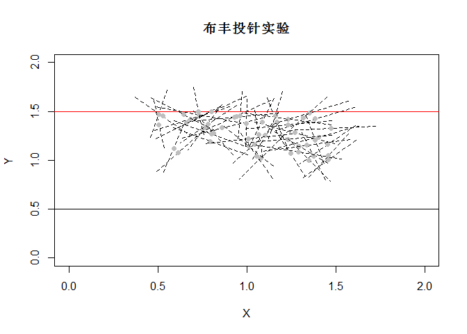

    ## trial= 1 cross= 1 PI= 1 
    ## trial= 2 cross= 1 PI= 2 
    ## trial= 3 cross= 1 PI= 3 
    ## trial= 4 cross= 2 PI= 2 
    ## trial= 5 cross= 2 PI= 2.5 
    ## trial= 6 cross= 2 PI= 3 
    ## trial= 7 cross= 2 PI= 3.5 
    ## trial= 8 cross= 2 PI= 4 
    ## trial= 9 cross= 2 PI= 4.5 
    ## trial= 10 cross= 2 PI= 5 
    ## trial= 11 cross= 2 PI= 5.5 
    ## trial= 12 cross= 2 PI= 6 
    ## trial= 13 cross= 2 PI= 6.5 
    ## trial= 14 cross= 3 PI= 4.666667 
    ## trial= 15 cross= 3 PI= 5 
    ## trial= 16 cross= 3 PI= 5.333333 
    ## trial= 17 cross= 3 PI= 5.666667 
    ## trial= 18 cross= 4 PI= 4.5 
    ## trial= 19 cross= 4 PI= 4.75 
    ## trial= 20 cross= 5 PI= 4 
    ## trial= 21 cross= 5 PI= 4.2 
    ## trial= 22 cross= 6 PI= 3.666667 
    ## trial= 23 cross= 6 PI= 3.833333 
    ## trial= 24 cross= 6 PI= 4 
    ## trial= 25 cross= 6 PI= 4.166667 
    ## trial= 26 cross= 7 PI= 3.714286 
    ## trial= 27 cross= 8 PI= 3.375 
    ## trial= 28 cross= 8 PI= 3.5 
    ## trial= 29 cross= 8 PI= 3.625 
    ## trial= 30 cross= 9 PI= 3.333333 
    ## trial= 31 cross= 10 PI= 3.1 
    ## trial= 32 cross= 10 PI= 3.2 
    ## trial= 33 cross= 10 PI= 3.3 
    ## trial= 34 cross= 10 PI= 3.4 
    ## trial= 35 cross= 10 PI= 3.5 
    ## trial= 36 cross= 10 PI= 3.6 
    ## trial= 37 cross= 10 PI= 3.7 
    ## trial= 38 cross= 10 PI= 3.8 
    ## trial= 39 cross= 11 PI= 3.545455 
    ## trial= 40 cross= 11 PI= 3.636364 
    ## trial= 41 cross= 11 PI= 3.727273 
    ## trial= 42 cross= 11 PI= 3.818182 
    ## trial= 43 cross= 11 PI= 3.909091 
    ## trial= 44 cross= 11 PI= 4 
    ## trial= 45 cross= 12 PI= 3.75 
    ## trial= 46 cross= 12 PI= 3.833333 
    ## trial= 47 cross= 13 PI= 3.615385 
    ## trial= 48 cross= 13 PI= 3.692308 
    ## trial= 49 cross= 14 PI= 3.5 
    ## trial= 50 cross= 14 PI= 3.571429

### 条件概率

``` r
S3 <- rolldie(2, makespace = TRUE) # assumes ELM
head(S3)
```

    ##   X1 X2      probs
    ## 1  1  1 0.02777778
    ## 2  2  1 0.02777778
    ## 3  3  1 0.02777778
    ## 4  4  1 0.02777778
    ## 5  5  1 0.02777778
    ## 6  6  1 0.02777778

``` r
A <- subset(S3, X1 == X2)
B <- subset(S3, X1 + X2 >= 8)
Prob(A,given=B) # B的条件下求A的概率
```

    ## [1] 0.2

``` r
Prob(S3,X1==X2, given=(X1+X2>=8)) # X1+X2>=8的条件下求A的概率
```

    ## [1] 0.2

二、随机变量及其分布
--------------------

### 离散型随机变量

**二项分布**

``` r
dbinom(x=2,size=20,prob=0.5)
```

    ## [1] 0.0001811981

``` r
pbinom(q=2,size=20,prob=0.5)
```

    ## [1] 0.0002012253

``` r
qbinom(p=0.4,size=20,prob=0.5)
```

    ## [1] 9

``` r
rbinom(n=5,size=20,prob=0.5)
```

    ## [1]  9 15  8  8 13

``` r
plot(dbinom(0:20,size=20,prob=0.5),type="h")
```

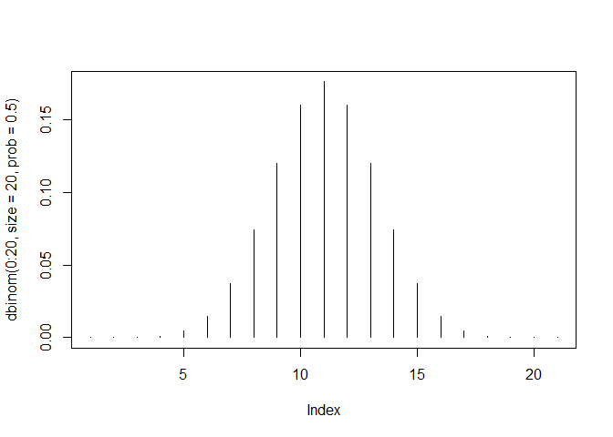

``` r
plot(dbinom(0:20,size=20,prob=0.8),type="h")
```

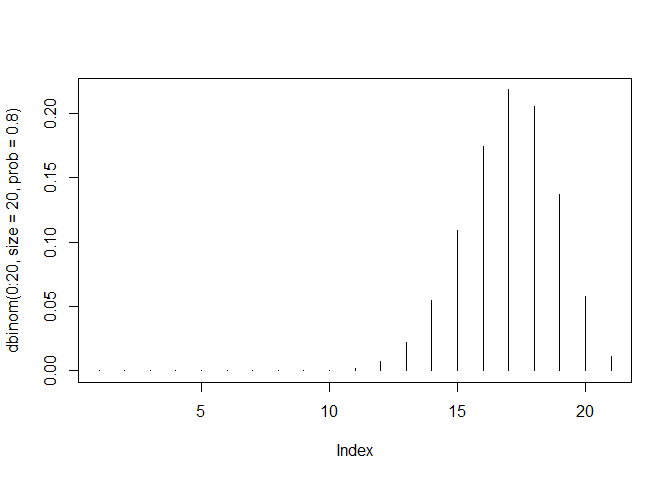

**超几何分布**

``` r
dhyper(x=2, m=10, n=30, k=6)
```

    ## [1] 0.3212879

``` r
phyper(q=2, m=10, n=30, k=6)
```

    ## [1] 0.8472481

``` r
qhyper(0.3, m=10, n=30, k=6)
```

    ## [1] 1

``` r
rhyper(nn=10, m=10, n=30, k=6)
```

    ##  [1] 3 2 2 0 2 1 2 0 1 2

**几何分布**

``` r
dgeom(4,prob=0.8)
```

    ## [1] 0.00128

``` r
pgeom(4, prob = 0.8)
```

    ## [1] 0.99968

``` r
qgeom(0.4,prob=0.8)
```

    ## [1] 0

``` r
rgeom(10,prob=0.8)
```

    ##  [1] 0 2 1 0 0 0 0 1 0 0

``` r
plot(dgeom(0:20,prob=0.5),type="h")
```

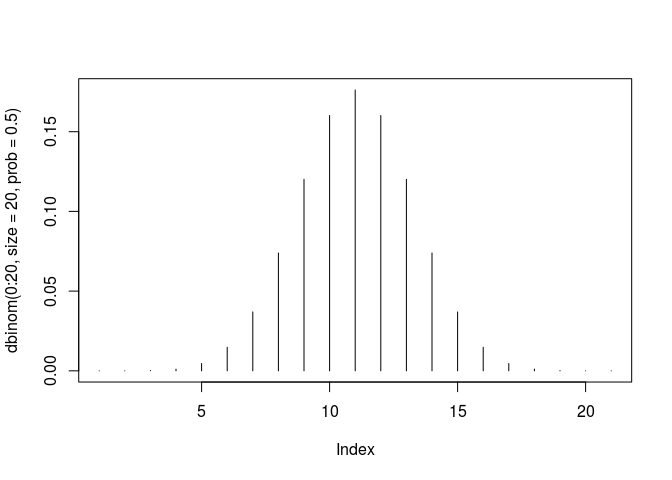

``` r
plot(dgeom(0:20,prob=0.8),type="h")
```

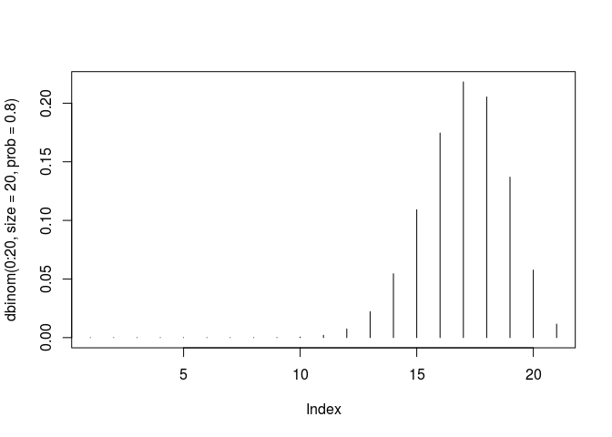

**负二项分布**

``` r
dnbinom(x=5,size=3,prob=0.4)   
```

    ## [1] 0.1045094

``` r
pnbinom(5,size=3,prob=0.4)
```

    ## [1] 0.6846054

``` r
qnbinom(0.5,size=3,prob=0.4)
```

    ## [1] 4

``` r
rnbinom(n=10,size=3,prob=0.4)
```

    ##  [1] 2 2 7 4 8 7 3 1 0 2

``` r
plot(dnbinom(0:20,size=5,p=0.5),type="h")
```


**泊松分布**

``` r
dpois(x=0,lambda=2.4)
```

    ## [1] 0.09071795

``` r
ppois(q=10,lambda=2.4)
```

    ## [1] 0.999957

``` r
qpois(p=0.9,lambda=2.4)
```

    ## [1] 4

``` r
rpois(n=10,lambda=2.4)
```

    ##  [1] 8 3 7 2 0 1 1 2 1 2

``` r
plot(dpois(0:20,lambda=1),type="h")
```

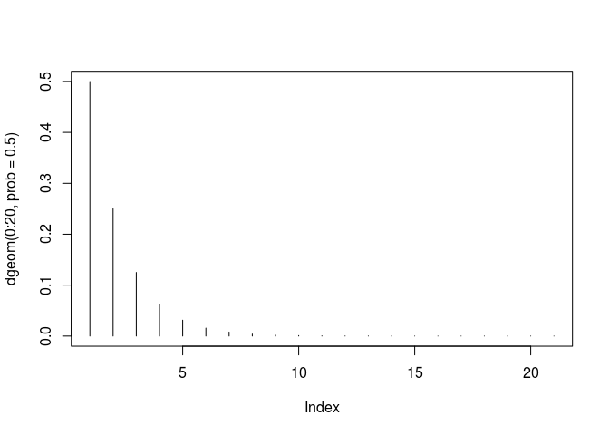

``` r
x <- 0:20
plot(x, ppois(x, 1), type="s", lty=1,ylab="F(x)", main="Poisson approx of binomial")
lines(x, pbinom(x, 100, 0.01),type="s",col=2,lty=2)
legend("bottomright",legend=c("Poisson","Binomial"),lty=1:2,col=1:2)
```

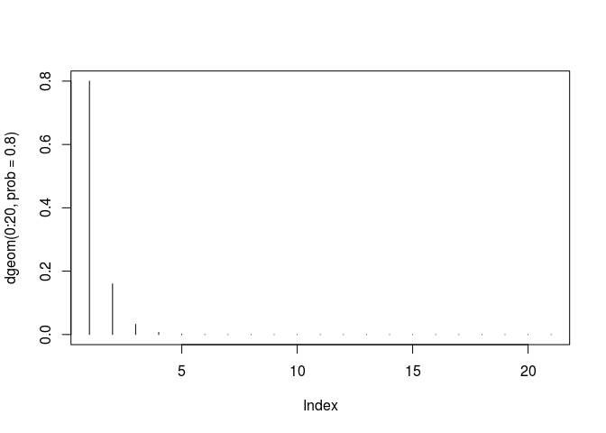

**二项分布的泊松近似和正态近似**

``` r
#P(X<=k)=pbinom(k,n,p)
#Poisson approximation: P(X<=k) app ppois(k,np)
#Normal approximation: P(X<=k) app pnorm(k,np,npq)

apprx <- function(n, p, R = 1000, k = 6) {
  trueval <- pbinom(k, n, p) # true binomial probability
  prob.zcc <- prob.zncc <- prob.pois <- NULL  
  q <- 1-p
  for (i in 1:R) {
    x <- rnorm(n, n * p, sqrt(n * p * q))
    z.cc <- ((k + .5) - mean(x))/sd(x) # with cont. correction
    prob.zcc[i] <- pnorm(z.cc)
    z.ncc <- (k - mean(x))/sd(x) # no cont. correction
    prob.zncc[i] <- pnorm(z.ncc)    
    y <- rpois(n, n * p)
    prob.pois[i] <- length(y[y <= k])/n
  }
  list(prob.zcc = prob.zcc, prob.zncc = prob.zncc, 
       prob.pois = prob.pois, trueval = trueval)
}

R <- 1000
set.seed(10)
out <- apprx(n = 200, p = .03, k = 6, R = 1000)
# windows(6,5)
plot(1:R, out$prob.pois, type = "l", 
     col = "green", xlab = "Runs", 
     main = expression(paste("Simulated Probabilities: ", 
                             n==200, ", ", p==0.03, sep="")),
     ylab = "Probability", ylim = c(.3, .7))
abline(h = out$trueval, col="red", lty=2)
lines(1:R, out$prob.zcc, lty = 1, col = "purple")
lines(1:R, out$prob.zncc, lty = 1, col = "orange")
legend("bottomleft", 
       c("Poisson", "Normal (with cc)", "Normal (w/o cc)"),
       lty = c(1), col = c("green", "purple", "orange"))
```

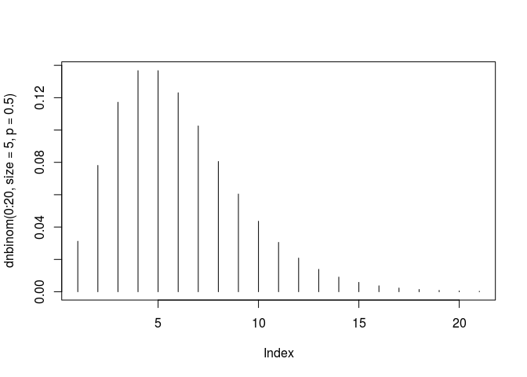

``` r
set.seed(10)
out <- apprx(n = 200, p = .03, k = 6, R = 1000)
# windows(6,5)
boxplot(out$prob.pois, boxwex = 0.25, at = 1:1 - .25,
        col = "green",
        main = expression(paste("Approximating Binomial Probability: ", 
                                n==200, ", ", p==0.03, sep="")),
        ylab = "Probablity", 
        ylim = c(out$trueval - 0.2, out$trueval + 0.25))
boxplot(out$prob.zcc, boxwex = 0.25, at = 1:1 + 0, add = T,
         col = "purple")
boxplot(out$prob.zncc, boxwex = 0.25, at = 1:1 + 0.25, add = T,
         col = "orange" )
abline(h = out$trueval, col = "red", lty=2)
legend("topleft", c("Poisson", "Normal (with cc)", "Normal (w/o cc)"), 
           fill = c("green", "purple", "orange"))
```


### 连续型随机变量

**正态分布**

``` r
dnorm(0,mean=0,sd=1)
```

    ## [1] 0.3989423

``` r
pnorm(0)
```

    ## [1] 0.5

``` r
qnorm(2.5/100,lower.tail=F)
```

    ## [1] 1.959964

``` r
rnorm(10,mean=1,sd=1.5)
```

    ##  [1]  0.1963887 -0.4863110  1.4597941  0.9939968  0.6741421  1.5888671
    ##  [7]  0.6617092  2.2173455  1.1084923 -0.3535931

``` r
# some plots

x <- seq(-4, 4, length = 401)
plot(x, dnorm(x), type = 'l') # N(0, 1)
# N(1, 1.5^2):
lines(x, dnorm(x, mean = 1, sd = 1.5), lty = 'dashed')
```

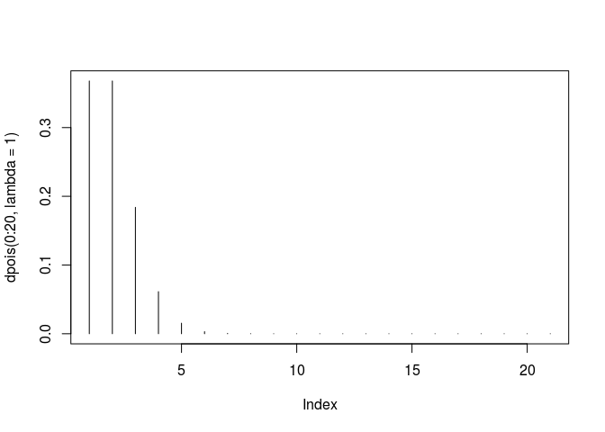

``` r
u <- seq(0, 1, length=401)
plot(u, qnorm(u), 'l')
# lower.tail = FALSE gives q(1-u)
lines(u, qnorm(u, lower.tail = FALSE), lty = 'dashed')
```

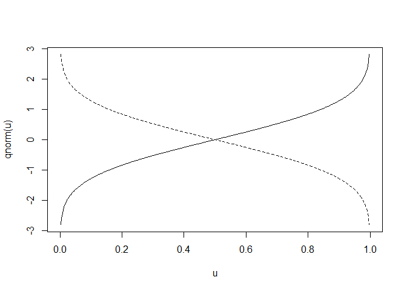

``` r
#cumulative distribution function
curve(pnorm(x), xlim=c(-5,5), col='red', lwd=3)
title(main='Cumulative gaussian distribution function')
curve(pnorm(x,1,1), xlim=c(-5,5), col='green', lwd=3,add=T)
curve(pnorm(x,1,2),  xlim=c(-5,5), col='black', lwd=3,add=T)
legend(-par('usr')[2], par('usr')[4], xjust=-0.5,
       c('standard norm', 'normal(1,1)','normal(1,2)'),
       lwd=2, col=c('red','green','black'))
```

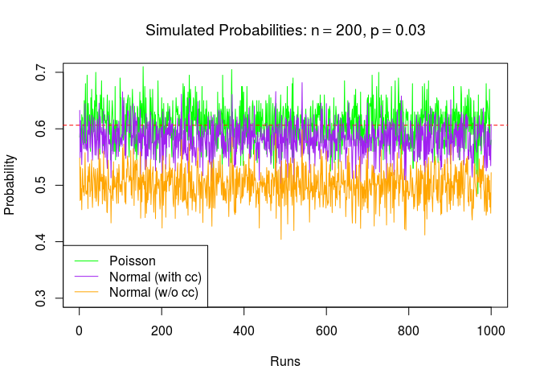

``` r
#density
curve(dnorm(x), xlim=c(-5,5), col='red', lwd=3)
curve(dnorm(x,1,1), add=T, col='green', lty=2, lwd=3)
curve(dnorm(x,1,2), add=T, col='black', lty=3, lwd=3)

legend(par('usr')[2], par('usr')[4], xjust=1,
       c('standard normal', 'normal(1,1)','normal(1,2)'),
       lwd=2, lty=c(1,2,3),
       col=c('red','green','black'))
```

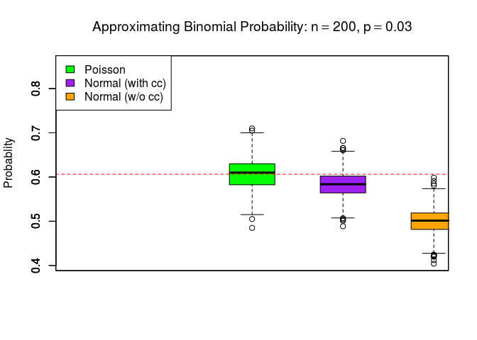

``` r
m <- c(-2,0,2)    # Means
p <- c(.3,.4,.3)  # Probabilities
s <- c(1, 1, 1)   # Standard deviations
 
curve(p[2]*dnorm(x, mean=m[2], sd=s[2]),
      col = "green", lwd = 3, 
      xlim = c(-5,5),ylim=c(0,0.23),
      main = "The three gaussian distributions in our mixture",
      xlab = "", ylab = "")
curve(p[1]*dnorm(x, mean=m[1], sd=s[1]),
      col="red", lwd=3, add=TRUE)
curve(p[3]*dnorm(x, mean=m[3], sd=s[3]),
      col="blue", lwd=3, add=TRUE)
curve(p[1]*dnorm(x, mean=m[1], sd=s[1])+
      p[2]*dnorm(x, mean=m[2], sd=s[2])+
      p[3]*dnorm(x, mean=m[3], sd=s[3]),
      col="black", lwd=3, add=TRUE)
```

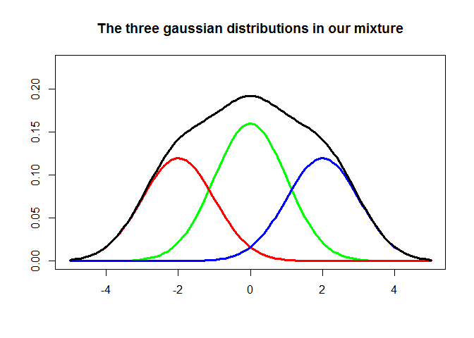

**指数分布**

``` r
dexp(5, rate = 1, log = FALSE)
```

    ## [1] 0.006737947

``` r
pexp(5, rate = 1, lower.tail = TRUE, log.p = FALSE)
```

    ## [1] 0.9932621

``` r
qexp(5, rate = 1, lower.tail = TRUE, log.p = FALSE)
```

    ## Warning in qexp(5, rate = 1, lower.tail = TRUE, log.p = FALSE): NaNs
    ## produced

    ## [1] NaN

``` r
rexp(5, rate = 1)
```

    ## [1] 0.2474990 0.4708818 0.2867484 0.2462769 1.2192623

``` r
#cumulative distribution function
curve(pexp(x,rate=0.5), xlim=c(0,10), col=1, lwd=3,
      main='Exponential Probability Distribution Function')
curve(pexp(x,rate=1), xlim=c(0,10), col=2, lwd=2, lty=2,
      add=T)
curve(pexp(x,rate=5), xlim=c(0,10), col=3, lwd=2, lty=3,
      add=T)
curve(pexp(x,rate=10), xlim=c(0,10), col=4, lwd=2, lty=4,
      add=T)
legend(par('usr')[2], par('usr')[4], xjust=1,
       c('rate=0.5','rate=1', 'rate=2','rate=10'),
       lwd=2, lty=c(1,2,3,4),
       col=1:4)
```

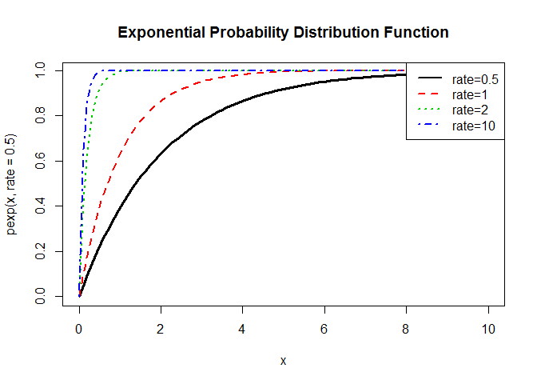

``` r
#density
curve(dexp(x,rate=0.5), xlim=c(0,10), col=1, lwd=3,
      main='Exponential Probability Distribution Function')
curve(dexp(x,rate=1), xlim=c(0,10), col=2, lwd=2, lty=2,
      add=T)
curve(dexp(x,rate=5), xlim=c(0,10), col=3, lwd=2, lty=3,
      add=T)
curve(dexp(x,rate=10), xlim=c(0,10), col=4, lwd=2, lty=4,
      add=T)
legend(par('usr')[2], par('usr')[4], xjust=1,
       c('rate=0.5','rate=1', 'rate=2','rate=10'),
       lwd=2, lty=1:4,
       col=1:4)
```

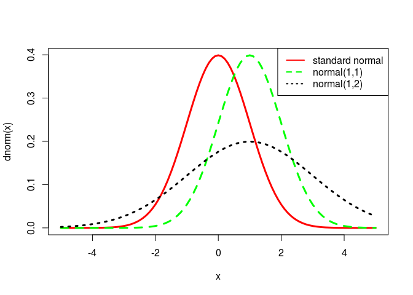

**均匀分布**

``` r
dunif(5, min=0, max=1, log = FALSE)
```

    ## [1] 0

``` r
punif(5, min=0, max=1, lower.tail = TRUE, log.p = FALSE)
```

    ## [1] 1

``` r
qunif(5, min=0, max=1, lower.tail = TRUE, log.p = FALSE)
```

    ## Warning in qunif(5, min = 0, max = 1, lower.tail = TRUE, log.p = FALSE):
    ## NaNs produced

    ## [1] NaN

``` r
runif(5, min=0, max=1)
```

    ## [1] 0.8813882 0.3047841 0.2416987 0.9618491 0.7194947

三、大数定律和中心极限定理
--------------------------

使用**animation包**演示大数定律和中心极限定理：

``` r
# install.packages("animation")
library(animation)
```

### 大数定律

LLN函数：

``` r
lln<-function (FUN, pars=NULL, np = 30, n = ani.options("nmax"),pch = 20,col.poly = "bisque", col.mu = "gray", ...) 
{    dist.name<-deparse(substitute(FUN))
     if(dist.name=='rbinom'){FUN<-function(n,pars) rbinom(n,size=pars[1],prob=pars[2]);mu<-pars[2];}
     if(dist.name=='rpois'){FUN<-function(n,pars) rpois(n,lambda=pars);mu<-pars;}
     if(dist.name=='rnorm'){FUN<-function(n,pars) rnorm(n,mean=pars[1],sd=pars[2]);mu<-pars[1];}
     if(dist.name=='rexp'){FUN<-function(n,pars) rexp(n,rate=pars); mu<-1/pars;}
     if(dist.name=='runif'){FUN<-function(n,pars) runif(n,min=pars[1],max=pars[2]);mu<-sum(pars)/2;}
     if(dist.name=='rchisq'){FUN<-function(n,pars) rchisq(n,df=pars);mu<-pars;}
    
    m = x = NULL
    for (i in 1:n) {
        d = colMeans(matrix(replicate(np, FUN(i*100,pars)), i*100))
        m = c(m, d)
        x = rbind(x, range(d))
    }
    rg = range(m)
    xax = pretty(1:n)
    for (i in 1:n) {
        dev.hold()
        plot(1:n, ylim = rg, type = "n",
             xlab = paste("n =100*", i), 
             ylab = expression(bar(x)), xaxt = "n",main=dist.name)
        axis(1, xax[xax <= i])
        polygon(c(1:i, i:1), c(x[1:i, 1], x[i:1, 2]), 
                border = NA, col = col.poly)
        points(rep(1:i, each = np), m[1:(i * np)], pch = pch, ...)
        abline(h = mu, col = col.mu)
        ani.pause()
    }
}
```

演示几个分布的大数定律：

``` r
# #LLN for Binomial
# lln(FUN=rbinom,pars=c(1,0.5))
# 
# #LLN for Poisson
# lln(FUN=rpois,pars=2)
# 
# #LLN for Uniform
# lln(FUN=runif,pars=c(0,1))
# 
# #LLN for Exponential
# lln(FUN=rexp,pars=2)
```

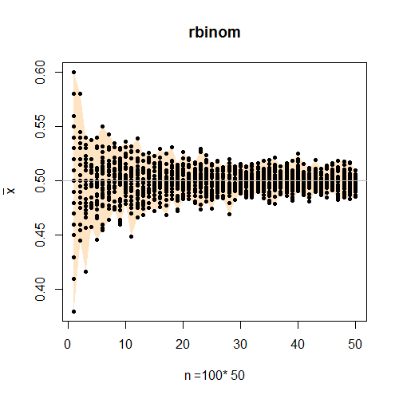

### 中心极限定理

CLT函数：

``` r
clt <- function (obs = 300, FUN =rexp, mu=0,sds=1,
                 nmax = ani.options("nmax"),
                 col = c("bisque", "red", "blue", "black"),xlim, ...) 
{
    x = matrix(nrow = nmax, ncol = obs)
    for (i in 1:nmax) x[i, ] = apply(matrix(replicate(obs, FUN(i)), i), 2, mean)
    if (missing(xlim)) xlim = quantile(x, c(0.005, 0.995))
    for (i in 1:nmax) {
        dev.hold()
        hist(x[i, ], freq = FALSE, main = "", 
             xlab = substitute(italic(bar(x)[i]), list(i = i)), 
             col = col[1], xlim = xlim)
        lines(density(x[i, ]), col = col[2],lwd=2)
    if(!is.na(mu) && !is.na(sds))
       curve(dnorm(x, mu, sds/sqrt(i)), col = col[3], 
             lty = 2, lwd=2, add = TRUE)
    legend("topright", legend = c("Normal","Est. pdf"),
           lty=2:1, lwd=2, col=c(col[3],col[2]), bty = "n")
    ani.pause()
    }
}

ani.options(interval = 0.5)
par(mar = c(3, 3, 1, 0.5), mgp = c(1.5, 0.5, 0), tcl = -0.3)
```

演示几个分布的中心极限定理：

``` r
# #Poisson case
#   f<-function(n) rpois(n,lambda=4);
#   clt(FUN = f, mu=4,sds=2)
# 
# #binomial case
#   f<-function(n) rbinom(n,size=1,prob=0.5)
#   clt(FUN = f, mu=0.5, sds=0.5)
# 
# #exponential distribution case
#   f<-function(n) rexp(n,rate=2);
#   clt(FUN = f, mu=1/2,sds=1/2)
# 
# #uniform distribution case
#    f<-function(n,pars) runif(n,min=0,max=1);
#    clt(FUN = f,mu=1/2,sd=1/sqrt(12))
# 
# #chi-square distribution
#   f<-function(n) rchisq(n,df=2);
#   clt(FUN = f,mu=2,sd=2)
```
