ggplot2 in R
================

概述：这则教程旨在介绍R语言中实现数据可视化的方法，主要介绍ggplot2包的基本用法。

ggplot2基本用法
===============

基本思想：
----------

1.  ggplot2的核心理念是将绘图与数据分离，数据相关的绘图与数据无关的绘图分离
2.  ggplot2是按图层作图
3.  ggplot2保有命令式作图的调整函数，使其更具灵活性
4.  ggplot2将常见的统计变换融入到了绘图中

qplot()函数实现快速绘图
-----------------------

**基本语法：**

``` r
# qplot(x, y = NULL, ..., data, facets = NULL,
#       margins = FALSE,geom = "auto", stat = list(NULL),
#       position = list(NULL), xlim = c(NA,NA),
#       ylim = c(NA, NA), log = "", main = NULL,
#       xlab = deparse(substitute(x)),
#       ylab = deparse(substitute(y)), asp = NA)
# 
# x, y与基本的plot()函数参数一致，指定图中x坐标和y坐标的值；
# ...为每个图层指定其他图形装饰属性，如颜色(colour)、形状(shape)、大小(size)等；
# data用于要分析的数据框；
# facets用来指定用于分面的变量，默认不指定分面变量；
# margins是否呈现图形边缘，默认不显示图形边缘；
# 
# geom为设定的几何对象，几何对象可以是一种，也可以是多种组合，如下为常用的几何对象：
# geom = 'point'，绘制散点图，当参数x和y指定时，默认为散点图；
# geom = 'boxplot'，绘制箱线图，参数colour控制外框颜色，
# fill指定填充颜色，size调节线的粗细；
# geom = 'path'或geom = 'line'，绘制线图；
# geom = 'histogram'，绘制直方图，当只提供x参数的数据时默认为直方图，
#可以指定直方图的组距参数binwidth = ，fill参数为直方图添加填充颜色；
# geom = 'freqploy'，绘制频率多变形；
# geom = 'density'，绘制密度曲线，adjust参数控制曲线的平滑程度，取值越大，越平滑；
# geom = 'bar'，绘制条形图，对于明细数据，条形图的纵坐标为频数；
#对于已经汇总的数据需要使用weight参数指定已汇总的变量；
# geom = 'jitter'，绘制扰动点图，可以查看各位置下的疏密情况，
#还可以配合alpha = I()参数一起使用，alpha值越小则越透明；
# 
# stat为字符向量，用于指定统计函数；
# position为字符向量，用于调整图形的位置；
# xlim和ylim指定图形横纵坐标的范围，与plot函数中xlim，ylim参数一致；
# log进行横纵坐标的对数转换，可也是log='x'或log='y'或log='xy';
# main为图形添加标题，与plot函数中main参数一致；
# xlab和ylab为图形横纵坐标添加标题，与plot函数中xlab，ylab参数一致。
```

**典型例子：**

下面的例子用到ggplot2包中自带的数据集diamonds

``` r
#下载并安装ggplot2包
if(!suppressWarnings(require('ggplot2'))){
  install.packages('ggplots')
  require('ggplot2')
  }
```

    ## Loading required package: ggplot2

``` r
head(diamonds)
```

    ## # A tibble: 6 × 10
    ##   carat       cut color clarity depth table price     x     y     z
    ##   <dbl>     <ord> <ord>   <ord> <dbl> <dbl> <int> <dbl> <dbl> <dbl>
    ## 1  0.23     Ideal     E     SI2  61.5    55   326  3.95  3.98  2.43
    ## 2  0.21   Premium     E     SI1  59.8    61   326  3.89  3.84  2.31
    ## 3  0.23      Good     E     VS1  56.9    65   327  4.05  4.07  2.31
    ## 4  0.29   Premium     I     VS2  62.4    58   334  4.20  4.23  2.63
    ## 5  0.31      Good     J     SI2  63.3    58   335  4.34  4.35  2.75
    ## 6  0.24 Very Good     J    VVS2  62.8    57   336  3.94  3.96  2.48

**简单介绍一下数据集中变量的含义：**

carat：砖石的重量（卡拉） cut：砖石的切工，共有5种水平 color：砖石的颜色，共有7个水平 clarity：砖石的纯度 depth，table，x，y和z为砖石的5种物理指标，深度、宽度等 price：砖石的价格

``` r
#绘制diamonds数据集中carat与price的散点图
qplot(carat, price, data = diamonds)
```

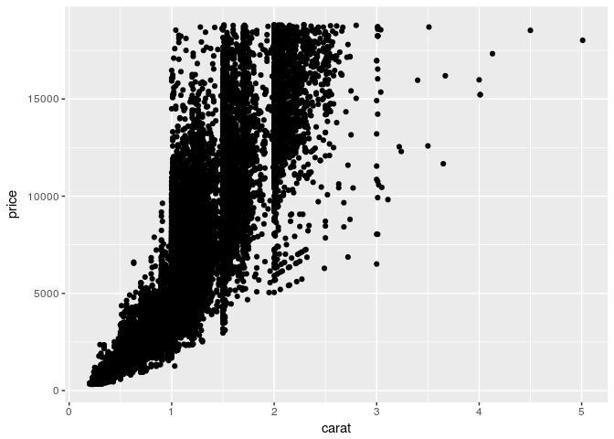

``` r
#对x和y坐标做对数变换，可以使用log参数
qplot(log(carat), log(price), data = diamonds)
```

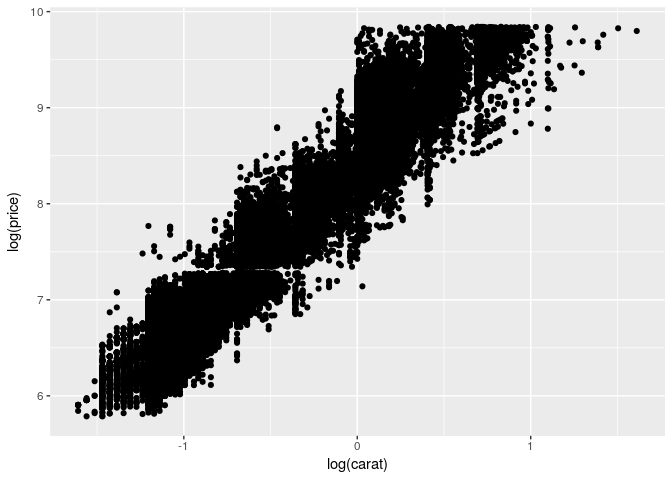

``` r
#或者
qplot(carat, price, data = diamonds, log='xy')
```

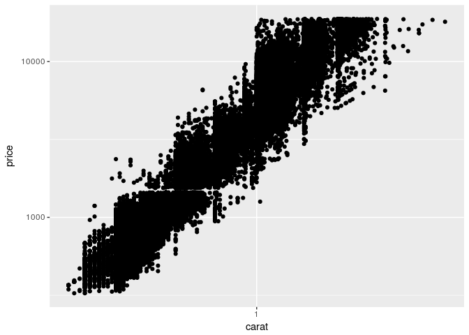

``` r
#绘制砖石重量与体积的散点图
qplot(carat, x*y*z, data = diamonds)
```

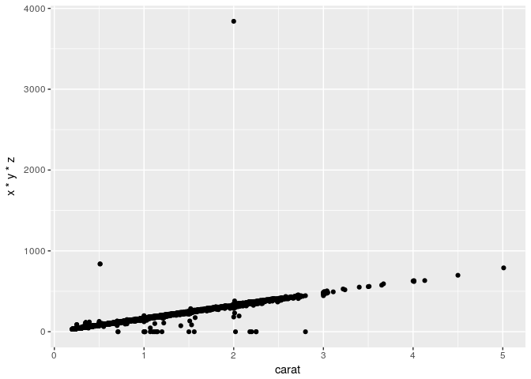

``` r
#对diamonds数据集进行抽样
set.seed(1234)
dia_sample <- diamonds[
sample(1:nrow(diamonds),1000),]
#为散点图添加图形的其他装饰属性，使用col参数添加颜色
qplot(carat, price, data = dia_sample, col = color)
```

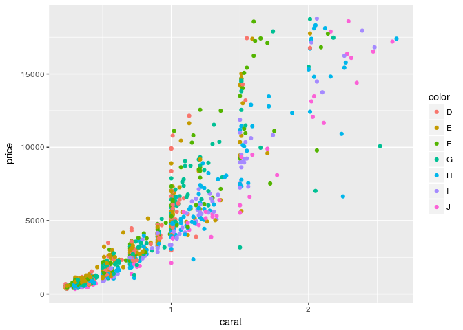

``` r
#为散点图添加图形的其他装饰属性，使用shape参数添加形状属性
qplot(carat, price, data = dia_sample, shape = cut)
```

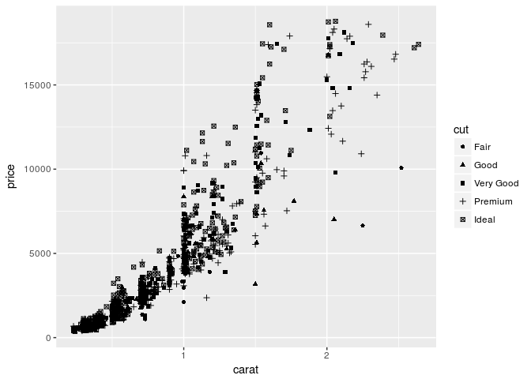

``` r
#绘制箱线图,为箱线图添加边缘色（colour参数）和填充色（fill参数）
qplot(color, price/carat, data = diamonds,
      geom = 'boxplot', colour = I('red'),
      fill = I('blue'))
```


``` r
#绘制线图（这里使用ggplot2包自带的ecnomics数据集，绘制时间序列图）
qplot(date, unemploy/pop, data = economics, geom = 'line')
```


``` r
#或者
qplot(date, unemploy/pop, data = economics, geom = 'path')
```

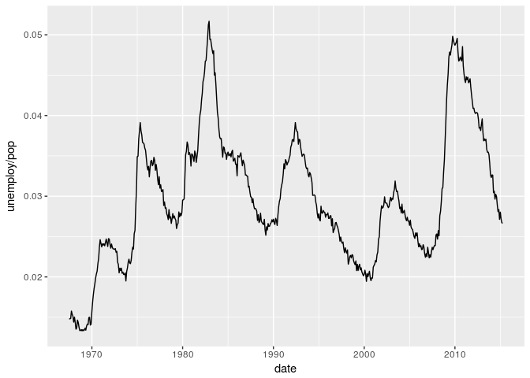

``` r
#绘制直方图，使用binwidth参数设置直方图的组距，默认纵坐标为频数
qplot(x = carat, data = diamonds, geom = 'histogram',
      binwidth = 0.1, xlim = c(0,3))
```

    ## Warning: Removed 32 rows containing non-finite values (stat_bin).

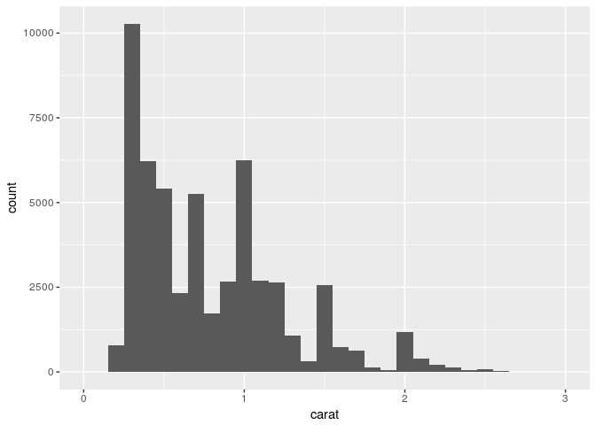

``` r
#用..density..参数设定纵坐标为频率，facets参数实现分面绘图
qplot(x = carat, ..density.., data = diamonds,
      facets = color~., geom = 'histogram',
      binwidth = 0.1, colour = I('black'),
      fill = I('blue'), xlim = c(0,3))
```

    ## Warning: Removed 32 rows containing non-finite values (stat_bin).

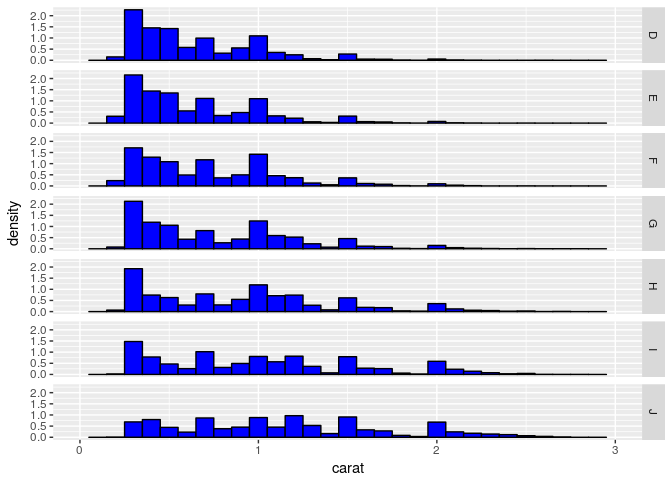

``` r
#绘制密度曲线
qplot(x = carat, data = diamonds, geom = 'density')
```

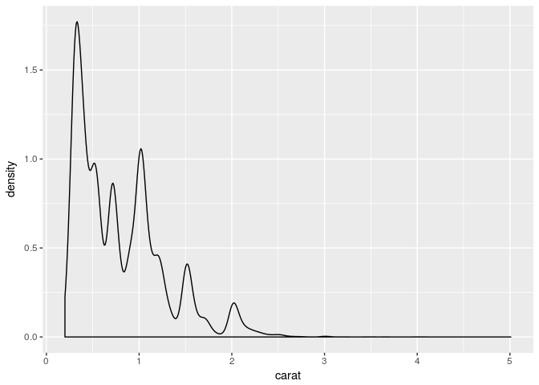

``` r
qplot(x = carat, data = diamonds, geom = 'density',col = color)
```

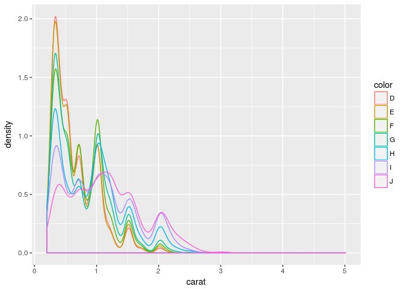

``` r
#绘制条形图，使用fill参数实现叠加条形图的绘制
qplot(x = color, data = diamonds, geom = 'bar', fill = cut)
```

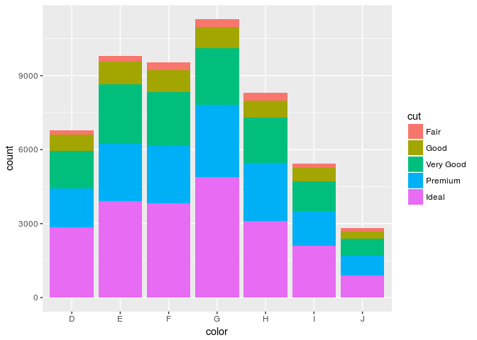

``` r
#对已经汇总的数据做条形图，需要添加weight参数指定频数
x <- rpois(1000,3)
df <- as.data.frame(table(x))
qplot(x = x, weight = Freq, data = df, geom = 'bar')
```

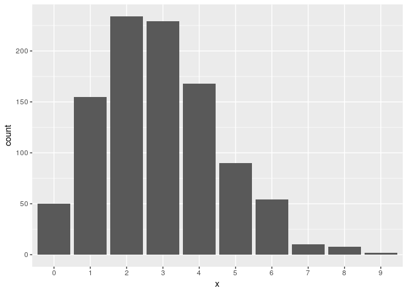

``` r
#绘制扰动点图
qplot(x = cut, y = price, data = diamonds, geom = 'jitter')
```

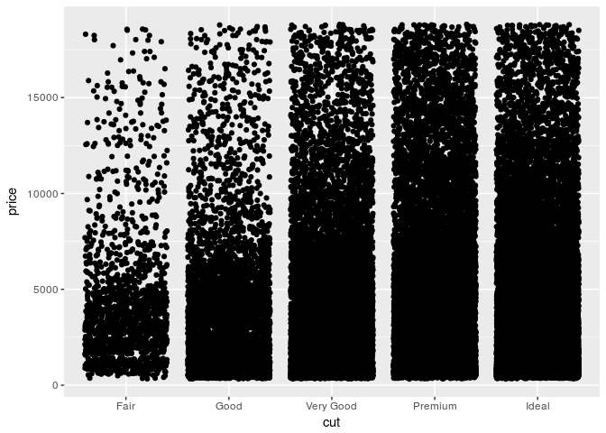

``` r
#添加alpha参数设定透明度
qplot(x = cut, y = price, data = diamonds,
      geom = 'jitter', alpha = I(0.1))
```

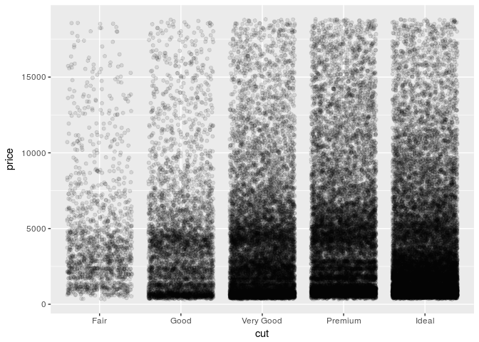

从上面的绘图情况来看，根据不同的geom值，可以方便快速的绘制想要的统计图形。然而相比于ggplot2包中的ggplot()函数还是存在明显的缺陷，qplot()函数只能使用一个数据集和一组图形属性映射，而ggplot()函数运用图层的思想，可为每个图层指定不同的数据集和图形属性。

ggplot()
--------

使用ggplot2包进行统计图形的绘制，绘图过程中主要包括以下四种组件：

1.  数据和图形属性映射
2.  几何对象
3.  统计变换
4.  位置调整

### 一、数据（data）和图形属性映射（mapping）

**基本语法：**

``` r
# ggplot(data = df, mapping = aes(x = , y = , ...))
# 使用ggplot2包进行绘图，对数据的要求必须是数据框，
# 如果数据集发生了变化，可以使用“%+%”来代替原来的数据集；
# aes()参数可以定义图形的属性，这里的属性可以是x轴或y轴所对应数据集的变量，
# 也可以是形状、颜色、尺寸、填充，分组等。
# 需要注意的是，aes()参数所设定的属性值必须是数据集中的变量，不可以是自定义的常量,
# 如果必须要添加属性映射为一个常量，可以做图层函数中添加。
# 还可以通过加号（+）来添加或修改或删除图形属性映射。
```

**典型例子：**

``` r
library(ggplot2)
library(gridExtra)
# 添加（在ggplot()函数外添加图形映射aes）：
p1 <- ggplot(data = mpg)
p1 <- p1 + aes(x = hwy, y = displ,
               colour = factor(cyl)) + geom_point()
# 修改（将x轴由原来的hwy改为cty）：
p2 <- p1 + aes(x = cty, y = displ,
               colour = factor(cyl)) + geom_point()
# 删除（删除颜色属性的映射）：
p3 <- p1 + aes(x = cty, y = displ, colour = NULL) + geom_point()
# 将三幅图组合到一张图中
grid.arrange(p1, p2, p3, ncol = 3, nrow = 1)
```

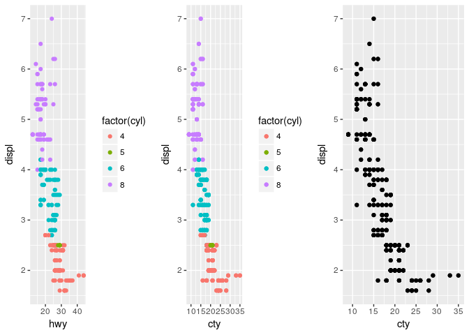

有关图形属性映射，这里还想强调一下**分组的属性**，即通过**group参数**实现绘图的分组，**默认情况下group = 1**，表示不对数据进行分组绘图，如果需要指定某个变量为分组变量，则需**将该变量指定给group参数**。这里**需要注意的是**，如果一个变量不能正确实现分组，而多个变量可以准确的将个体进行分组的话，可以使用**interaction()函数**将多个变量组合起来。

**典型例子：**

``` r
# 通过group = Subject实现每个男孩一条身高增长曲线
library(nlme)
p1 <- ggplot(data = Oxboys, mapping = 
               aes(x = age, y = height, group = Subject)) +
             geom_line()
p1
```

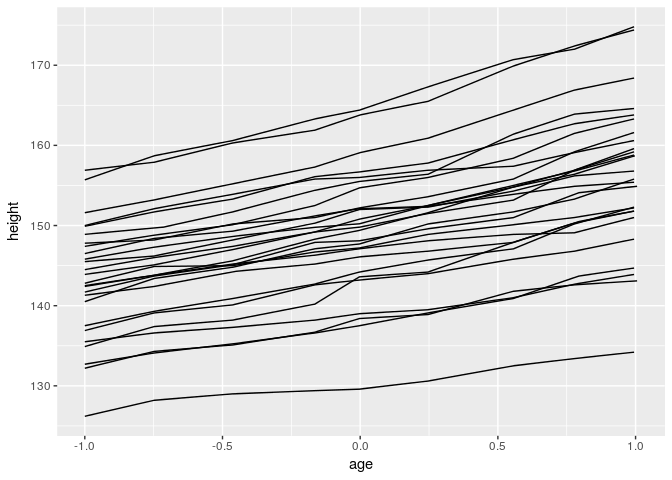

``` r
# 如果不指定分组变量，将会返回无意义的图
p2 <- ggplot(data = Oxboys, mapping =
               aes(x = age, y = height, group = 1)) + geom_line()
p2
```

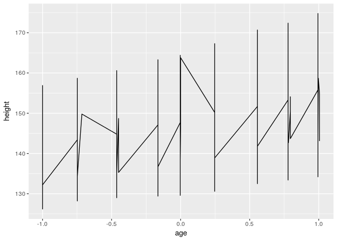

``` r
# 为每一个男孩的身高增长曲线添加一条线性的平滑曲线显然不能反映所有男孩的趋势
p3 <- ggplot(data = Oxboys, mapping =
               aes(x = age, y = height, group = Subject)) + 
             geom_line() + 
             geom_smooth(mapping = aes(group = Subject),
                         method = 'lm', se = FALSE,
                         size = 2, colour = 'blue')
p3
```

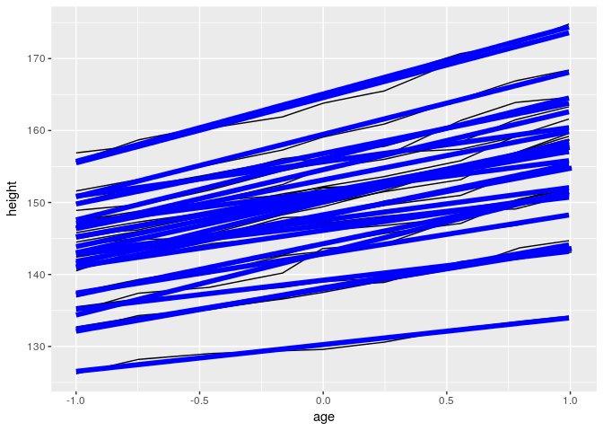

``` r
# 这时绘制所有男孩的平滑曲线时，就不能添加分组属性
p4 <- ggplot(data = Oxboys, mapping =
               aes(x = age, y = height, group = Subject)) +
             geom_line() +
             geom_smooth(mapping = aes(group = 1),
                         method = 'lm', se = FALSE,
                         size = 2, colour = 'blue')
p4
```

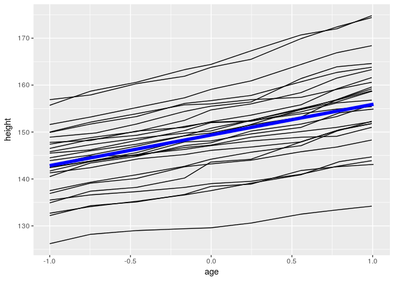

### 二、几何对象（geom\_）

**基本语法：**

``` r
# 通过加号（+）添加图层函数，实现图层的叠加，以添加条形图图层为例：
#  + geom_bar(mapping = NULL, data = NULL,
#             stat = "bin", position = "stack",...)
# mapping：可以为每个图层添加各自的图形属性映射，用aes()函数包含各种属性映射；
# data：可以为每个图层指定不同的数据集，默认情况下使用ggplot()函数指定的数据集；
# stat：可以为每个图层添加不同的统计变换，对于条形图来说，默认的统计变换封箱bin；
# position：实现图层的位置调整，默认情况下是堆叠图，还可以指定填充图（fill）和并列图（dodge）
# ...：可以指定的其他参数，如透明度、尺寸等。
```

### 三、统计变换（stat\_）

**基本语法：**

``` r
# 可以通过加号（+）添加统计变换函数，实现图层上的统计变换，这里以qq图为例：
#  + stat_qq(mapping = NULL, data = NULL,
#            geom = "point",position = "identity",
#            distribution = qnorm, dparams = list(),
#            na.rm = FALSE, ...)
# mapping：为每个统计变换函数添加各自的图形映射；
# data：为每个统计变换函数指定不同的数据集；
# geom：为每个统计变换函数添加不同几何对象，这里默认为点图；
# position：可以实现每个统计变换函数的位置调整；
# distribution：这里指定stat_qq()函数中的分布函数，用字符串表示，默认为正态分位数函数；
# dparams：为指定的某种分布的分位数函数设置参数；
# na.rm：为每个统计变换函数选择缺失值的处理方式，默认情况下，剔除缺失值并返回警告信息。
```

**典型例子：**

``` r
library(ggplot2)
library(gridExtra)
set.seed(1234)
x <- rt(1000,3)
#绘制正态分布的QQ图
p1 <- ggplot(data = NULL, mapping = aes(sample = x)) +
             stat_qq(distribution = qnorm)
#绘制t分布的QQ图
p2 <- ggplot(data = NULL, mapping = aes(sample = x)) +
             stat_qq(distribution = qt, dparams = list(df = 3))
#合并以上两张图
grid.arrange(p1, p2, ncol = 2, nrow = 1)
```

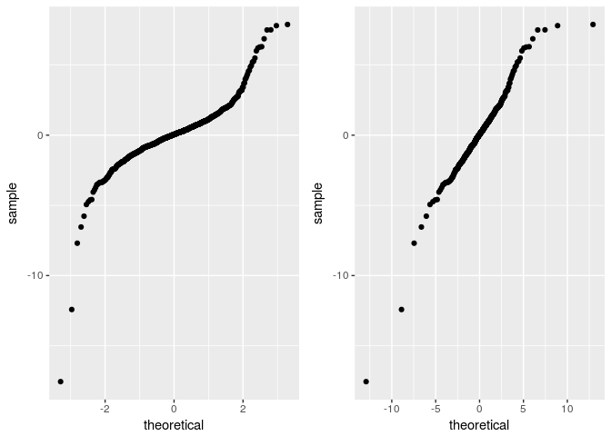

通过图层函数和统计变换函数的介绍，发现每一个几何对象都有一个默认的统计变换，每一个统计变换函数都有一个默认的几何对象，详见《ggplot2：数据分析与图形艺术》一书。

### 四、位置调整（position）

**基本语法：**

``` r
# 位置调整就是对图层元素进行微调，当前ggplot2包含如下5种位置调整参数：
# position = 'dodge'，避免重叠，并排放置；
# position = 'fill'，堆叠图形元素，并将高度标准化为1；
# position = 'stack'，将图形元素堆叠起来；
# position = 'jitter'，给点添加扰动，避免重合；
# position = 'identity'，不对图形元素进行任何调整。
# 位置调整一般多用于处理离散数据，因为连续数据一般很少出现完全重叠的问题。
```

**典型例子：**

``` r
library(ggplot2)
library(gridExtra)
#堆叠条形图
bar_stack <- ggplot(data = mtcars,
                    mapping = aes(x = factor(am),
                                  fill = factor(cyl))) + 
                    geom_bar(stat = 'count', position = 'stack')
#填充条形图
bar_fill <- ggplot(data = mtcars,
                   mapping = aes(x = factor(am),
                                 fill = factor(cyl))) + 
                   geom_bar(stat = 'count', position = 'fill')
#并列条形图
bar_bodge <- ggplot(data = mtcars,
                    mapping = aes(x = factor(am),
                                  fill = factor(cyl))) + 
                    geom_bar(stat = 'count', position = 'dodge')
#合并三张图为一张图
grid.arrange(bar_stack, bar_fill, bar_bodge, ncol = 3, nrow = 1)
```


以上便是ggplot2的基本概念及用法，下面将详细介绍绘制不同种类图形的方法。

ggplot2绘制散点图
=================

散点图可以用来描述两个连续变量之间的关系，一般在做数据探索分析时会使用到，通过散点图发现变量之间的相关性强度、是否线性关系等。

绘制简单的散点图
----------------

ggplot包中的**geom\_point()函数**可以非常方便绘制出所需的散点图。

``` r
library(ggplot2)
set.seed(1234)
x <- rnorm(100,mean = 2, sd = 3)
y <- 1.5 + 2*x + rnorm(100)
df <- data.frame(x = x, y = y)
ggplot(data = df, mapping = aes(x = x, y = y)) + geom_point()
```


绘制分组的散点图
----------------

可将分组变量(因子或字符变量)赋值给颜色或形状属性，实现分组散点图的绘制

``` r
set.seed(1234)
x <- rnorm(100,mean = 2, sd = 3)
y <- 1.5 + 2*x + rnorm(100)
z <- sample(c(0,1), size = 100, replace = TRUE)
df <- data.frame(x = x, y = y, z = z)
# 将数值型变量转换为因子型变量
df$z <- factor(df$z)
# 分组变量赋值给颜色属性
ggplot(data = df, mapping = aes(x = x, y = y, colour = z)) + geom_point(size = 3)
```

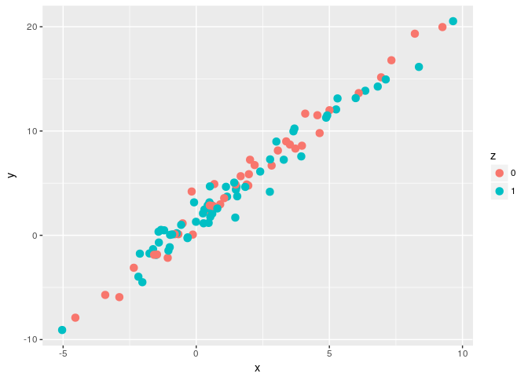

``` r
# 分组变量赋值给形状属性
ggplot(data = df, mapping = aes(x = x, y = y, shape = z)) + geom_point(size = 3)
```

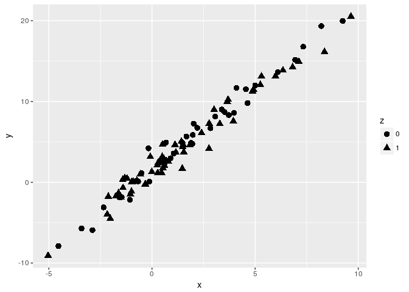

用户可能对默认的颜色或形状不满意，可以通过**scale\_colour\_brewer()或scale\_colour\_manual()函数自定义点的颜色**；通过**scale\_shape\_manual()函数实现自定义点的形状**。为了说明问题，这里将分组变量同时赋值给颜色属性和形状属性。

``` r
ggplot(data = df, mapping = aes(x = x, y = y, colour = z, shape = z)) + 
       geom_point(size = 3) + scale_color_brewer(palette = 'Accent') + 
       scale_shape_manual(values = c(2,16))
```

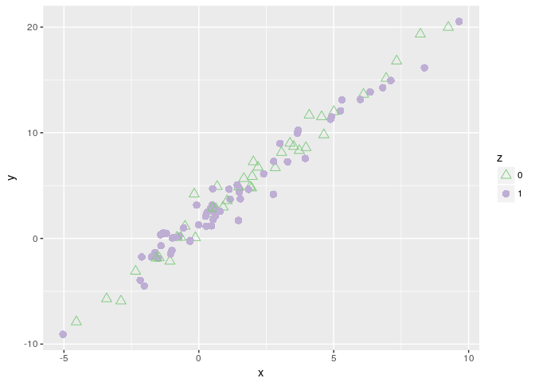

以上几种图形是将离散变量或因子映射给颜色属性或形状属性，下面介绍如何将连续变量映射给颜色属性或大小属性。

``` r
x <- c(10,13,11,15,18,20,21,22,24,26)
y <- c(76,60,70,58,55,48,44,40,26,18)
z <- c(100,120,300,180,80,210,30,95,145,420)
df <- data.frame(x = x, y = y, z = z)
#将连续变量映射给颜色属性
ggplot(data = df, mapping = aes(x = x, y = y, colour = z)) + geom_point(size = 3)
```

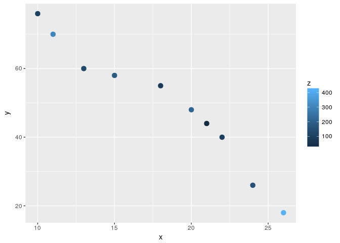

但这里发现一个问题，颜色越深而对应的值越小，如何将值的大小与颜色的深浅保持一致呢？很简单，只需人为的设置色阶，从低到高设置不同的颜色即可。

``` r
ggplot(data = df, mapping = aes(x = x, y = y, colour = z)) + geom_point(size = 3) +
       scale_colour_gradient(low = 'lightblue', high = 'darkblue')
```

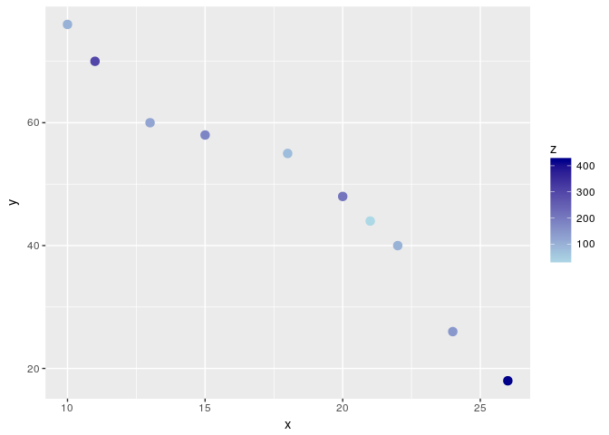

``` r
#将连续变量映射给大小属性
ggplot(data = df, mapping = aes(x = x, y = y, size = z)) + geom_point()
```

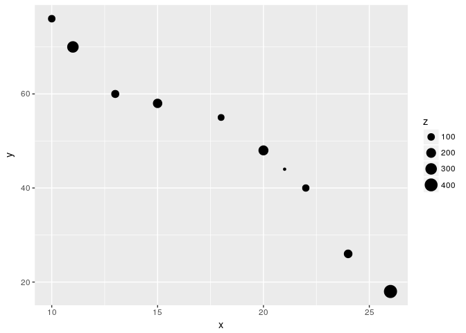

上面将连续变量赋值给颜色属性或大小属性，我们还可以人为的设置色阶间隔或大小间隔。

``` r
#自定义色阶间隔
ggplot(data = df, mapping = aes(x = x, y = y, fill = z)) + 
       geom_point(shape = 21, size = 3) +
       scale_fill_continuous(low = 'lightblue', high = 'darkblue', breaks =
                               c(100,150,200,300,350,400))
```

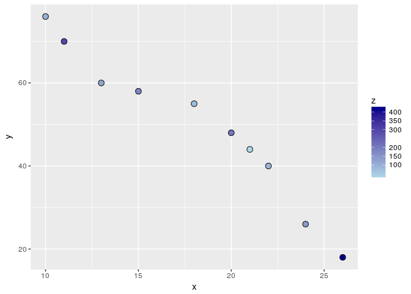

``` r
#自定义球大小的间隔
ggplot(data = df, mapping = aes(x = x, y = y, size = z)) + 
       geom_point() +
       scale_size_continuous(breaks = c(100,150,200,300,350,400), 
                             guide = guide_legend())
```

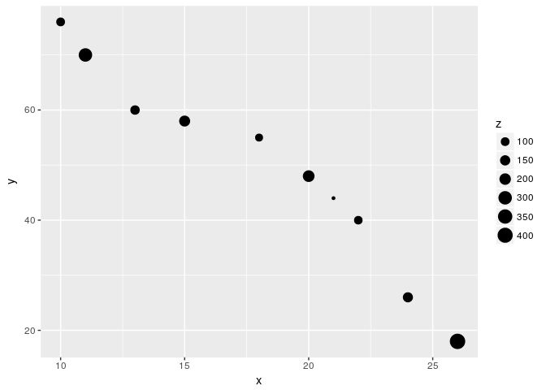

``` r
#将连续变量值的大小与球的大小成比例
ggplot(data = df, mapping = aes(x = x, y = y, size = z)) + 
       geom_point() +
       scale_size_area(max_size = 10)
```

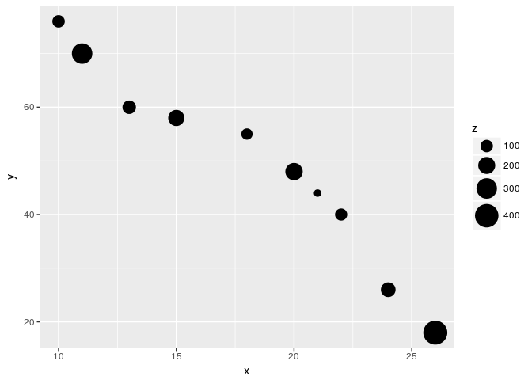

很明显，使用第二种球大小的图看起来更舒服，也更明显。

重叠点的处理
------------

当数据点非常多时，可能会导致数据点重叠非常严重，该如何处理这样的问题呢？一般有以下几种方法：

1.  使用半透明的点
2.  数据分箱，并用矩形表示
3.  数据分箱，并用六边形表示
4.  使用二维密度估计，并将等高线添加到散点图中
5.  向散点图中添加边际地毯

``` r
set.seed(1234)
x <- rnorm(10000)
y <- rnorm(10000,0,2)
df <- data.frame(x = x, y = y)
#不作任何处理
ggplot(data = df, mapping = aes(x = x, y = y)) + geom_point()
```

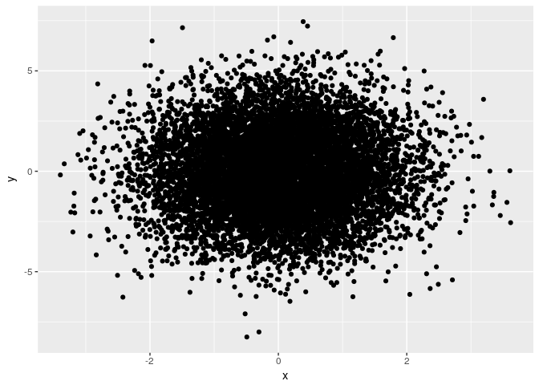

``` r
#使用透明度处理点的重叠问题
ggplot(data = df, mapping = aes(x = x, y = y)) + geom_point(alpha = 0.1)
```

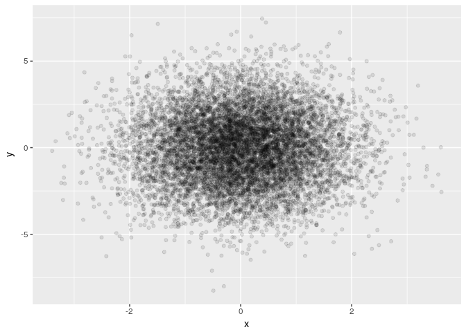

``` r
#分箱，并用矩阵表示
ggplot(data = df, mapping = aes(x = x, y = y)) + stat_bin2d()
```

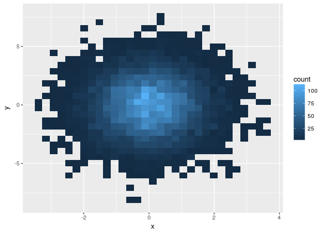

**默认情况下，stat\_bin\_2d()函数将x轴和y轴的数据点各分为30个段，即参数900个箱子**，用户还可以自定义分段个数,以及箱子在垂直和水平方向上的宽度。

``` r
#设置bins为50
ggplot(data = df, mapping = aes(x = x, y = y)) + stat_bin2d(bins = 50) +
       scale_fill_gradient(low = 'steelblue', high = 'darkred', limits = c(0,100), 
                           breaks = c(0,25,50,100))
```


将图形划分为小的正方形箱可能会产生分散注意力的视觉假象，**一般建议使用六边形代之**。

``` r
#分箱，并用六边形表示
ggplot(data = df, mapping = aes(x = x, y = y)) + 
       stat_binhex(binwidth = c(0.2,0.3)) + 
       scale_fill_gradient(low = 'lightgreen', high = 'darkred', 
                           limits = c(0,100), breaks =
                           c(0,25,50,100))
```

    ## Warning: Computation failed in `stat_binhex()`:
    ## Package `hexbin` required for `stat_binhex`.
    ## Please install and try again.

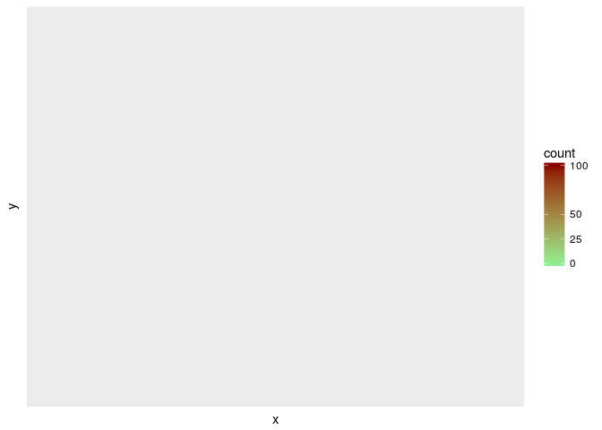

``` r
#使用stat_density2d作二维密度估计，并将等高线添加到散点图中
ggplot(data = df, mapping = aes(x = x, y = y)) + 
       geom_point() + 
       stat_density2d()
```

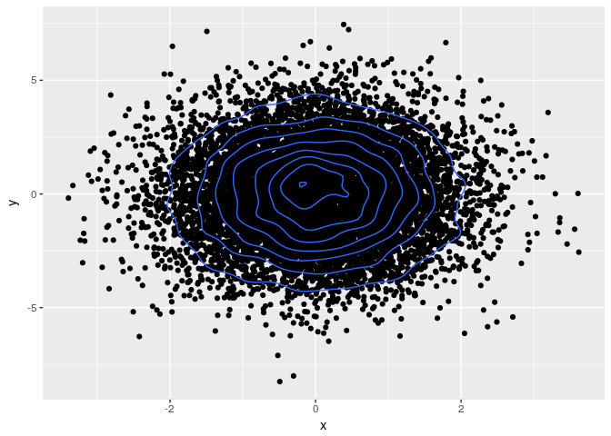

``` r
#使用大小与分布密度成正比例的点
ggplot(data = df, mapping = aes(x = x, y = y)) + 
       stat_density2d(geom = 'point', 
                      aes(size = ..density..), 
                      contour = FALSE) + 
       scale_size_area()
```

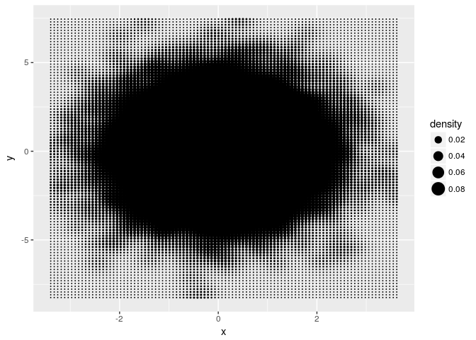

``` r
#使用热图展示数据分布密度情况
ggplot(data = df, mapping = aes(x = x, y = y)) + 
       stat_density2d(geom = 'tile', 
                      aes(fill = ..density..), contour = FALSE)
```

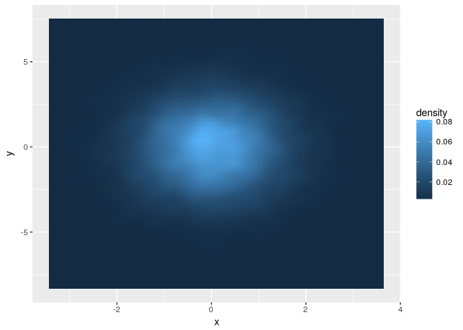

``` r
#向散点图中添加边际地毯
ggplot(data = faithful, mapping = aes(x = eruptions, y = waiting)) + 
       geom_point() +
       geom_rug()
```

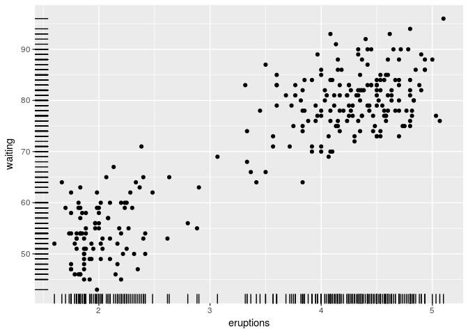

通过边际地毯，可以快速查看每个坐标轴上数据的分布密疏情况。还可以通过向边际地毯线的位置坐标添加扰动并设定size减少线宽，从而减轻边际地毯线的重叠程度。

``` r
ggplot(data = faithful, mapping = aes(x = eruptions, y = waiting)) + 
       geom_point() +
       geom_rug(position = 'jitter', size = 0.1)
```

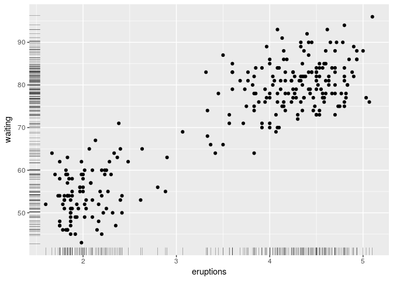

如果一个变量为离散变量，另一个变量为连续变量时，如何绘制散点图？

``` r
set.seed(1234)
x <- rep(1:5, each = 1000)
y <- c(rnorm(1000),rnorm(1000,1,2),rnorm(1000,3,4),rt(1000,2),rt(1000,4))
df <- data.frame(x = x, y = y)
df$x <- factor(df$x)
#不作任何处理的散点图
ggplot(data = df, mapping = aes(x = x, y = y)) + geom_point()
```

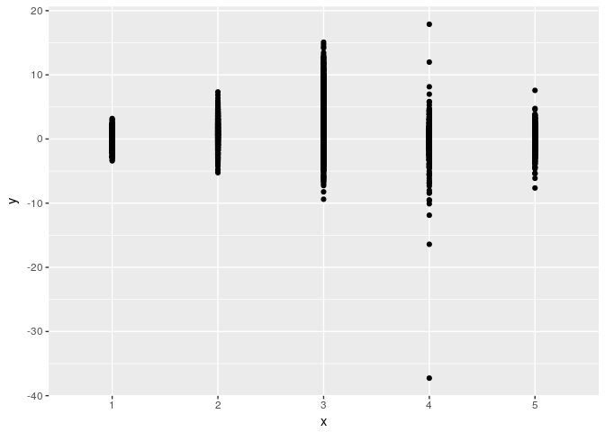

对于这样的图，似乎没有什么意义，为了避免过度重叠，有以下两种处理方法：

1.  使用扰动图
2.  使用箱线图(适用于一个或两个变量为离散变量)

``` r
#给数据点添加随机扰动
ggplot(data = df, mapping = aes(x = x, y = y)) + geom_point(position = 'jitter')
```

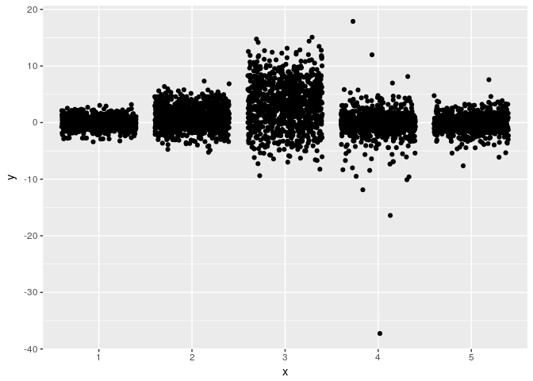

默认情况下，扰动函数在每个方向（水平和垂直）上添加的扰动值为数据点最小精度的40%，当然也可以通过width和height参数自定义扰动量。

``` r
# 水平方向上添加50%的扰动量
ggplot(data = df, mapping = aes(x = x, y = y)) + 
       geom_point(position = position_jitter(width = 0.5, height = 0))
```

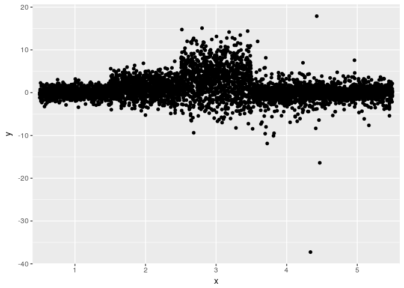

``` r
#绘制箱线图
ggplot(data = df, mapping = aes(x = x, y = y)) + 
       geom_boxplot(mapping = aes(group = x),
       fill = 'steelblue')
```

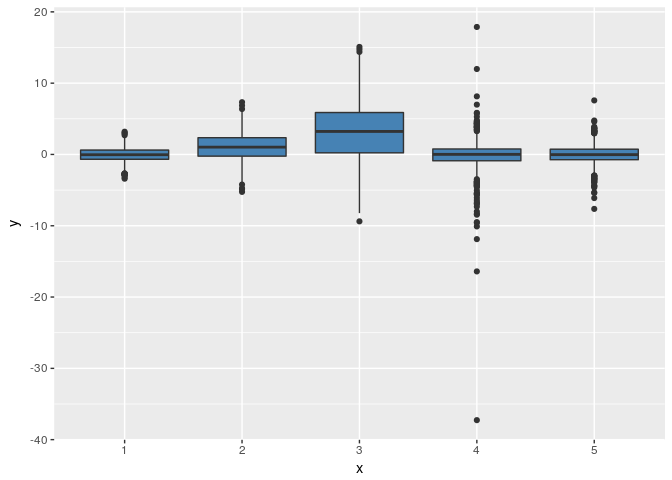

**这里需要提醒的是**，横坐标为数值型变量时，必须要将其转换为因子，并在**geom\_boxplot()函数的属性中将因子映射给group**，否则产生的效果图将是错误的。

上文中提到，通过绘制两个变量的散点图可以查看变量将的关系，可以是线性的也可以是非线性的，如何在散点图的基础上再添加拟合曲线呢？下文将逐一介绍几种拟合线。

``` r
#不添加任何拟合线
ggplot(data = iris, mapping = aes(x = Petal.Length, y = Petal.Width, colour = Species)) +
       geom_point()
```

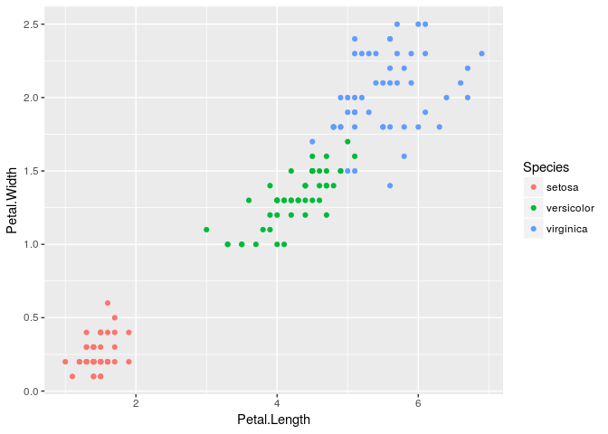

``` r
#添加线性拟合线
ggplot(data = iris, mapping = aes(x = Petal.Length, y = Petal.Width, colour = Species)) +
       geom_point() + stat_smooth(method = 'lm')
```

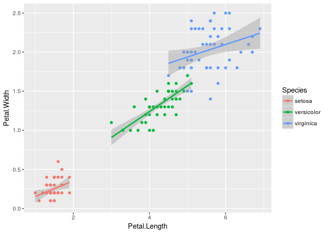

``` r
#添加局部加权多项式曲线
ggplot(data = iris, mapping = aes(x = Petal.Length, y = Petal.Width, colour = Species)) +
       geom_point() + stat_smooth(method = 'loess')
```

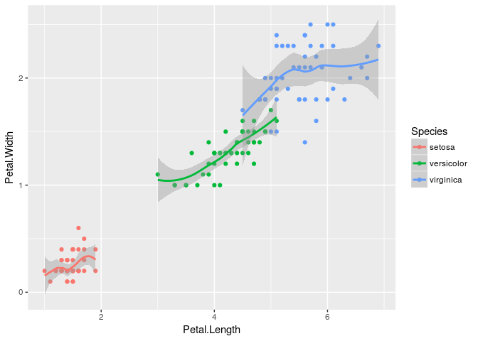

``` r
#添加Logistic曲线
library(MASS)
b <- biopsy
#绘制Logistic曲线必须将因变量强制转换为0-1
b <- transform(b, class_trans = ifelse(class == 'benign', 0, 1))
ggplot(data = b, mapping = aes(x = V1, y = class_trans)) + 
       geom_point(position =position_jitter(width = 0.3, height = 0.06), 
                  alpha = 0.4, shape = 21, size = 2) +
       stat_smooth(method = glm, method.args = list(family = "binomial"))
```

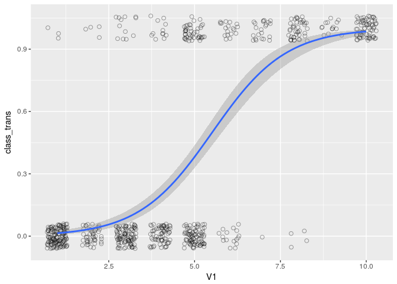

**如果不需要为拟合线绘制置信区间的话**，置信将stat\_smooth()函数中的参数se设为FALSE即可。

如果两个变量均是离散变量，该如何绘制散点图？实质上，这样的散点图我们称作气泡图。一般可以将这种图应用到价值转移中。

``` r
value1 <- rep(c('高价值','中价值','低价值'), each = 3)
value2 <- rep(c('高价值','中价值','低价值'), times = 3)
nums <- c(500,287,123,156,720,390,80,468,1200)
df <- data.frame(value1 = value1, value2 = value2, nums = nums)
df$value1 <- factor(df$value1, levels = c('高价值','中价值','低价值'), order = TRUE)
df$value2 <- factor(df$value2, levels = c('低价值','中价值','高价值'), order = TRUE)
ggplot(data = df, mapping = aes(x = value1, y = value2, size = nums)) +
       geom_point(colour = 'steelblue') + scale_size_area(max_size = 30, guide = FALSE) +
       geom_text(aes(label = nums), vjust = 0, colour = 'black', size = 5)
```

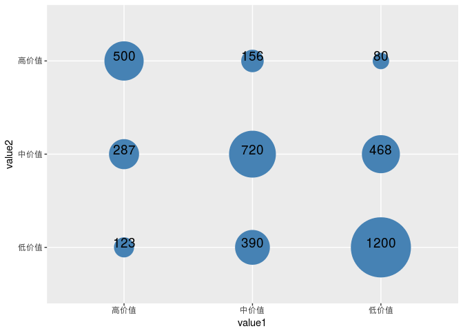

从图中可知，高价值用户中有80个流向了低价值，而低价值用户中又有128个流向高价值。

最后再介绍两种比较常用的种散点图，即**Cleveland点图和散点图矩阵**。 在《手把手教你使用ggplot2绘制条形图》我们向大家介绍了然后绘制各种各样的条形图，这里介绍另一种替代条形图的Cleveland点图。**通过Cleveland点图可以减少图形造成的视觉混乱，同时图形更具可读性**。

``` r
set.seed(1234)
names <- letters
Score <- runif(26, min = 55, max = 90)
df <- data.frame(names = names, Score = Score)
#条形图
ggplot(data = df, mapping = aes(x = reorder(names,Score), y = Score)) + 
       geom_bar(stat = 'identity', fill = 'steelblue', colour = 'black') + 
       xlab('Name') + geom_text(aes(label = round(Score)), vjust = 1)
```

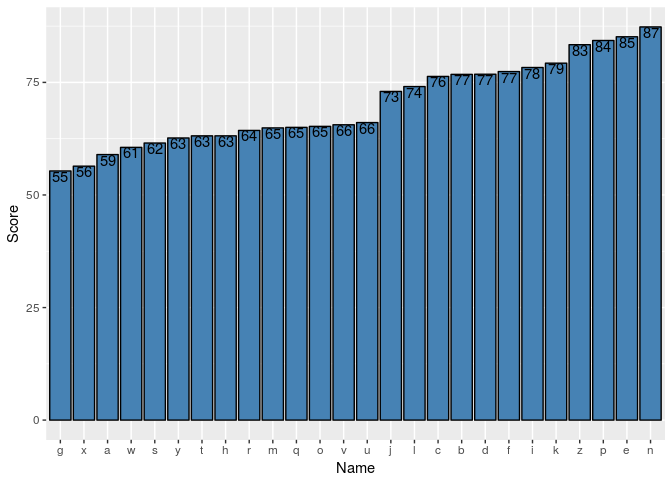

``` r
#Cleveland点图
ggplot(data = df, mapping = aes(x = reorder(names,Score), y = Score)) + 
       geom_point(size = 5, shape = 21, fill = 'steelblue', colour = 'black') + 
       xlab('Name')
```

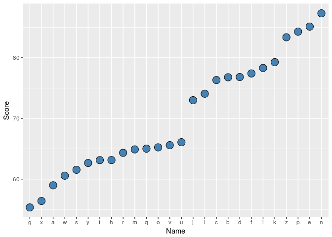

散点图矩阵是一种对多个变量两两之间关系进行可视化的有效方法，R中pairs()函数可以实现这样的需求。

``` r
#使用pairs()函数绘制散点图矩阵
data(tips, package = "reshape")
pairs(tips[,1:3])
```

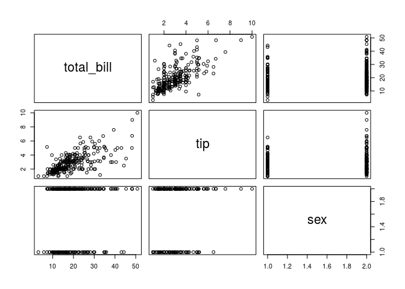

``` r
#使用car包中的scatterplotMatrix()函数
library(car)
scatterplotMatrix(tips[,1:3])
```

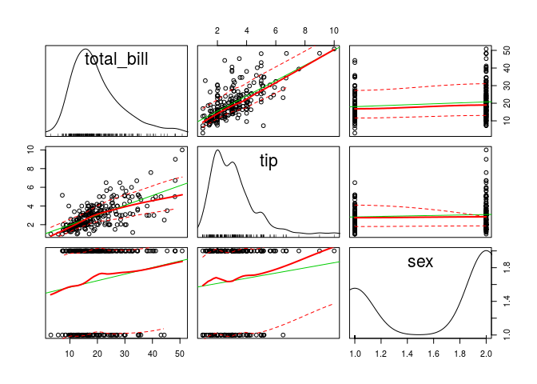

``` r
#使用GGally包中的ggpairs()函数绘制散点图矩阵
library(GGally)
ggpairs(tips[, 1:3])
```

    ## `stat_bin()` using `bins = 30`. Pick better value with `binwidth`.
    ## `stat_bin()` using `bins = 30`. Pick better value with `binwidth`.

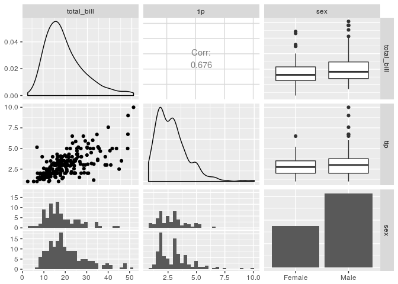

通过GGally包中的ggpairs()函数绘制散点图矩阵还是非常引入入目的，将连续变量和离散变量非常完美的结合在一起。

ggplot2绘制条形图
=================

数据分析报告中经常会看见各种各样的条形图，如简单条形图、水平交错条形图、堆叠条形图、堆叠百分比条形图等，本文从R语言的角度，教大家绘制各式各样的条形图。

绘制离散单变量的条形图
----------------------

从数据形式来看：**有汇总好的数据集和明细数据集**

### 使用汇总好的数据集绘制条形图：

``` r
x <- c('A','B','C','D','E') 
y <- c(13,22,16,31,8) 
df <- data.frame(x= x, y = y)
ggplot(data = df, mapping = aes(x = x, y = y)) + geom_bar(stat= 'identity')
```

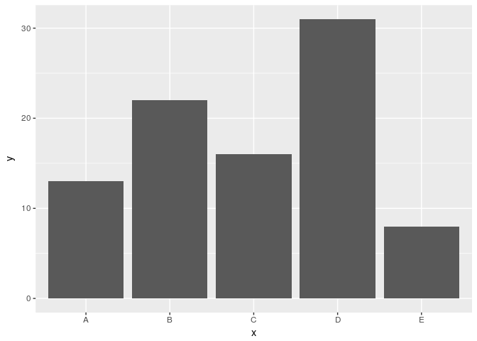

对于条形图的y轴就是数据框中原本的数值时，**必须将geom\_bar()函数中stat(统计转换)参数设置为’identity’**，即对原始数据集不作任何统计变换，而该参数的默认值为’count’，即观测数量。

### 使用明细数据集绘制条形图：

``` r
set.seed(1234) 
x <- sample(c('A','B','C','D'), size = 1000, replace= TRUE, prob = c(0.2,0.3,0.3,0.2)) 
y <- rnorm(1000) * 1000
df = data.frame(x= x, y = y) 
ggplot(data = df, mapping = aes(x = x)) + geom_bar(stat = 'count')
```

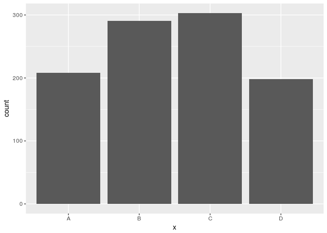

数据集本身是明细数据，而对于统计某个离散变量出现的频次时，geom\_bar()函数中stat(统计转换)参数只能设置为默认，即’count’。

**从x轴的数据类型来看：有字符型的x值也有数值型的x值**

上面的两幅图对应的x轴均为离散的字符型值，如果x值是数值型时，该如何正确绘制条形图？

``` r
set.seed(1234) 
x <- sample(c(1,2,4,6,7), size = 1000, replace = TRUE,prob = c(0.1,0.2,0.2,0.3,0.2)) 
ggplot(data = data.frame(x = x), mapping= aes(x = x, y = ..count..)) + 
       geom_bar(stat = 'count')
```

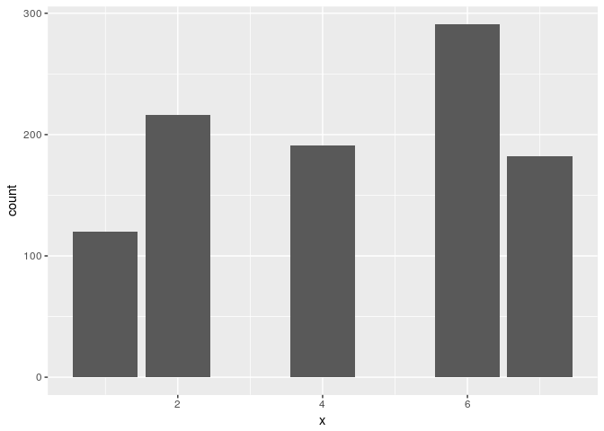

如果直接使用数值型变量作为条形图的x轴，我们会发现条形图之间产生空缺，这个空缺其实对应的是3和5两个值，这样的图形并不美观。为了能够使条形图之间不存在类似的空缺，**需要将数值型的x转换为因子**，即factor(x)，如下图所示：

``` r
ggplot(data = data.frame(x = x), mapping = aes(x = factor(x), y = ..count..)) + 
       geom_bar(stat = 'count')
```

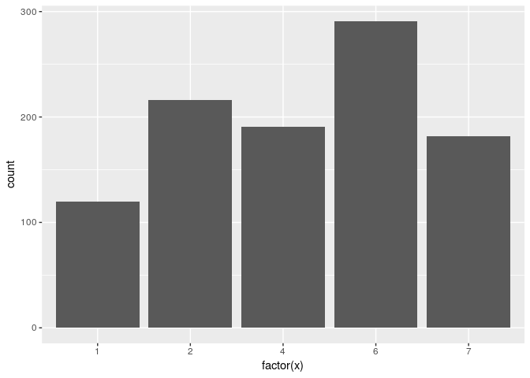

上面几幅图的颜色均为灰色的，显得并不是那么亮眼，为了使颜色更加丰富多彩，可以在geom\_bar()函数内通过**fill参数可colour参数**设置条形图的填充色和边框色，例如：

``` r
ggplot(data = data.frame(x = x), mapping = aes(x = factor(x), y = ..count..)) + 
       geom_bar(stat = 'count', fill = 'steelblue', colour = 'darkred')
```

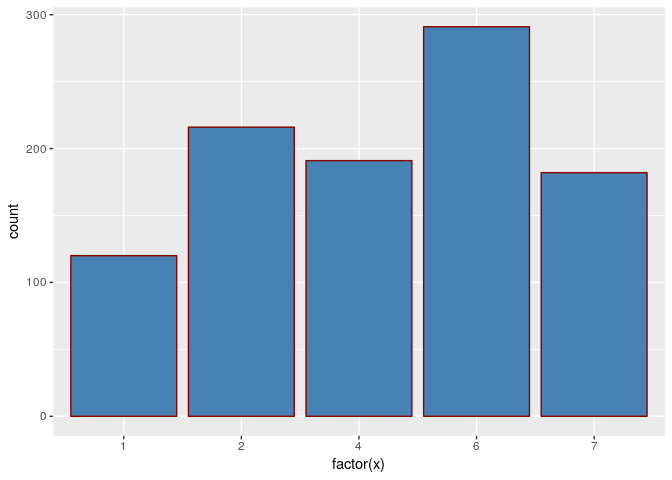

关于颜色的选择可以在R控制台中输入**colours()**，将返回657种颜色的字符。如果想查看所有含红色的颜色值，可以**输入colours()\[grep(‘red’,colours())\]**返回27种红色。

绘制簇条形图
------------

以上绘制的条形图均是基于一个离散变量作为x轴，如果想绘制两个离散变量的条形图即簇条形图该如何处理呢？具体见下方例子：

``` r
x <- rep(1:5, each = 3) 
y <- rep(c('A','B','C'),times = 5) 
set.seed(1234)
z <- round(runif(min = 10, max = 20, n = 15)) 
df <- data.frame(x= x, y = y, z = z) 
ggplot(data = df, mapping = aes(x = factor(x), y = z,fill = y)) + 
       geom_bar(stat = 'identity', position = 'dodge')
```

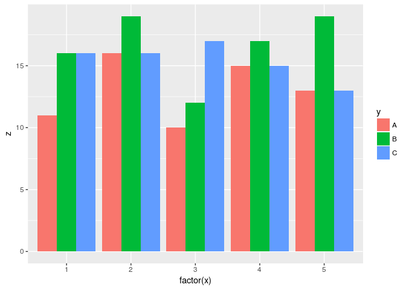

对于簇条形图**只需在ggplot()函数的aes()参数中将其他离散变量赋给fill参数即可**。这里的position参数表示条形图的摆放形式，默认为堆叠式(stack)，还可以是百分比的堆叠式。下面分别设置这两种参数，查看一下条形图的摆放形式。

### 堆叠式：

``` r
ggplot(data = df, mapping = aes(x = factor(x), y = z, fill = y)) + 
       geom_bar(stat= 'identity', position = 'stack')
```

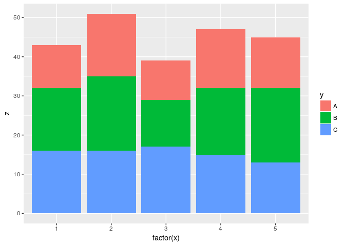

### 百分比堆叠式：

``` r
ggplot(data = df, mapping = aes(x = factor(x), y = z, fill = y)) + 
       geom_bar(stat= 'identity', position = 'fill')
```

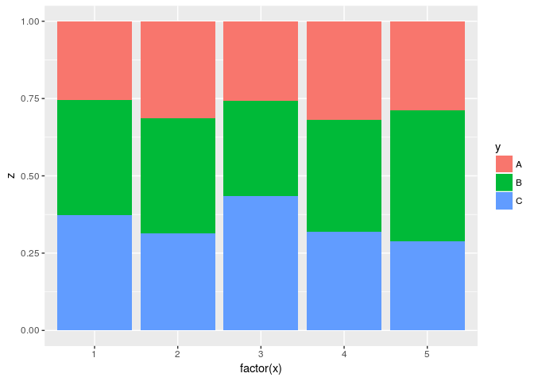

颜色配置：
----------

同样，如果觉得R自动配置的填充色不好看，还可以根据自定义的形式更改条形图的填充色，具体**使用scale\_fill\_brewer()和scale\_fill\_manual()函数**进行颜色设置。

scale\_fill\_brewer()函数使用R自带的ColorBrewer画板

``` r
ggplot(data = df, mapping = aes(x = factor(x), y = z, fill = y)) + 
       geom_bar(stat= 'identity', position = 'dodge') + 
       scale_fill_brewer(palette = 'Accent')
```

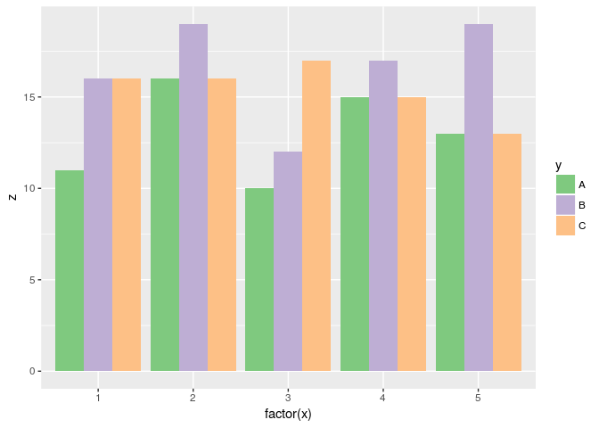

具体的调色板颜色可以查看scale\_fill\_brewer()函数的帮助。

scale\_fill\_manual()函数允许用户给指定的分类水平设置响应的色彩，个人觉得这个比较方便

``` r
col <- c('darkred','skyblue','purple')
ggplot(data = df, mapping =aes(x = factor(x), y = z, fill = y)) + 
       geom_bar(stat = 'identity', colour= 'black', position = 'dodge') +
       scale_fill_manual(values = col, limits= c('B','C','A')) + 
       xlab('x')
```

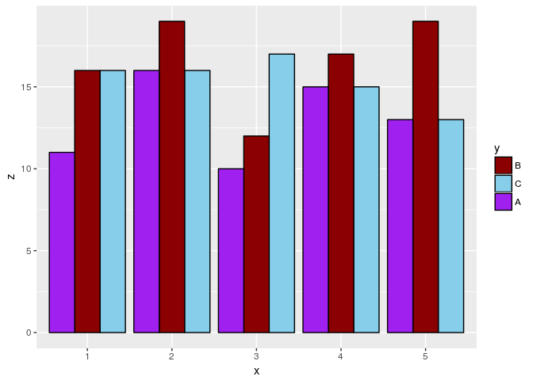

该如何绘制有序的条形图？
------------------------

``` r
#不经排序的条形图，默认按x值的顺序产生条形图 
x <- c('A','B','C','D','E','F','G') 
y <- c('xx','yy','yy','xx','xx','xx','yy') 
z <- c(10,33,12,9,16,23,11) 
df <- data.frame(x = x, y = y, z = z) 
ggplot(data = df, mapping = aes(x= x, y = z, fill = y)) + 
       geom_bar(stat = 'identity')
```

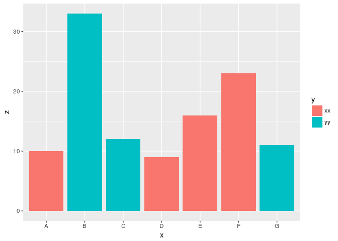

按z值的大小，重新排列条形图的顺序，只需将aes()中x的属性用reorder()函数更改即可。

``` r
ggplot(data = df, mapping = aes(x = reorder(x, z), y = z, fill = y)) + 
       geom_bar(stat = 'identity') + xlab('x')
```

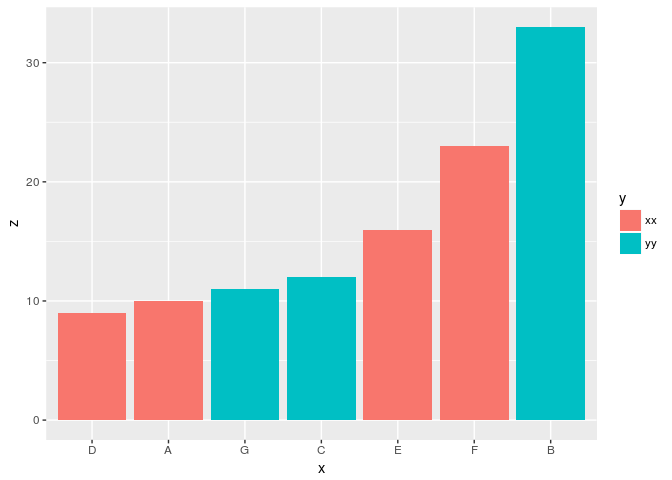

关于条形图的微调
----------------

### 如何y轴的正负值区分开来，并去除图例

``` r
set.seed(1234) 
x = 1980 + 1:35 
y = round(100*rnorm(35)) 
df <- data.frame(x= x, y = y) 
#判断y是否为正值 
df <- transform(df, judge=ifelse(y>0,'Yes', 'No'))
ggplot(data = df, mapping = aes(x = x, y = y, fill = judge)) + 
       geom_bar(stat = 'identity', position = 'identity') + 
       scale_fill_manual(values = c('blue','red'), guide = FALSE) + 
       xlab('Year')
```

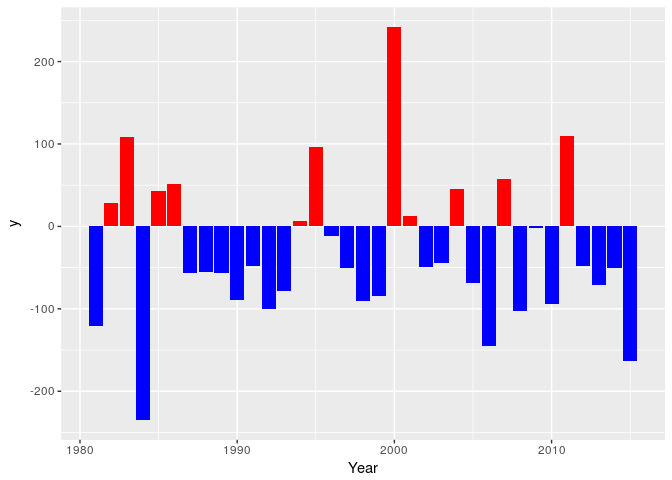

stat参数和position参数均设置为identity，目的是图形绘制不要求对原始数据做任何的变换，包括统计变换和图形变换，排除图例可以通过scale\_fill\_manual()函数将参数guide设置为FALSE，同时该函数还可以自定义填充色，一举两得。

### 调整条形图的条形宽度和条形间距

geom\_bar()函数可以非常灵活的将条形图的条形宽度进行变宽或变窄设置,具体通过函数的width参数实现，width的最大值为1，默认为0.9。

``` r
x = c('A','B','C','D','E') 
y = c(10,20,15,22,18) 
df <- data.frame(x = x, y = y) 
#不作任何条形宽度的调整 
ggplot(data = df, mapping = aes(x = x, y = y)) + 
       geom_bar(stat = 'identity', fill = 'steelblue', colour = 'black')
```


``` r
#使条形宽度变宽
ggplot(data = df, mapping = aes(x = x, y = y)) + 
       geom_bar(stat = 'identity', fill = 'steelblue', colour = 'black', width = 1)
```

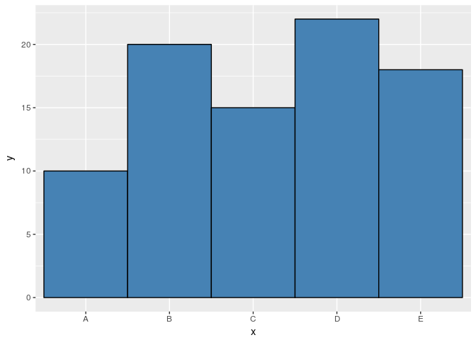

对于簇条形图来说，还可以调整条形之间的距离，默认情况下，条形图的组内条形间隔为0，具体可通过函数的position\_dodge参数实现条形距离的调整，为了美观，一般将条形距离设置的比条形宽度大一点。

``` r
x <- rep(1:5, each = 3) 
y <- rep(c('A','B','C'),times = 5) 
set.seed(1234)
z <- round(runif(min = 10, max = 20, n = 15)) 
df <- data.frame(x= x, y = y, z = z) 
#不作任何条形宽度和条形距离的调整 
ggplot(data = df, mapping = aes(x= factor(x), y = z, fill = y)) + 
       geom_bar(stat = 'identity', position ='dodge')
```


``` r
#调整条形宽度和条形距离
ggplot(data = df, mapping = aes(x = factor(x), y = z, fill = y)) + 
       geom_bar(stat= 'identity', width = 0.5, position = position_dodge(0.7))
```

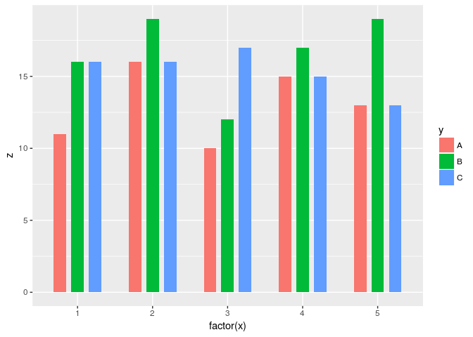

### 添加数据标签

geom\_text()函数可以方便的在图形中添加数值标签，具体微调从几个案例开始：

``` r
x <- rep(1:5, each = 3) 
y <- rep(c('A','B','C'),times = 5)
set.seed(1234)
z <- round(runif(min = 10, max = 20, n = 15)) 
df <- data.frame(x= x, y = y, z = z) 
ggplot(data = df, mapping = aes(x = interaction(x,y), y = z, fill = y)) + 
       geom_bar(stat = 'identity') + 
       geom_text(mapping = aes(label= z))
```

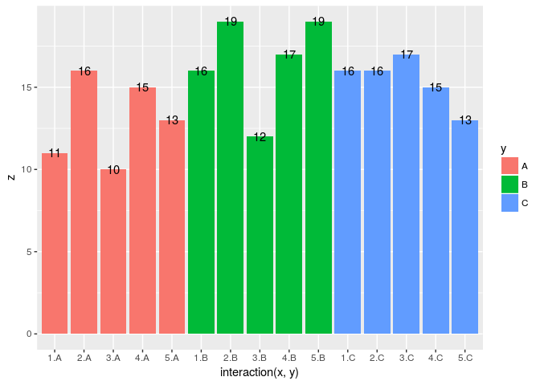

除此之外，还可以**调整标签的大小、颜色、位置等**。

``` r
ggplot(data = df, mapping = aes(x = interaction(x,y), y = z, fill = y))+ 
       geom_bar(stat = 'identity') + 
       ylim(0,max(z)+1) + 
       geom_text(mapping =aes(label = z), size = 8, colour = 'orange', vjust = 1)
```

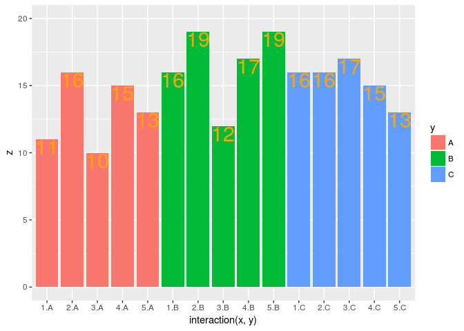

ylim设置条形图中y轴的范围；**size调整标签字体大小**，默认值为5号；**colour更换标签颜色**；**vjust调整标签位置**，1为分界线，越大于1，标签越在条形图上界下方，反之则越在条形图上上界上方。

对于水平交错的簇条形图，必须通过geom\_text()函数中的position\_dodge()参数来调整标签位置，**hjust=0.5将标签水平居中放置**。

``` r
ggplot(data = df, mapping = aes(x = x, y = z, fill = y)) + geom_bar(stat
= 'identity', position = 'dodge') + geom_text(mapping = aes(label = z),
size = 5, colour = 'black', vjust = 1, hjust = .5, position = position_dodge(0.9))
```


**这里的图形位置与标签位置摆放必须一致**，即图形位置geom\_bar()函数中的position = ‘dodge’参数，标签位置geom\_text()函数中的position = position\_dodge(0.9)参数。

对于堆叠的簇条形图，必须通过geom\_text()函数中的position\_stack()参数来调整标签位置，hjust将标签水平居中放置。

``` r
ggplot(data = df, mapping = aes(x = x, y = z, fill = y)) + 
       geom_bar(stat = 'identity', position = 'stack') + 
       geom_text(mapping = aes(label = z),size = 5, colour = 'black', 
                 vjust = 3.5, hjust = .5, position = position_stack())
```

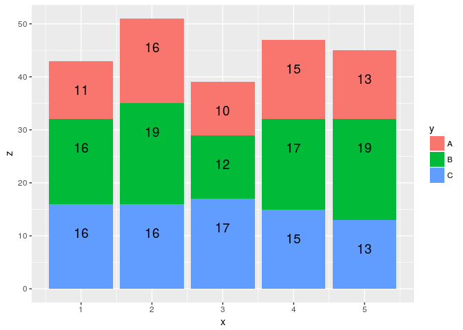

**这里的图形位置与标签位置摆放必须一致**，即图形位置geom\_bar()函数中的position = ‘stack’参数，标签位置geom\_text()函数中的position = position\_stack()参数。

ggplot2绘制饼图
===============

饼图在ggplot2中是**通过极坐标变换**获得，在绘制饼图之前需要绘制堆叠的条形图，通过将条形图进行极坐标变换后，就能实现饼图绘制了。

``` r
library(ggplot2)
type <- c('A','B','C','D','E','F','G')
nums <- c(60,40,12,33,8,23,10)
df <- data.frame(type = type, nums = nums)

# 绘制条形图
p <- ggplot(data = df, mapping = aes(x = 'Content', y = nums, fill = type)) + 
            geom_bar(stat = 'identity', position = 'stack')
p
```

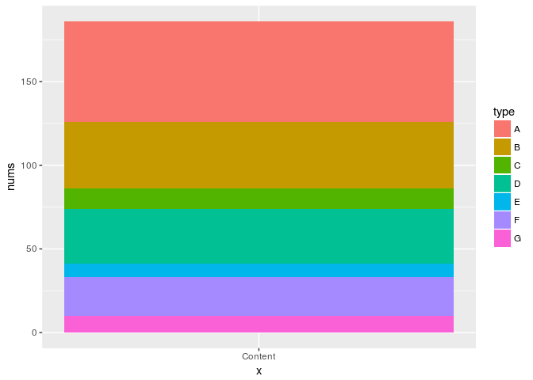

``` r
# 堆叠的条形图绘制完后，接下来就需要进行极坐标变换了
# ggplot2中coord_polar()函数可以非常方便的实现极坐标变换。
p <- p + coord_polar(theta = 'y')
p
```

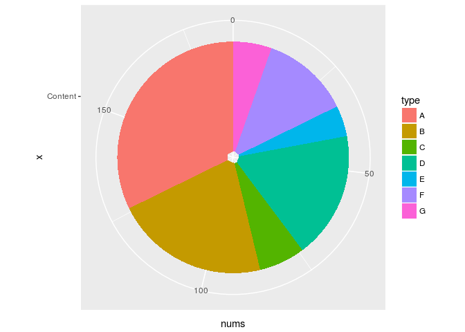

发现饼图中间有一个空心圆，这里只需稍稍改动原条形图的宽度，**将宽度设置为1**。

``` r
# 绘制条形宽度为1的条形图
p <- ggplot(data = df, mapping = aes(x = 'Content', y = nums, fill = type)) + 
            geom_bar(stat = 'identity', position = 'stack', width = 1)
p
```

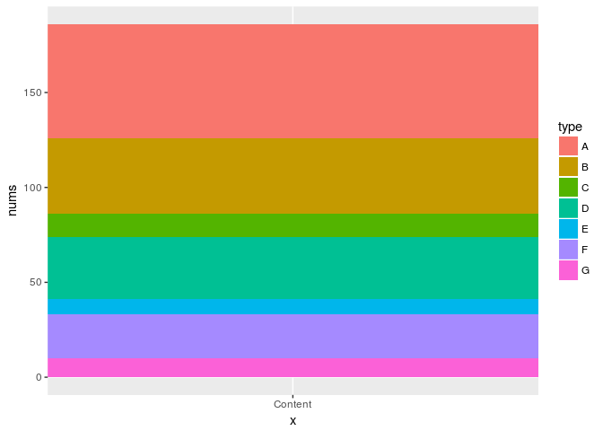

看见与之前的条形图之间的区别了吗？对，两边的空隙不见了。

``` r
# 绘制无空心点的饼图
p <- p + coord_polar(theta = 'y')
p
```

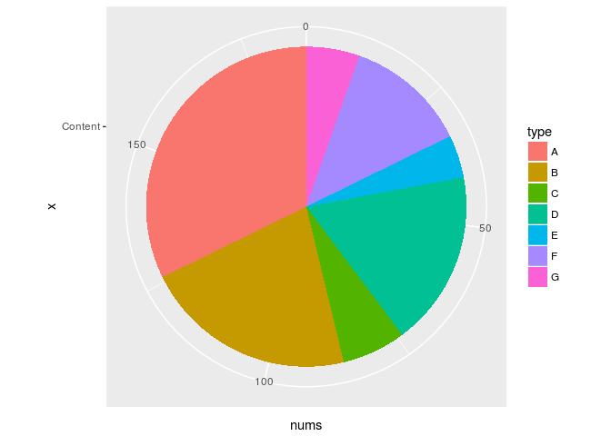

一个完整的饼图绘制完了。饼图周围还有多余的数字(0,50,100,150)、标签(“Content”,nums)、刻度(Content)和横杠(-)，这我该如何清除呢？

``` r
# 这里的标签其实就是坐标轴的标签，可以通过labs()函数将其清除。
p <- p + labs(x = '', y = '', title = '')
p
```

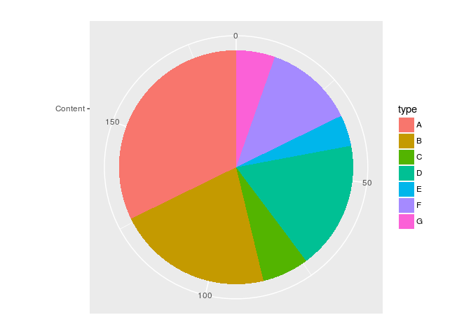

刻度(Content)、(0,50,100,150)和横杠(-)在原条形图中就是x轴和y轴的刻度值及刻度标记，可以通过theme()的方法将他们清除掉。

``` r
p <- p + theme(axis.text = element_blank())
p
```

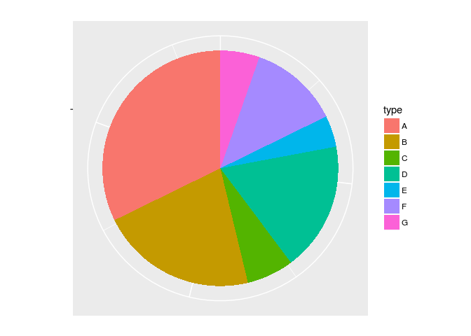

清除刻度标记

``` r
p <- p + theme(axis.ticks = element_blank())
p
```


接下来就看看如何给这个饼图绘制百分比

**将百分比直接显示在图例中**，这种方式适合分类较多的情况。

``` r
# 先来看看如何将这样的百分比（10.2%）表示出来
label_value <- paste('(', round(df$nums/sum(df$nums) * 100, 1), '%)', sep = '')
label_value
```

    ## [1] "(32.3%)" "(21.5%)" "(6.5%)"  "(17.7%)" "(4.3%)"  "(12.4%)" "(5.4%)"

``` r
# 下面还需要为这些百分比值对应到各个组。
label <- paste(df$type, label_value, sep = '')
label
```

    ## [1] "A(32.3%)" "B(21.5%)" "C(6.5%)"  "D(17.7%)" "E(4.3%)"  "F(12.4%)"
    ## [7] "G(5.4%)"

``` r
# 接下来就是将这些百分比标签放到图例中。
p <- p + scale_fill_discrete(labels = label)
p
```

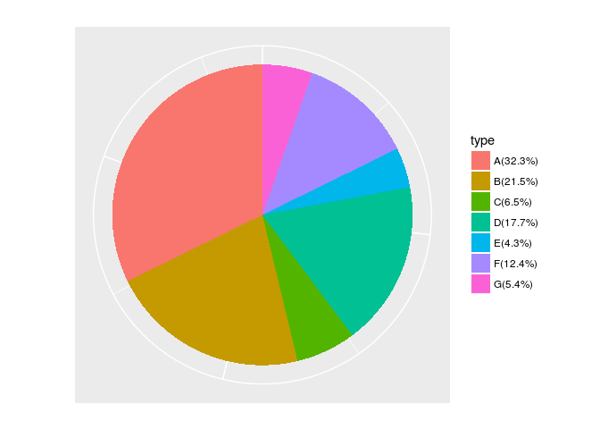

**环形图**

只需将条形图的宽度调整到小于1就可以了，还记得之前的第一张饼图中间有一个空心白圈吗？就是因为默认的条形宽度为0.9导致的。

``` r
ggplot(data = df, mapping = aes(x = 'Content', y = nums, fill = type)) + 
  geom_bar(stat = 'identity', position = 'stack', width = 0.5) + 
  coord_polar(theta = 'y') + 
  labs(x = '', y = '', title = '') + 
  theme(axis.text = element_blank()) + 
  theme(axis.ticks = element_blank()) + 
  scale_fill_discrete(labels = label)
```

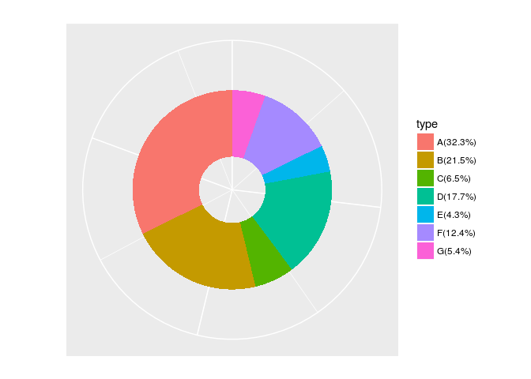

使用ggplot2进行数据分布探索
===========================

数据探索过程中往往需要了解数据的分布情况，例如上、下四分位数的位置、数据符合哪种分布等，下文将使用R的ggplot2包探索数据分布情况。

绘制直方图
----------

数据探索中，使用最为广泛的分布图就是直方图，**ggplot2包中的geom\_histogram()函数**就可方便的实现直方图的绘制。

``` r
library(ggplot2)
set.seed(1234)
x <- rnorm(1000,mean = 2, sd = 3)
ggplot(data = NULL, mapping = aes(x = x)) + geom_histogram()
```

    ## `stat_bin()` using `bins = 30`. Pick better value with `binwidth`.

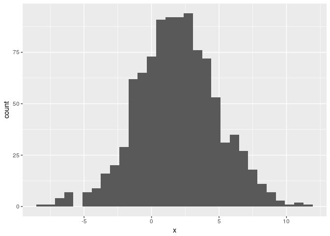

由于直方图的绘制，**只需要传递一个变量的数据**，如果收集的数据是数据框，ggplot()中的参数正常设置；**如果收集的数据仅仅是一个向量**，**那么ggplot()中data参数需要设置为NULL**，其余参数可正常设置。

**默认情况下，直方图将数据切割为30组，即bins = 30**，如果对默认分组不满意，可以自定义直方图的**组距(binwidth = )和分组数量(bins = )**；如果对默认的颜色不敏感，也可以自定义直方图的填充色和边框颜色。

``` r
# 将数据切割为50组，并将直方图的填充色设置为铁蓝色，边框色设置为黑色
ggplot(data = NULL, mapping = aes(x = x)) + 
       geom_histogram(bins = 50, fill = 'steelblue', colour = 'black')
```

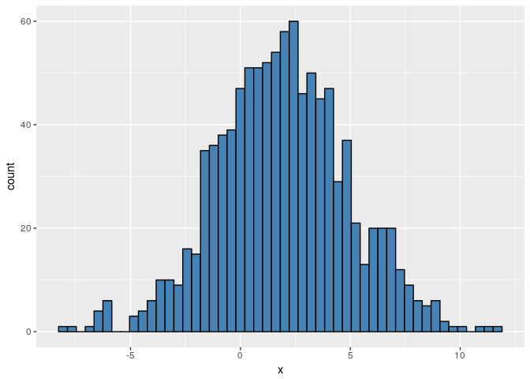

``` r
# 将直方图的组距设置为极差的二十分之一
group_diff <- diff(range(x))/20
ggplot(data = NULL, mapping = aes(x = x)) + 
  geom_histogram(binwidth =
                   group_diff, fill = 'steelblue', colour = 'black')
```

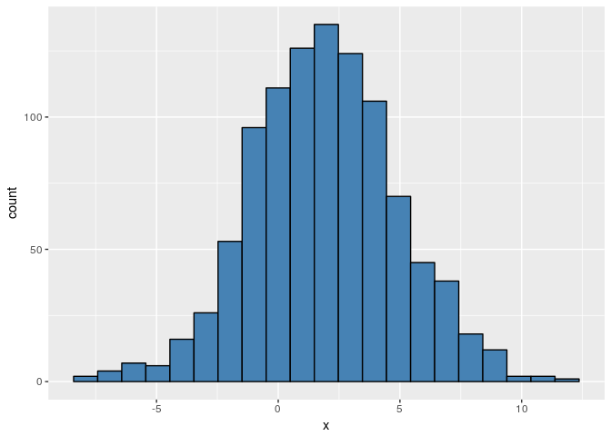

绘制分组直方图
--------------

对于分组直方图，必须为直方图传递一个分组变量，这个变量可以是字符型变量，也可以是因子型的数值变量。一般绘制分组直方图，有两种方式，即：

1.  将分组变量映射给颜色属性
2.  使用ggplot2包中的分面功能

``` r
# 将分组变量映射给颜色属性
set.seed(1234)
x <- c(rnorm(500,mean = 1, sd = 2), rt(500, df = 10))
y <- rep(c(0,1), times = c(500,500))
df <- data.frame(x = x ,y = y)
# 将数值型分组变量进行因子化
df$y = factor(df$y)
ggplot(data = df, mapping = aes(x = x, fill = y)) + 
       geom_histogram(position = 'identity', bins = 50, colour = 'black')
```

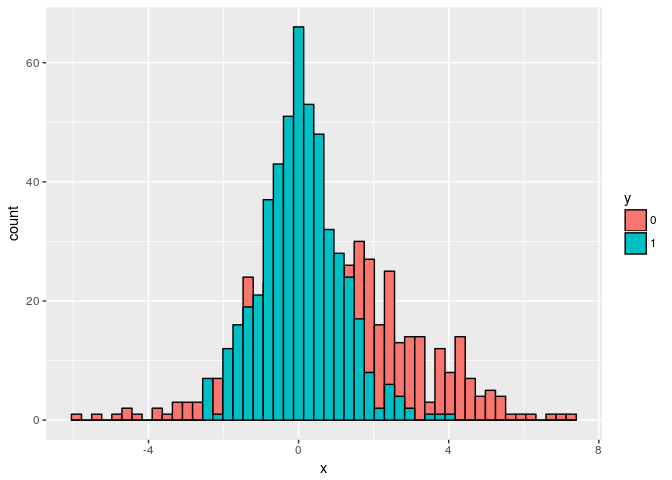

这里必须提醒的是，如果将分组变量映射给颜色时，必须**将position参数设置为‘identity’**，否则绘制的直方图将是堆叠的，反而失去了分布图的对比。如下图所示：

``` r
ggplot(data = df, mapping = aes(x = x, fill = y)) + 
       geom_histogram(bins = 50, colour = 'black')
```

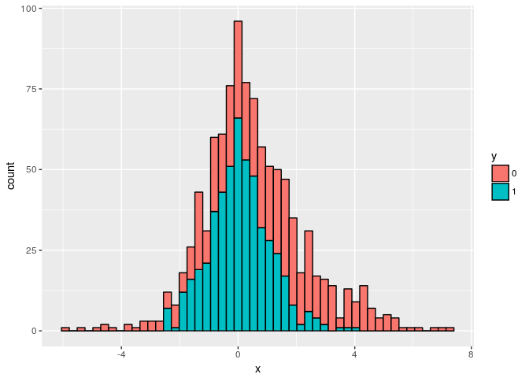

``` r
# 使用分面功能
ggplot(data = df, mapping = aes(x = x)) + 
       geom_histogram(bins = 50, fill = 'steelblue', colour = 'black') + 
       facet_grid(. ~ y)
```

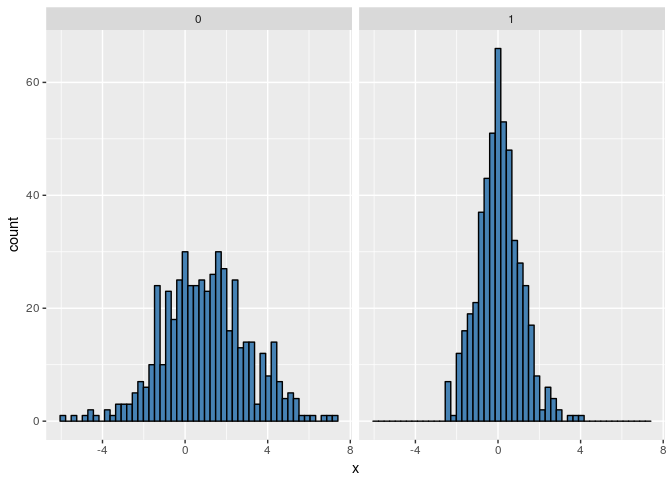

除了直方图可以很好的表达数据的分布情况，还可以通过核密度曲线生成数据的分布估计，下面使用geom\_density()函数和geom\_line()函数中stat=’density’两种方法绘制核密度曲线。

绘制核密度曲线
--------------

``` r
# 使用geom_density()函数绘制核密度曲线
state <- as.data.frame(state.x77)
ggplot(data = state, mapping = aes(x = Income)) + geom_density()
```

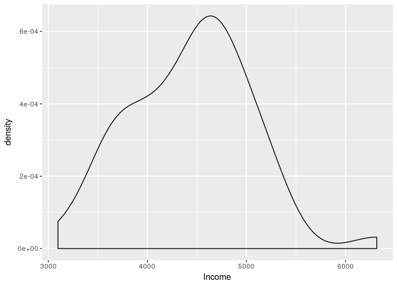

``` r
# geom_line()函数绘制核密度曲线
ggplot(data = state, mapping = aes(x = Income)) + geom_line(stat = 'density')
```

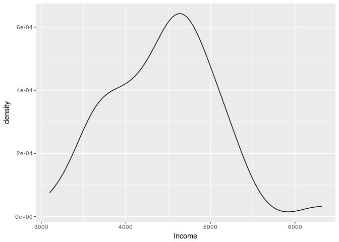

这两幅图的最大区别就是geom\_density()函数绘制的核密度图两侧和底部有线段。

有关核密度图的一个非常重要参数就是带宽，**带宽越大，曲线越光滑，默认带宽为1**，可以通过adjust参数进行调整。

``` r
# 为了对比不同带宽，将密度图绘制在一起
ggplot(data = state, mapping = aes(x = Income)) + 
  geom_line(stat = 'density', adjust = 0.5, colour = 'red',size = 2) + 
  geom_line(stat = 'density', adjust = 1, colour = 'black', size = 2) + 
  geom_line(stat = 'density', adjust = 2, colour = 'steelblue', size = 2)
```

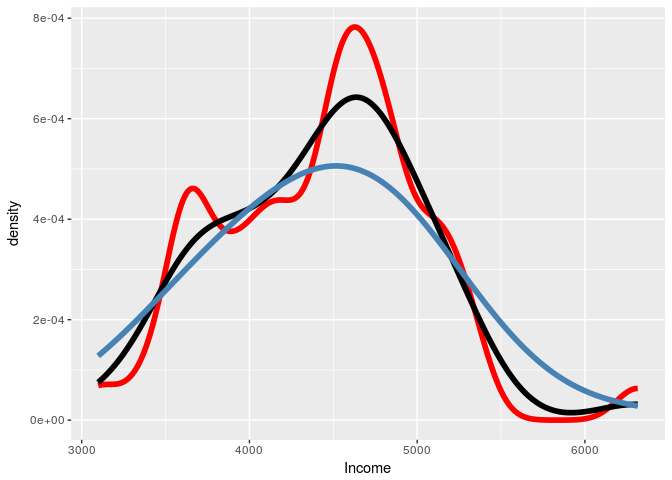

``` r
# 而且还可以为密度图填充颜色，但这里必须使用geom_density()函数。
ggplot(data = state, mapping = aes(x = Income)) + 
  geom_density(adjust = 0.5, fill = 'red', alpha = .2) + 
  geom_density(adjust = 1, fill = 'black', alpha = .5) + 
  geom_density(adjust = 2, fill = 'steelblue', alpha = .4)
```

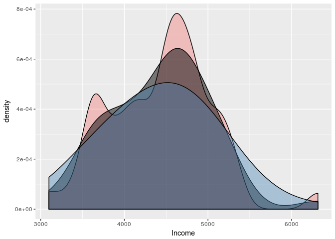

同样，密度曲线也可以进行分组绘制，方法与直方图一致，这里使用两个例子说明：

``` r
# 将分组变量映射给颜色属性
set.seed(1234)
x <- c(rnorm(500), rnorm(500,2,3), rnorm(500, 0,5))
y <- rep(c('A','B','C'), each = 500)
df <- data.frame(x = x, y = y)
ggplot(data = df, mapping = aes(x = x, colour = y)) + 
  geom_line(stat = 'density', size = 2)
```

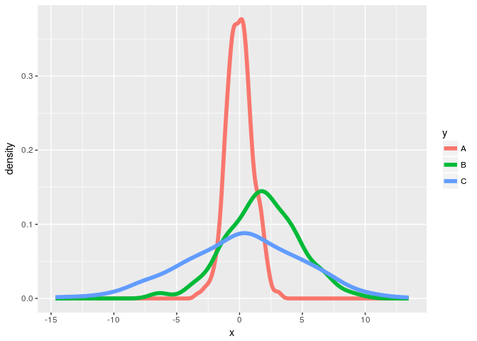

``` r
# 使用分面功能
ggplot(data = df, mapping = aes(x = x, colour = y)) + 
  geom_density(size = 2) + 
  facet_grid(. ~ y)
```

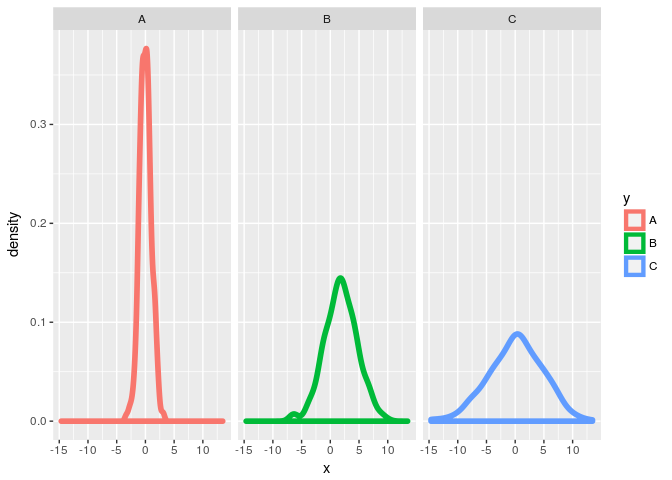

上面分别介绍了直方图和核密度曲线的绘制，接下来将**把两种图形组合在一起**，可对数据的理论分布和实际分布进行比较。

``` r
ggplot(data = df, mapping = aes(x = x)) + 
  geom_histogram(bins = 50, fill = 'blue', colour = 'black') + 
  geom_density(adjust = 0.5, colour = 'black', size = 2) + 
  facet_grid(. ~ y)
```

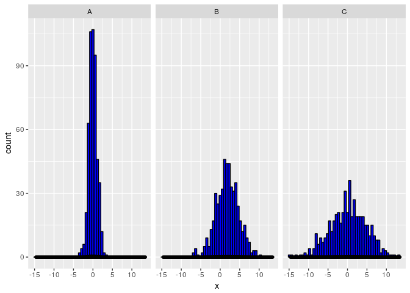

发现一个问题，密度曲线被压成了一条线，原因是密度曲线的纵轴范围为0<sub>1，而直方图的纵轴范围0</sub>120。为解决该问题，只需将直方图中的y值改为..density..即可。

``` r
ggplot(data = df, mapping = aes(x = x)) + 
  geom_histogram(aes(y = ..density..), bins = 50, 
                 fill = 'blue', colour = 'black') + 
  geom_density(adjust = 0.5, colour = 'red') + 
  facet_grid(. ~ y)
```

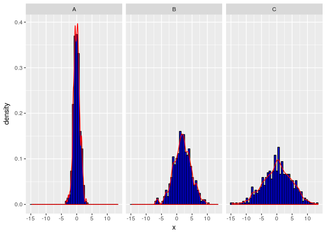

绘制箱线图
----------

**绘制箱线图也是数据探索过程中常用的手法**，箱线图的实现可以使用ggplot2包中的**geom\_boxplot()**绘制。箱线图一般使用在分组变量中，即通过箱线图的比较，发现组别之间的差异。

``` r
ggplot(data = iris, mapping = aes(x = Species, y = Sepal.Width)) + 
  geom_boxplot(fill = 'steelblue')
```


**图中黑点即为离群点**，关于离群点可以将其设置为不同的颜色和形状，用于醒目标示，除此，还可以调整箱线图的宽度,默认宽度为1。

``` r
ggplot(data = iris, mapping = aes(x = Species, y = Sepal.Width)) + 
  geom_boxplot(fill = 'steelblue', outlier.colour = 'red', 
               outlier.shape = 15, width = 1.2)
```

    ## Warning: position_dodge requires non-overlapping x intervals

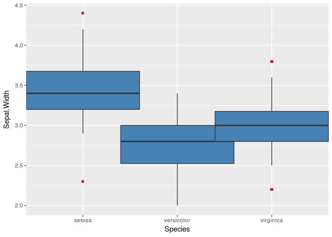

为了比较各组数据中位数的差异，可以为盒形图设置槽口，只需将geom\_boxplot()函数中notch参数设置为TRUE。

``` r
ggplot(data = iris, mapping = aes(x = Species, y = Sepal.Width)) + 
  geom_boxplot(notch = TRUE, fill = 'steelblue', outlier.colour = 'red', 
               outlier.shape = 15, width = 1.2)
```

    ## Warning: position_dodge requires non-overlapping x intervals

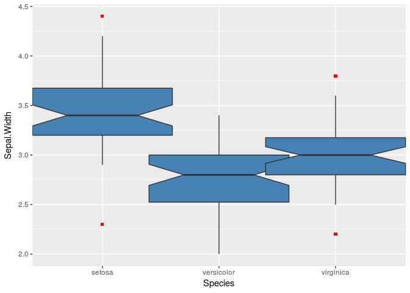

如果各箱线图的槽口互补重合，则说明各组数据的中位数是由差异的。

**如何绘制不分组的箱线图呢？这里的提醒点非常重要：**

1.  必须给x赋一个常量值，赋值将会报错
2.  清除x轴上的刻度标记和标签

``` r
ggplot(data = iris, mapping = aes(x = 'Test', y = Sepal.Width)) + 
  geom_boxplot(fill = 'steelblue', outlier.colour = 'red', 
               outlier.shape = 15, width = 1.2)
```

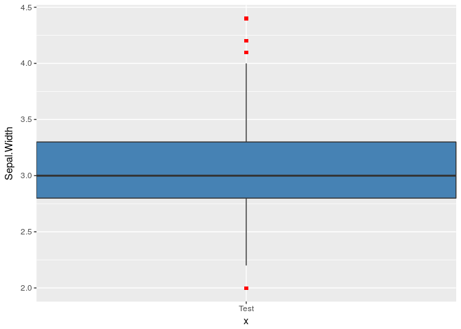

``` r
#清除x轴上的刻度标记和标签
ggplot(data = iris, mapping = aes(x = 'Test', y = Sepal.Width)) + 
  geom_boxplot(fill = 'steelblue', outlier.colour = 'red', 
               outlier.shape = 15, width = 1.2) + 
  theme(axis.title.x = element_blank()) + 
  scale_x_discrete(breaks = NULL)
```

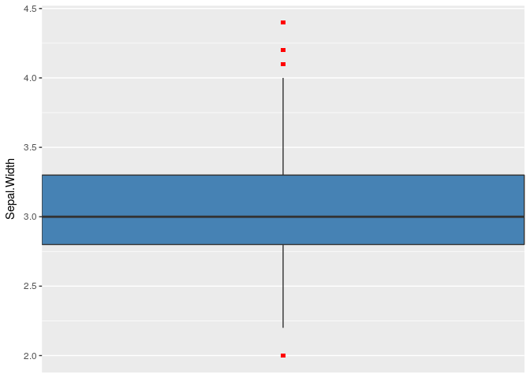

我们发现，对于默认的盒形图，将会展示最小值、下四分位数、中位数、上四分位数和最大值的位置，如果想查看均值或方差的位置该如何添加呢？同样很简单，只需在图层上添加一层stat\_summary()的值即可。

``` r
ggplot(data = iris, mapping = aes(x = 'Test', y = Sepal.Width)) + 
  geom_boxplot(fill = 'steelblue', outlier.colour = 'red', 
               outlier.shape = 15, width = 1.2) + 
  theme(axis.title.x = element_blank()) + 
  scale_x_discrete(breaks = NULL) + 
  stat_summary(fun.y = 'mean', geom = 'point', 
               shape = 18, colour = 'orange', size = 5)
```


绘制小提琴图
------------

小提琴图实质上也是**核密度估计**，其用来对多组数据的分布进行比较，**如果使用上文中的密度曲线时容易被多条彩色曲线所干扰**，而小提琴图是并排排列，对分组数据的分布进行比较比较容易一些。

***绘制普通的小提琴图***

``` r
ggplot(data = iris, mapping = aes(x = Species, y = Sepal.Width)) + 
  geom_violin()
```

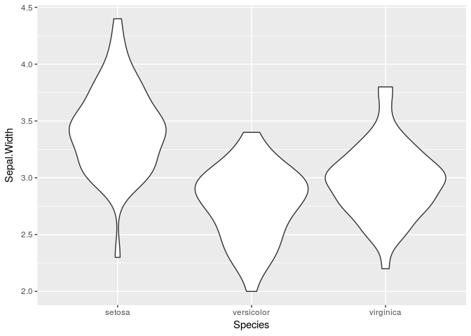

除此，我们还可以**将小提琴图与盒形图进行组合**，即可以了解数据的分布形态，又可以了解数据的具体分布。

***绘制叠加盒形图的小提琴图***

``` r
ggplot(data = iris, mapping = aes(x = Species, y = Sepal.Width)) + 
  geom_violin() + 
  geom_boxplot(width = 0.3, outlier.colour = NA, fill = 'blue') + 
  stat_summary(fun.y = 'median', geom = 'point', 
               shape = 18, colour = 'orange')
```

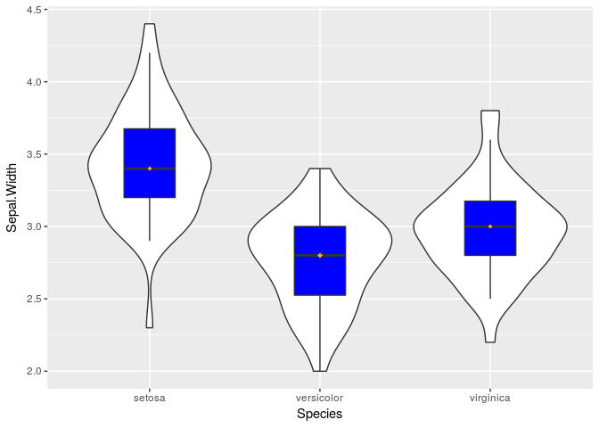

默认情况下，系统对小提琴图进行标准化处理，**使得各组数据对于的图的面积一样**，如果对这样的设置不满，还**可以将sacle参数设为'count'，使图的面积观测值数目成正比**。

``` r
set.seed(1234)
x <- rep(c('A','B','C'), times = c(100,300,200))
y <- c(rnorm(100), rnorm(300,1,2), rnorm(200,2,3))
df <- data.frame(x = x, y = y)
ggplot(data = df, mapping = aes(x = x, y = y)) + 
  geom_violin(scale = 'count') + 
  geom_boxplot(width = 0.1, outlier.colour = NA, fill = 'blue') + 
  stat_summary(fun.y = 'median', geom = 'point', 
               shape = 18, colour = 'orange')
```

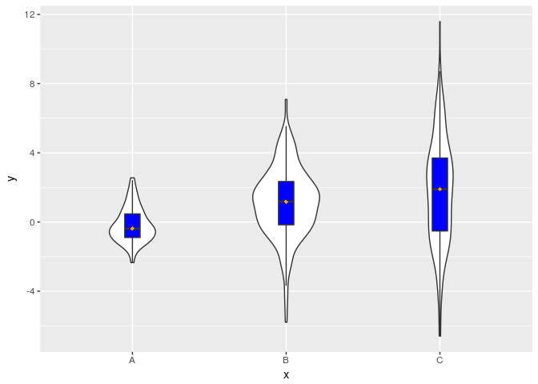

很明显，小提琴图的面积大小有很大差异，原因是各组的观测数量分别为100,300和200。

绘制二维密度分布图
------------------

以上数据的探索均是基于1维数据的直方图、核密度曲线、盒形图和小提琴图，下面使用ggplot2包探索一下2维数据的分布情况，**有关二维数据的分布常使用密度图进行探索**。

使用stat\_density2d()函数实现二维数据的核密度估计，具体探索见下文的几个例子

``` r
library(C50)
data(churn)

#绘制散点图和密度等高线
ggplot(data = churnTrain, 
       mapping = aes(x = total_day_minutes, y = total_eve_calls)) + 
  geom_point() + 
  stat_density2d()
```

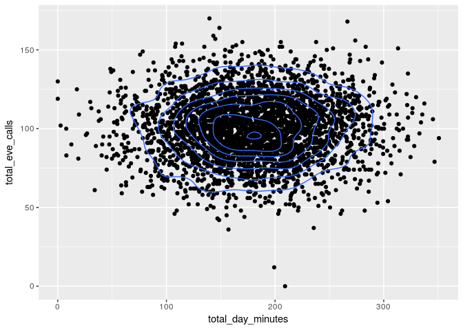

``` r
#使用..level..，将密度曲面的高度映射给等高线的颜色
ggplot(data = churnTrain, 
       mapping = aes(x = total_day_minutes, y = total_eve_calls)) + 
  stat_density2d(aes(colour = ..level..)) + 
  scale_color_gradient(low = 'lightblue', high = 'darkred')
```

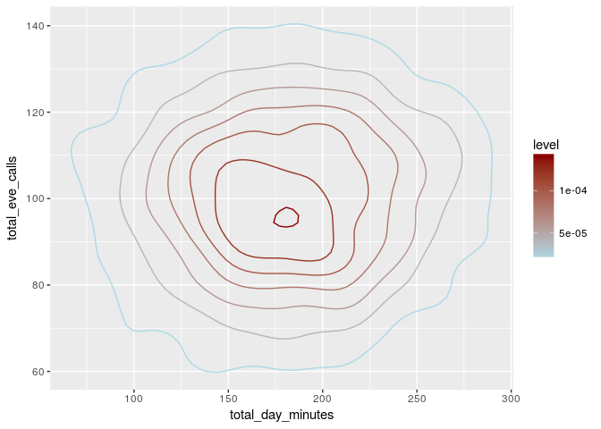

由上面两幅图发现，**衡量数据分布的密集情况是通过默认的等高线展示，也可以选择瓦片图展示数据的分布情况**。

``` r
#将密度估计映射给填充色
ggplot(data = churnTrain, 
       mapping = aes(x = total_day_minutes, y = total_eve_calls)) + 
  stat_density2d(aes(fill = ..density..), 
                 geom = 'tile', contour = FALSE)
```

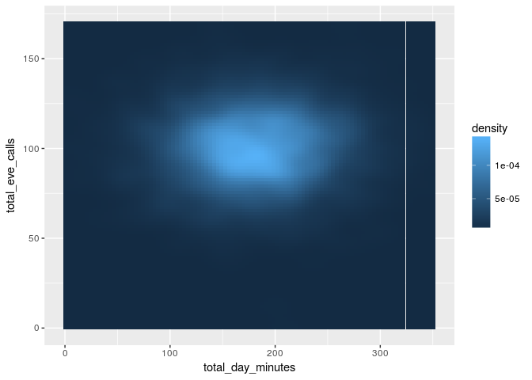

``` r
#将密度估计映射给透明度
ggplot(data = churnTrain, 
       mapping = aes(x = total_day_minutes, y = total_eve_calls)) + 
  stat_density2d(aes(alpha = ..density..), 
                 geom = 'tile', contour = FALSE)
```

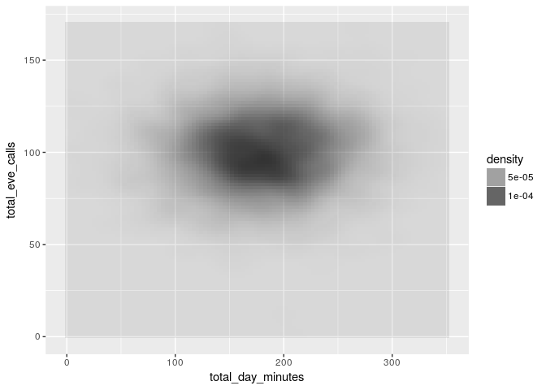

前文中我们说过，核密度曲线是有一个非常重要的参数，即带宽，可以通过带宽的调整提高核密度曲线对实际数据分布的估计精度，**同样在二维核密度曲线中，也可以为两个变量设置带宽，所不同的是，这里设置带宽用参数h实现**。

``` r
ggplot(data = iris, mapping = aes(x = Petal.Length, y = Petal.Width)) + 
  stat_density2d(aes(alpha = ..density..), 
                 geom = 'tile', contour = FALSE, h = c(0.1,0.2))
```

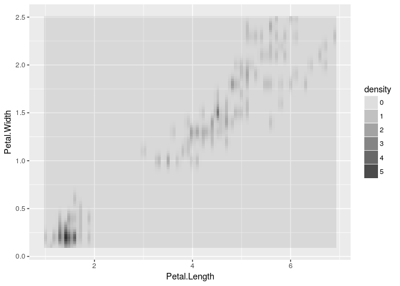

使用ggplot2绘制分面图形
=======================

在之前的一系列ggplot2绘图中都没有涉及到关于分面的操作，分面是数据可视化最实用的技术之一，**通过facet\_grid()和facet\_wrap()函数将分组数据横向或纵向或横纵向排列**，这样更有助于图形之间的比较。

一、绘制分面图
--------------

``` r
library(ggplot2)
# 创建模拟数据集
set.seed(1234)
M <- c('一月','二月','三月','四月','五月','六月','七月','八月','九月','十月','十一月','十二月')
Month <- rep(M, each = 5)
Region <- rep(c('East','South','West','North','Center'), times = 12)
Amount <- round(runif(n = 60, min = 500, max = 5000))
df <- data.frame(Month = Month, Region = Region, Amount = Amount)
```

首先用facet\_grid()函数绘制横向或纵向分面图

``` r
# 绘制横向的分面图
ggplot(data = df, mapping = aes(x = Region, y = Amount, fill = Region)) + 
  geom_bar(stat = 'identity') + 
  facet_grid(. ~ Month) + 
  theme(axis.text.x = element_blank(), axis.ticks.x = element_blank())
```

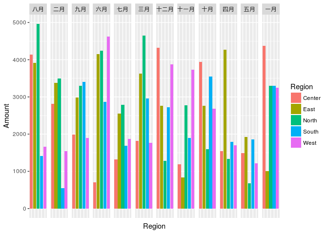

这样一幅横向分面的条形图就绘制成功了，下面在看看纵向分面图该如何绘制？

``` r
#绘制纵向的分面图
ggplot(data = df, mapping = aes(x = Region, y = Amount, fill = Region)) + 
  geom_bar(stat = 'identity') + 
  facet_grid(Month ~ .) + 
  theme(axis.text.x = element_blank(), axis.ticks.x = element_blank())
```

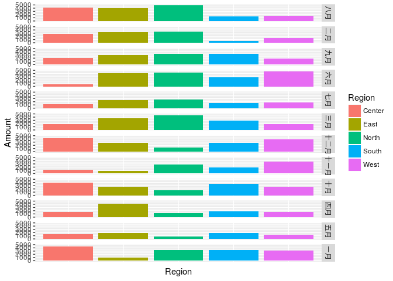

图形很难看，我们从新构建一组数据以绘制纵向的分面图：

``` r
set.seed(1234)
Year <- rep(seq(from = 2001, to = 2015),times = 4)
Type <- rep(c('A','B','C','D'), each = 15)
Value <- round(runif(60, min = 10, max = 100))
df2 <- data.frame(Year = Year, Type = Type, Value = Value)

#绘制纵向的分面图
ggplot(data = df2, mapping = aes(x = factor(Year), y = Value, group = 1)) + 
  geom_line(colour = 'blue') + 
  xlab('Year') + 
  facet_grid(Type ~ .)
```

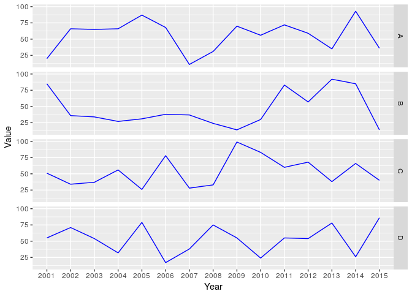

我们按照facet\_grid()函数的语法，使用facet\_wrap()函数绘制分面图：

``` r
# #绘制横向的分面图
# ggplot(data = df, mapping = aes(x = Region, y = Amount, fill = Region)) + 
#   geom_bar(stat = 'identity') + 
#   facet_wrap(.~ Month) + 
#   theme(axis.text.x = element_blank(), axis.ticks.x = element_blank())
```

报错了！显示错误内容为：分面中至少包含一个分层变量。经查帮助，facet\_wrap()函数的语法不能写成.~ Month格式！于是改成下方的格式：

``` r
ggplot(data = df, mapping = aes(x = Region, y = Amount, fill = Region)) + 
  geom_bar(stat = 'identity') + 
  facet_wrap(~ Month) + 
  theme(axis.text.x = element_blank(), axis.ticks.x = element_blank())
```

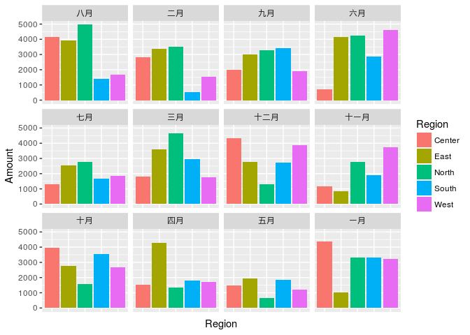

运行成功！接下来我们看看纵向的分面图：

``` r
# #绘制纵向的分面图
# ggplot(data = df, mapping = aes(x = Region, y = Amount, fill = Region)) + 
#   geom_bar(stat = 'identity') + 
#   facet_wrap(Month ~) + 
#   theme(axis.text.x = element_blank(), axis.ticks.x = element_blank())
```

又一次报错！报错内容为：语法中存在错误的')'。查看帮助后发现：使用facet\_wrap()函数不能使用Month <sub>语法，只能是类似于</sub>a + b或('a','b')的形式。

经过了摸打滚爬，我们应该发现**facet\_grid()函数和facet\_wrap()函数的区别**了吧，下面总结一下：

1.  facet\_grid()函数会严格按照用户指定的方向分面，即横向分面必须是.<sub>x的格式，纵向分面必须是y.</sub>的格式，当然也可以y~x表示纵横两个维度的方向进行分面绘图；**facet\_wrap()函数不存在横向或纵向或横纵向的分面，其实他就像按照从左到右，从上到下的顺序摆放每一个分面图**。
2.  语法上有显著的区别，**facet\_grid()函数必须是y<sub>.或.</sub>x或y<sub>x的格式，而facet\_wrap()函数只能是</sub>x的格式，与之等价的是加引号的分面变量名称，即'x'**。
3.  上面的图形中，没有展现出来，其实**facet\_wrap()函数可以自由排版分面行方向的个数和列方向的个数，通过nrow=和ncol=参数实现**，而facet\_grid()函数只能是一根筋的下来，即要么全在行方向上，要么全在列方向上，要么就在组合方向上。下面举个facet\_wrap()函数指定列数的分面图例子：

``` r
ggplot(data = df, mapping = aes(x = Region, y = Amount, fill = Region)) + 
  geom_bar(stat = 'identity') + 
  facet_wrap(~Month, ncol = 3) + 
  theme(axis.text.x = element_blank(), axis.ticks.x = element_blank())
```

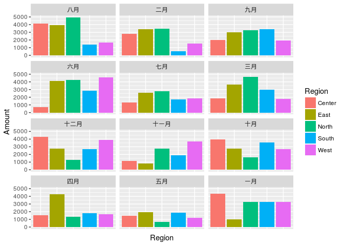

上图可知，我们控制了列数为3的分面图，当然根据实际情况，也可以随意的设置其他列数或行数。

善于发现问题的朋友，一定迫不可待的问一个问题，分面图按月份绘制的话，为什么月份不是正常的“一月”到“十二月”的顺序，而是按照拼音的字母顺序排列。如果我想按照自定义的顺序展现我的分面图该如何操作呢？很简单，只需要从新**定义字符变量的因子顺序**即可：

``` r
df$Month <- factor(df$Month, 
                   levels = c('一月','二月','三月','四月','五月','六月',
                              '七月','八月','九月','十月','十一月','十二月'))
#通过facet_wrap()函数绘制分面图
ggplot(data = df, mapping = aes(x = Region, y = Amount, fill = Region)) + 
  geom_bar(stat = 'identity') + 
  facet_wrap(~Month, ncol = 3) + 
  theme(axis.text.x = element_blank(), 
        axis.ticks.x = element_blank())
```

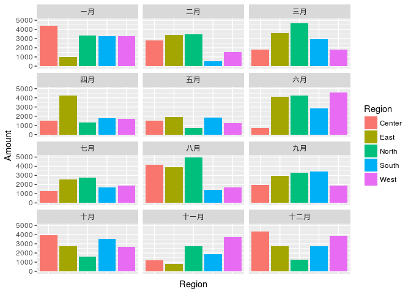

这下顺序正常了，而且也可以从季度的顺序发现图形展现之间的规律或特征。同样，**我们也可以使用facet\_grid()函数绘制分面图**：

``` r
ggplot(data = df, mapping = aes(x = Region, y = Amount, fill = Region)) + 
  geom_bar(stat = 'identity') + 
  facet_grid(. ~ Month) + 
  theme(axis.text.x = element_blank(), axis.ticks.x = element_blank())
```

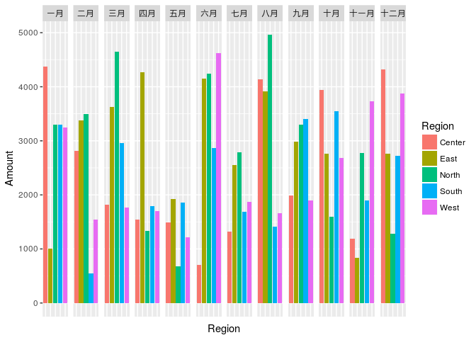

同样也是按照指定的顺序进行排列。

二、分面图的微调
----------------

关于分面图的微调，这里就说明三项常用的微调手段，即：

### 非固定的坐标轴

``` r
set.seed(1234)
height <- c(runif(100, min = 60, max = 195), 
            runif(80, min = 45, max = 175))
weight <- 1.2*height + rnorm(180, mean = 10, sd = 20)
sex = rep(c('M','F'), times = c(100, 80))
df3 <- data.frame(sex = sex, height = height, weight = weight)
ggplot(data = df3, mapping = aes(x = height, y = weight)) + 
  geom_point(colour = 'blue', size = 3) + 
  facet_grid(.~sex)
```


**默认情况下，分面图的纵坐标和横坐标的范围是一致的**，如果我想让分面图横坐标轴的范围随实际数据大小进行调整，该如何实现？

``` r
ggplot(data = df3, mapping = aes(x = height, y = weight)) + 
  geom_point(colour = 'blue', size = 3) + 
  facet_grid(.~sex, scales = 'free_x')
```

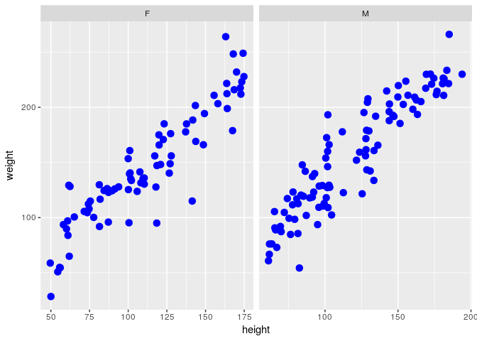

图形结果很明显，**女性（F）与男性（M）的横坐标范围各不相同，男性的范围要比女性大一些**。**这里需要强调的是**，横向分面只能控制各自的x轴是否自由设定，纵向分面只能控制各自的y轴是否自由设定，纵横交错的分面可以同时设定两轴是否自由。

### 修改分面的文本标签

分面图形的默认情况下只显示分组变量的水平，即F和M，一个陌生人可能并不知道F和M各代表什么含义，如果能够把相应的分组变量名称也加入进来就更能提高可读性，下面通过修改一点点的脚本就能实现这样的功能：

``` r
ggplot(data = df3, mapping = aes(x = height, y = weight)) + 
  geom_point(colour = 'blue', size = 3) + 
  facet_grid(.~sex, labeller = label_both)
```

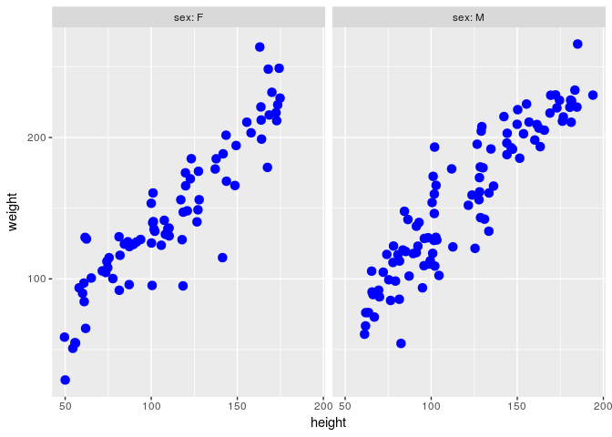

简单吧，**只需将设置labeller = label\_both就可以实现功能**，如果你还觉得这样做不够清晰，我还想把F和M改为Female和Male，该怎么办呢？同样很简单，只需要更改原数据中水平的标签即可。

``` r
levels(df3$sex)[levels(df3$sex)=='F'] <- 'Female'
levels(df3$sex)[levels(df3$sex)=='M'] <- 'Male'
ggplot(data = df3, mapping = aes(x = height, y = weight)) + 
  geom_point(colour = 'blue', size = 3) + 
  facet_grid(.~sex, labeller = label_both)
```


### 修改分面标签外观

通常修改图形的外观都是通过主题theme()函数实现，毫不例外，这里也使用主题函数对分面标签外观进行修改。

``` r
ggplot(data = df3, mapping = aes(x = height, y = weight)) + 
  geom_point(colour = 'blue', size = 3) + 
  facet_grid(.~sex, labeller = label_both) + 
  theme(strip.text = element_text(colour = 'red', face = 'bold', 
                                  size = rel(1.5)), 
        strip.background = element_rect(fill = 'white', colour = 'brown', 
                                        size = rel(2), linetype = 2))
```

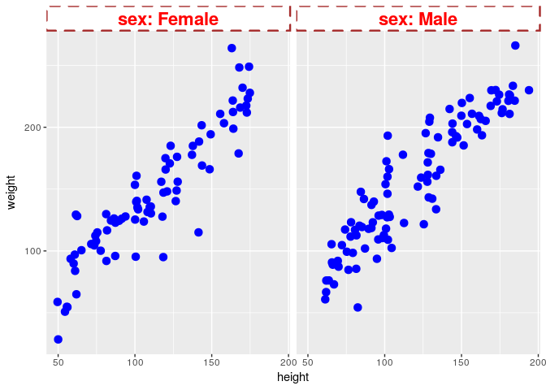

其中，**参数strip.text设置**分面标签的颜色、大小、字体等；**参数strip.background设置**分面标签背景的填充色、线框色、线型等；**rel()设置**字体大小或线宽为原主题的倍数。

绘制双轴坐标图形
================

下面介绍**plotrix包中的twoord.plot()函数和twoord.stackplot()函数**，它们可以实现双坐标轴图形的绘制。

``` r
# twoord.plot()函数语法及参数含义：
# twoord.plot(lx,ly,rx,ry,data=NULL,main="",
#         xlim=NULL,lylim=NULL,rylim=NULL,
#         mar=c(5,4,4,4),lcol=1,rcol=2,
#         xlab="",lytickpos=NA,ylab="",
#         ylab.at=NA,rytickpos=NA,rylab="",
#         rylab.at=NA,lpch=1,rpch=2,
#         type="b",xtickpos=NULL,
#         xticklab=NULL,halfwidth=0.4,
#         axislab.cex=1,do.first=NULL,...)
# lx,ly,rx,ry：分别指定左坐标轴和右坐标轴的值，必须是连续的值
# data：需要绘制双轴图形的数据框
# main：为图形指定标题
# xlim：限制横坐标值的范围
# lylim,rylim：限制左右纵坐标值的范围
# mar：设置图形边界距，默认值为(5,4,4,4)
# lcol,rcol：设置左右坐标轴的颜色，这样可以起到图例的作用
# xlab：设置横坐标轴标签
# lytickpos：设置左坐标轴刻度标签的位置
# ylab：设置左坐标轴标签
# ylab.at：设置左坐标轴标签位置
# rytickpos：设置右坐标轴刻度标签的位置
# rylab：设置又坐标轴标签
# rylab.at：设置右坐标轴标签位置
# lpch,rpch：设置左右坐标轴图形的外观
# type：指定图形类型
# xtickpos：设置横坐标轴刻度标签位置
# xticklab：设置横坐标轴刻度标签
# halfwidth：设置用户给定条形图宽度的一半
# axislab.cex：设置坐标轴标签和刻度标签的大小
# do.first：通过该参数可以往图形中添加背景色或网格线
```

下面通过案例来说明**twoord.plot()函数**的应用：

``` r
library(plotrix)
```

``` r
##绘制双轴的两个线图

Date <- seq(from = as.Date('2015-01-01'), to = as.Date('2015-12-01'), 
            by = 'month')
Consumers <- c(100,80,120,153,200,188,220,322,300,321,282,304)
Amount <- c(1000,840,1458,1844,2045,2000,2548,5081,5000,5200,4800,4971)
df1 <- data.frame(Date = Date, Consumers=Consumers, Amount = Amount)
twoord.plot(lx = df1$Date, ly = df1$Consumers, rx = df1$Date, ry = df1$Amount, 
            main = '双轴的两条线图', xlab = '月份', ylab = '会员人数', 
            rylab = '总消费额', type = c('line','line'))
```

    ## Warning in plot.xy(xy.coords(x, y), type = type, ...): 绘图种类'line'被缩短
    ## 成第一个字符

    ## Warning in plot.xy(xy.coords(x, y), type = type, ...): 绘图种类'line'被缩短
    ## 成第一个字符

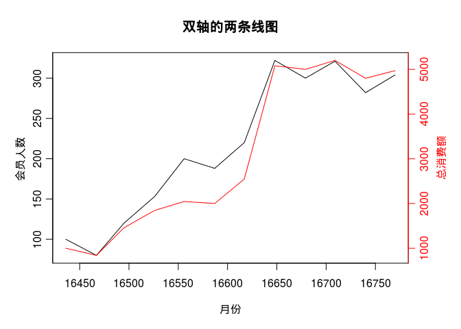

虽然双坐标轴图形已经绘制好，但图中有几个不满意的地方：

1.  横坐标轴的刻度标签不是正确的日期格式

2.  右坐标轴刻度标签很挤

3.  图形不炫酷，想添加背景色或网格线

这些不满意的地方都不是问题，twoord.plot()函数可以轻松搞定：

1.  通过xticklab参数重新设置横坐标轴的刻度标签

2.  通过rytickpos参数重新设置刻度标签

3.  通过do.first参数给图形添加背景色和网格线

``` r
twoord.plot(lx = df1$Date, ly = df1$Consumers, 
            rx = df1$Date, ry = df1$Amount, main = '双轴的两条线图', 
            xlab = '月份', ylab = '会员人数', rylab = '总消费额', 
            type = c('line','line'), xtickpos=as.numeric(df1$Date), 
            xticklab = as.character(df1$Date), 
            rytickpos = seq(500,5000,by = 1500), 
            do.first = 'plot_bg(col = \'gray\'); grid(col = \'white\', lty = 2)')
```

    ## Warning in plot.xy(xy.coords(x, y), type = type, ...): 绘图种类'line'被缩短
    ## 成第一个字符

    ## Warning in plot.xy(xy.coords(x, y), type = type, ...): 绘图种类'line'被缩短
    ## 成第一个字符

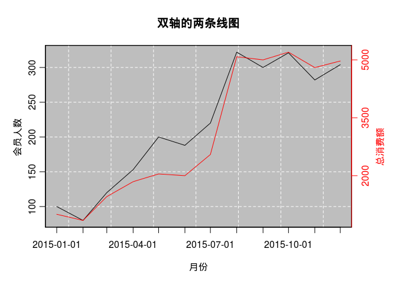

这样的图形结果要比上面的图看起来舒服多了。如果想把左坐标轴的会员人数用条形图表示，右坐标轴的总消费额用线条表示，该如何操作呢？很简单，只需**将type参数设置为('bar','line')**就可以了：

``` r
twoord.plot(lx = df1$Date, ly = df1$Consumers, 
            rx = df1$Date, ry = df1$Amount, lcol = 'steelblue', 
            main = '双轴的两条线图', xlab = '月份', ylab = '会员人数', 
            rylab = '总消费额', type = c('bar','line'), 
            xtickpos=as.numeric(df1$Date), xticklab = as.character(df1$Date), 
            rytickpos = seq(500,5000,by = 1500), 
            do.first = 'plot_bg(col = \'gray\'); grid(col = \'white\', lty = 2)')
```

    ## Warning in plot.xy(xy.coords(x, y), type = type, ...): 绘图种类'line'被缩短
    ## 成第一个字符

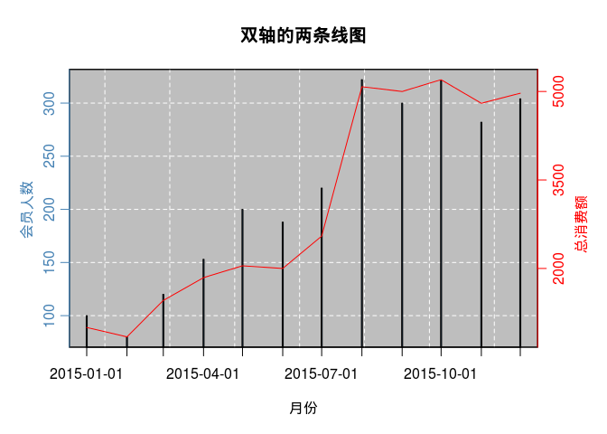

哎？又有问题了，这个条形图怎么这么细窄？超级难看。不要着急，只要稍稍调整halfwidth参数的大小即可，这里设置为8：

``` r
twoord.plot(lx = df1$Date, ly = df1$Consumers, 
            rx = df1$Date, ry = df1$Amount, lcol = 'steelblue', 
            main = '双轴的两条线图', xlab = '月份', ylab = '会员人数', 
            rylab = '总消费额', type = c('bar','line'), 
            xtickpos=as.numeric(df1$Date), xticklab = as.character(df1$Date), 
            rytickpos = seq(500,5000,by = 1500), halfwidth = 8, 
            do.first = 'plot_bg(col = \'gray\'); grid(col = \'white\', lty = 2)')
```

    ## Warning in plot.xy(xy.coords(x, y), type = type, ...): 绘图种类'line'被缩短
    ## 成第一个字符

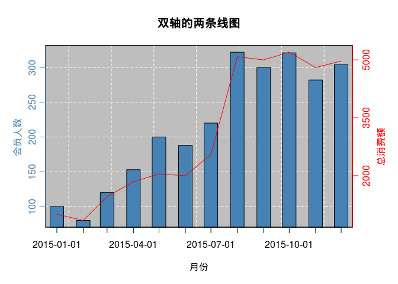

这会儿图形正常了。还记得直方图是如何绘制的吗？hist()函数，直方图+核密度图是如何绘制的？hist()函数+lines()函数：

``` r
set.seed(1000)
x = rnorm(1000,10,3)
h <- hist(x, breaks = 50)
```

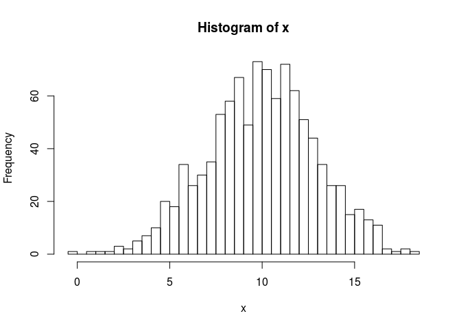

绘制直方图和核密度图
--------------------

``` r
hist(x, breaks = 50, col = 'steelblue')
lines(density(x), col = 'red')
```


哎？核密度线怎么成了一条直线了？原来是因为直方图高度对于的频次与核密度值不是一个量纲，即频次在0<sub>60之间，而核密度值在0</sub>1之间。如果要使核密度曲线体现出来，必须**将hist()函数中freq参数设置为FALSE**：

``` r
hist(x, breaks = 50, col = 'steelblue', freq = FALSE)
lines(density(x), col = 'red', lwd=2)
```

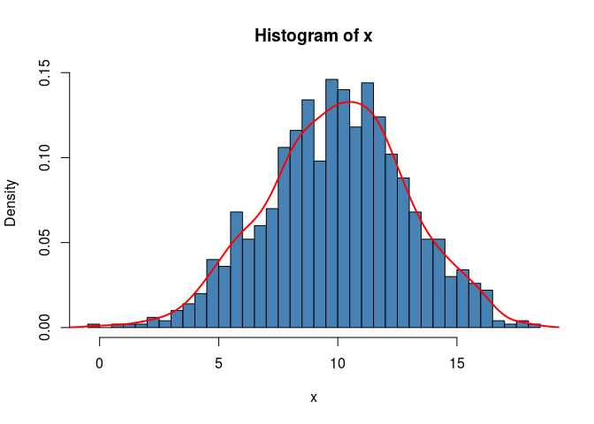

如果我既想看到不同组的频次，又想看到对应的密度值该怎么办呢？这个时候就需要绘制**双轴图**了：

``` r
x1 <- h$mids
y1 <- h$counts
x2 <- seq(min(x), max(x), by = 0.01)
y2 <- dnorm(seq(min(x), max(x), by = 0.01),10,3)
twoord.plot(lx = x1, ly = y1, rx = x2, ry = y2, 
            type=c('bar','l'), lcol = 'steelblue', rcol = 'red', 
            ylab = 'Counts', rylab = 'Density', 
            main = 'Histogram and density curve', halfwidth=0.2, 
            lylim = c(0,max(y1)+1), rylim = c(0,0.2),lwd=2)
```

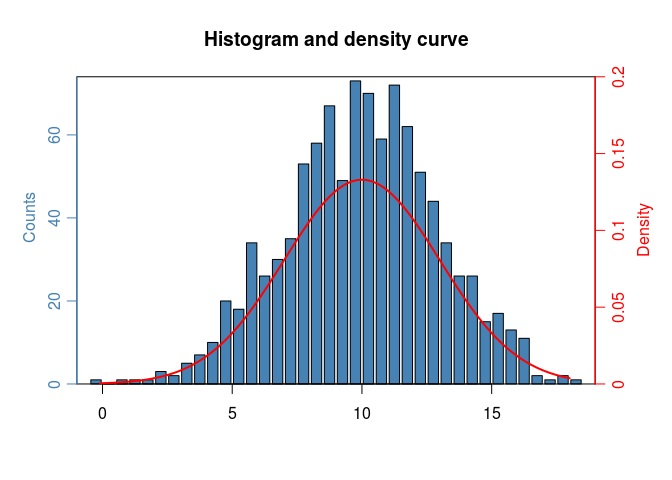

关于twoord.plot()函数，最后再介绍一种图，帕累托图形。即图形中包一个纵坐标轴表示绝对数量，另一个纵坐标轴表示累计百分比。实现该图脚本如下：

``` r
type <- 1:7
absolute <- c(12,15,20,28,11,5,7)
cum_per <- cumsum(absolute)/sum(absolute)
twoord.plot(lx = type, ly = absolute, rx = type, ry = cum_per, 
            type=c('bar','l'), lcol = 'steelblue', rcol = 'red', 
            ylab = '总数', rylab = '累计百分比%', main = '帕累托图', 
            xtickpos=type, xticklab = c('A','B','C','D','E','F','G'))
```

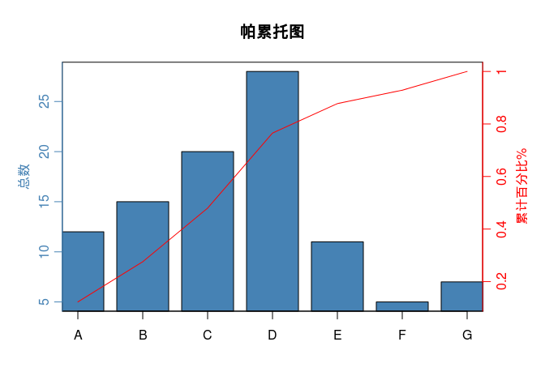

下面再看一下twoord.stackplot()函数，该函数与twoord.plot()的不同之处在于，其可以**绘制堆叠图**，函数具体语法和参数含义如下：

``` r
# twoord.stackplot(lx, rx, ldata, rdata,
#           lcol, rcol, ltype, rtype,
#           border, rylab, lylab, xlab,
#           ..., incrylim=NULL,halfwidth=0.4,
#           leftfront=FALSE, 
#           mar = c(5, 4, 4, 4))
# lx,rx：指定左右横坐标轴的值
# ldata,rdata：指定左右纵坐标轴的值
# lcol, rcol：指定左右坐标轴的颜色
# ltype, rtype：指定左右坐标轴线的类型
# border：指定条形图边框颜色
# rylab,lylab：指定左右纵坐标轴标签
# xlab：指定横坐标轴标签
# incrylim：增加坐标轴值的范围
# halfwidth：设置用户给定条形图宽度的一半
# leftfront：如果leftfront设置为TRUE的话，则左坐标轴将置于顶层
# mar：设置图形边界距，默认值为(5,4,4,4)
```

现在有一个场景是这样的，需要绘制某APP在2015年各月中新老会员人数及新会员所占比重：

``` r
set.seed(1111)
Date <- 1:12
Old <- round(runif(12, 100,300))
New <- round(runif(12, 50,120))
Ratio <- New/(New+Old)
twoord.stackplot(lx=Date, rx=Date, 
                 ldata=cbind(Old, New), rdata=Ratio,
                 lcol=c('steelblue','orange'), rcol='red', 
                 ltype='bar',rtype='l', border='grey80', 
                 lylab = '人数', rylab = '新客比例', xlab='月份',
                 main='新老客占比', incrylim=0.1)
```

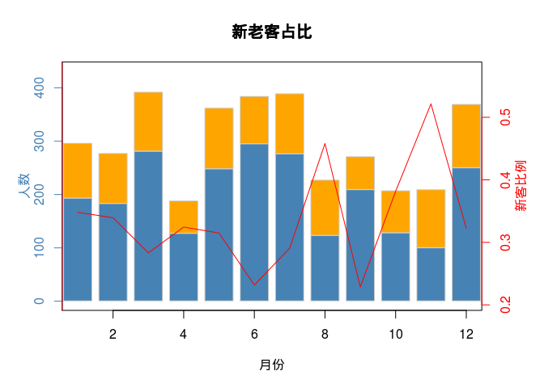

绘制相关系数图
==============

虽然**cor()函数**可以非常方便快捷的计算出连续变量之间的相关系数，但当变量非常多时，返回的相关系数一定时读者看的眼花缭乱。 下面就以R自带的mtcars数据集为例，讲讲相关系数图的绘制：

``` r
cor(mtcars[1:7])
```

    ##             mpg        cyl       disp         hp        drat         wt
    ## mpg   1.0000000 -0.8521620 -0.8475514 -0.7761684  0.68117191 -0.8676594
    ## cyl  -0.8521620  1.0000000  0.9020329  0.8324475 -0.69993811  0.7824958
    ## disp -0.8475514  0.9020329  1.0000000  0.7909486 -0.71021393  0.8879799
    ## hp   -0.7761684  0.8324475  0.7909486  1.0000000 -0.44875912  0.6587479
    ## drat  0.6811719 -0.6999381 -0.7102139 -0.4487591  1.00000000 -0.7124406
    ## wt   -0.8676594  0.7824958  0.8879799  0.6587479 -0.71244065  1.0000000
    ## qsec  0.4186840 -0.5912421 -0.4336979 -0.7082234  0.09120476 -0.1747159
    ##             qsec
    ## mpg   0.41868403
    ## cyl  -0.59124207
    ## disp -0.43369788
    ## hp   -0.70822339
    ## drat  0.09120476
    ## wt   -0.17471588
    ## qsec  1.00000000

**很显然，这么多数字堆在一起肯定很难快速的发现变量之间的相关性大小**，如果可以将相关系数可视化，就能弥补一大堆数字的缺陷了。这里介绍**corrplot包中的corrplot()函数**进行相关系数的可视化，首先来看看该函数的语法和一些重要参数：

``` r
# corrplot(corr, 
#          method = c("circle", "square", "ellipse", "number", "shade", "color", "pie"),
#          type = c("full", "lower", "upper"), add = FALSE,
#          col = NULL, bg = "white", title = "", is.corr = TRUE, 
#          diag = TRUE, outline = FALSE, mar = c(0, 0, 0, 0), 
#          addgrid.col = NULL, addCoef.col = NULL, addCoefasPercent = FALSE, 
#          order = c("original", "AOE", "FPC", "hclust", "alphabet"), 
#          hclust.method = c("complete", "ward", "ward.D", "ward.D2", "single", 
#                            "average", "mcquitty", "median", "centroid"),
#          addrect = NULL, rect.col = "black", rect.lwd = 2, 
#          tl.pos = NULL, tl.cex = 1, 
#          tl.col = "red", tl.offset = 0.4, tl.srt = 90,
#          cl.pos = NULL, cl.lim = NULL, 
#          cl.length = NULL, cl.cex = 0.8, cl.ratio = 0.15, 
#          cl.align.text = "c", cl.offset = 0.5, number.cex = 1,
#          number.font = 2, number.digits = NULL, 
#          addshade = c("negative", "positive", "all"), 
#          shade.lwd = 1, shade.col = "white", p.mat = NULL, sig.level = 0.05, 
#          insig = c("pch", "p-value", "blank", "n"), 
#          pch = 4, pch.col = "black", pch.cex = 3, 
#          plotCI = c("n", "square", "circle", "rect"), 
#          lowCI.mat = NULL, uppCI.mat = NULL, 
#          na.label = "?", na.label.col = "black", ...)
# corr：需要可视化的相关系数矩阵
# method：指定可视化的方法，可以是圆形、方形、椭圆形、数值、阴影、颜色或饼图形
# type：指定展示的方式，可以是完全的、下三角或上三角
# col：指定图形展示的颜色，默认以均匀的颜色展示
# bg：指定图的背景色
# title：为图形添加标题
# is.corr：是否为相关系数绘图，默认为TRUE，同样也可以实现非相关系数的可视化，只需使该参数设为FALSE即可
# diag：是否展示对角线上的结果，默认为TRUE
# outline：是否绘制圆形、方形或椭圆形的轮廓，默认为FALSE
# mar：具体设置图形的四边间距
# addgrid.col：当选择的方法为颜色或阴影时，默认的网格线颜色为白色，否则为灰色
# addCoef.col：为相关系数添加颜色，默认不添加相关系数，只有方法为number时，该参数才起作用
# addCoefasPercent：为节省绘图空间，是否将相关系数转换为百分比格式，默认为FALSE
# order：指定相关系数排序的方法，可以是原始顺序(original)、特征向量角序(AOE)、第一主成分顺序(FPC)、层次聚类顺序(hclust)和字母顺序，一般”AOE”排序结果都比”FPC”要好
# hclust.method：当order为hclust时，该参数可以是层次聚类中ward法、最大距离法等7种之一
# addrect：当order为hclust时，可以为添加相关系数图添加矩形框，默认不添加框，如果想添加框时，只需为该参数指定一个整数即可
# rect.col：指定矩形框的颜色
# rect.lwd：指定矩形框的线宽
# tl.pos：指定文本标签(变量名称)的位置，当type=full时，默认标签位置在左边和顶部(lt)，当type=lower时，默认标签在左边和对角线(ld)，当type=upper时，默认标签在顶部和对角线，d表示对角线，n表示不添加文本标签
# tl.cex：指定文本标签的大小
# tl.col：指定文本标签的颜色
# cl.pos：图例（颜色）位置，当type=upper或full时，图例在右表(r)，当type=lower时，图例在底部，不需要图例时，只需指定该参数为n
# addshade：只有当method=shade时，该参数才有用，参数值可以是negtive/positive和all，分表表示对负相关系数、正相关系数和所有相关系数添加阴影。注意：正相关系数的阴影是45度，负相关系数的阴影是135度
# shade.lwd：指定阴影的线宽
# shade.col：指定阴影线的颜色
```

虽然该函数的参数比较多，但可以组合各种参数，灵活实现各种各样的相关系数图。下面就举几个例子：

``` r
library(corrplot)
corr <- cor(mtcars[,1:7])
#参数全部默认情况下的相关系数图
corrplot(corr = corr)
```

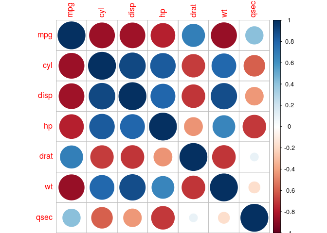

``` r
#指定数值方法的相关系数图
corrplot(corr = corr, method="number", col="black", cl.pos="n")
```

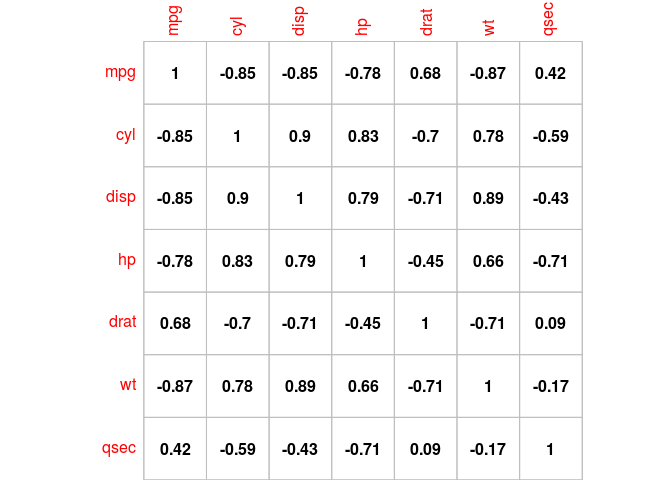

``` r
#按照特征向量角序(AOE)排序相关系数图
corrplot(corr = corr, order = 'AOE')
```


``` r
#同时添加相关系数值
corrplot(corr = corr, order ="AOE", addCoef.col="grey")
```

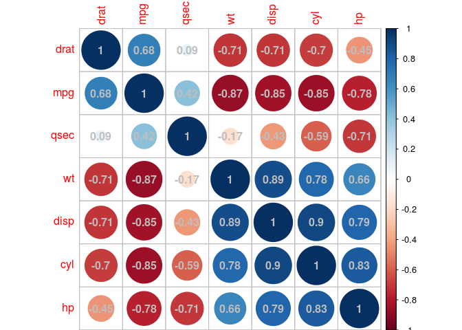

``` r
#选择方法为color
corrplot(corr = corr, method = 'color', order ="AOE", addCoef.col="grey")
```


``` r
#绘制圆形轮廓相关系数图
corrplot(corr = corr, col = c("white","black"), order="AOE", outline=TRUE, cl.pos="n")
```

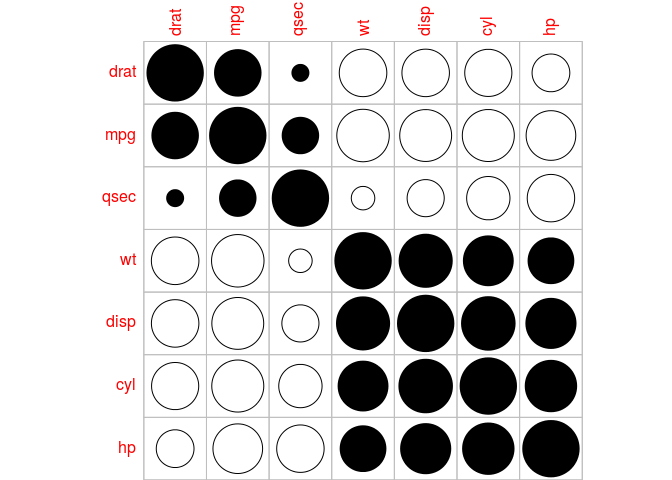

这个图看起来非常像围棋

``` r
#自定义背景色
corrplot(corr = corr, col = c("white","black"), bg="gold2",  order="AOE", cl.pos="n")
```

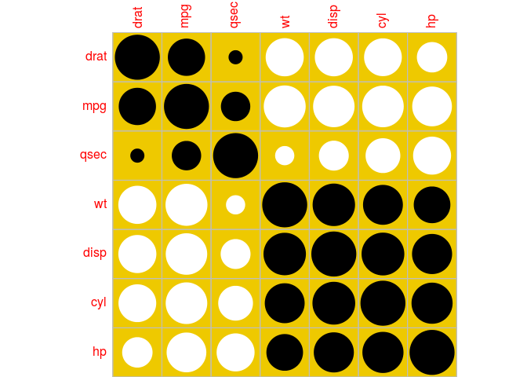

``` r
#混合方法之上三角为圆形，下三角为数字
corrplot(corr = corr,order="AOE",type="upper",tl.pos="d")
corrplot(corr = corr,add=TRUE, type="lower", method="number",
         order="AOE",diag=FALSE,tl.pos="n", cl.pos="n")
```

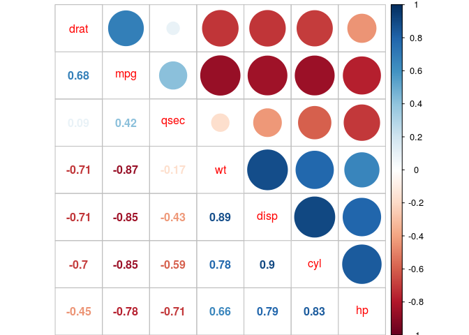

这幅图将颜色、圆的大小和数值型相关系数相结合，更容易发现变量之间的相关性/

``` r
#混合方法之上三角为圆形，下三角为方形
corrplot(corr = corr,order="AOE",type="upper",tl.pos="d")
corrplot(corr = corr,add=TRUE, type="lower", method="square",
         order="AOE",diag=FALSE,tl.pos="n", cl.pos="n")
```

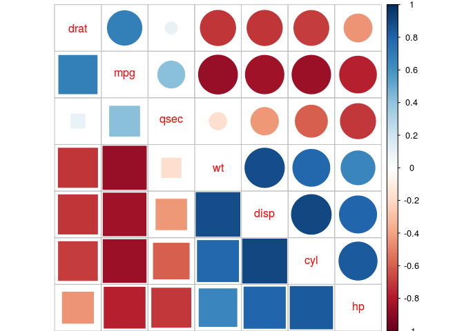

``` r
#混合方法之上三角为圆形，下三角为黑色数字
corrplot(corr = corr,order="AOE",type="upper",tl.pos="tp")
corrplot(corr = corr,add=TRUE, type="lower", method="number",
         order="AOE", col="black",diag=FALSE,tl.pos="n", cl.pos="n")
```

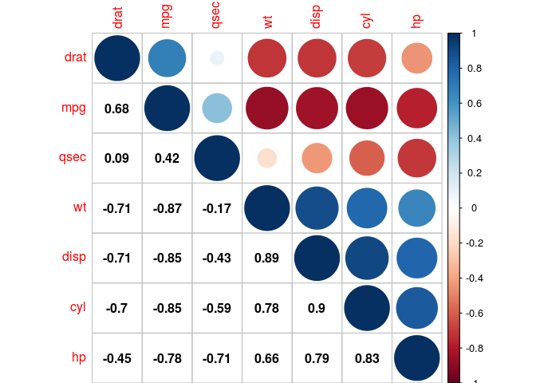

``` r
#以层次聚类法排序
corrplot(corr = corr, order="hclust")
```

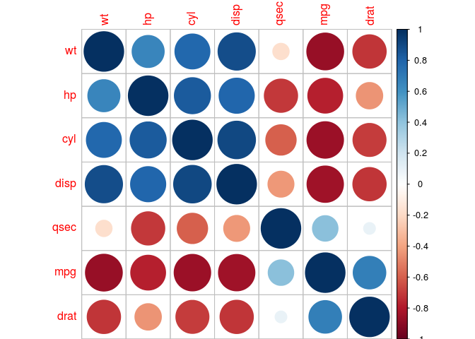

``` r
#以层次聚类法排序，并绘制3个矩形框
corrplot(corr = corr, order="hclust", addrect = 3, rect.col = "black")
```


有关更多相关系数图的绘制可参见corrplot()函数的帮助文档，文档中还包括了很多案例，感兴趣的可以去参考的看看。

绘制热图及网络图
================

热力图是一种非常常用的统计图形，该图**将两个变量（一般是离散变量）的交叉汇总信息以颜色的形式展现出来**，而映射给颜色变量的是连续型数值变量，下面就以例子说明热力图的优势：

``` r
#模拟数据集 
set.seed(123) 
Year <- rep(2006:2015, each = 4) 
Quater <-rep(c('Q1','Q2','Q3','Q4'), times = 10) 
Counts <- round(runif(40, min= 10, max = 200)) 
df <- data.frame(Year = Year, Quater = Quater, Counts= Counts)
```

热力图可以通过**stats包的heatmap()函数**绘制，也可以通过**ggplot2包中的geom\_tile()函数或geom\_raster()函数**绘制，这里就以ggplot2包中的函数为例：

``` r
library(ggplot2) 
#使用geom_tile()函数 
ggplot(data = df, mapping = aes(x =Year, y = Quater, fill = Counts)) + geom_tile() 
```

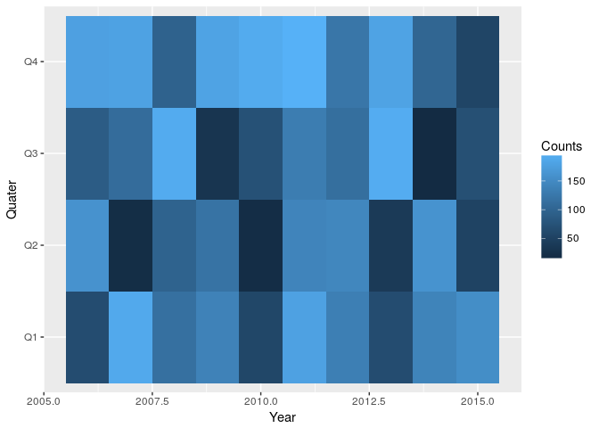

``` r
#或者使用geom_raster()函数
ggplot(data= df, mapping = aes(x = Year, y = Quater, fill = Counts)) + geom_raster()
```

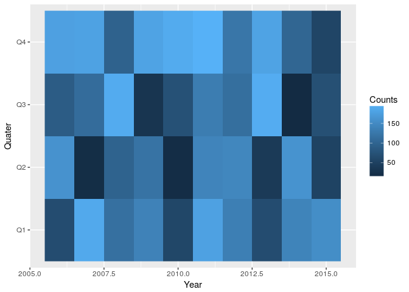

两者绘制的结果区别不大，一般**geom\_raster()效率更高，且更适合打印**。

**这里发现三个问题：**

1.  横坐标年怎么出现小数了？

2.  一般认为颜色越深代表的值越大，这里恰好相反

3.  季度坐标从上到下正好是反的季度顺序，能否颠倒一下？

**解决办法：**

1.  将横坐标年份离散化，改为因子

2.  只需将默认颜色颠倒一下即可：scale\_fill\_continuous(low = ‘\#56B1F7’, high = ‘\#132B43’)

3.  对于离散变量可以使用scale\_y\_discrete(limits=c(‘Q4’,’Q3’,’Q2’,’Q1’))方法实现颠倒，对于连续变量可以直接使用scale\_y\_reverse()实现刻度的颠倒

具体操作如下：

``` r
ggplot(data = df, mapping = aes(x = factor(Year), y = Quater, fill = Counts)) + 
  geom_tile() + scale_fill_continuous(low = '#56B1F7', high = '#132B43') + 
  scale_y_discrete(limits=c('Q4','Q3','Q2','Q1')) + 
  xlab('Year')
```

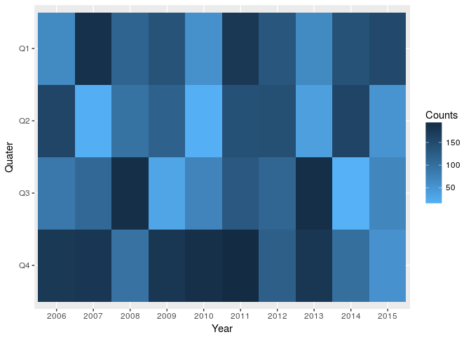

这样就能非常快速的查看到哪年那季度的数量较多和较少，总比单纯的数字形式要强：

``` r
head(df, 10)
```

    ##    Year Quater Counts
    ## 1  2006     Q1     65
    ## 2  2006     Q2    160
    ## 3  2006     Q3     88
    ## 4  2006     Q4    178
    ## 5  2007     Q1    189
    ## 6  2007     Q2     19
    ## 7  2007     Q3    110
    ## 8  2007     Q4    180
    ## 9  2008     Q1    115
    ## 10 2008     Q2     97

很显然，这是一个长形表，如何将其转换为宽形表呢？这里使用**tidyr包中的spread()函数**加以实现

``` r
#长形表变宽形表 
library(tidyr) 
spread(data = df, key = Quater, value = Counts)
```

    ##    Year  Q1  Q2  Q3  Q4
    ## 1  2006  65 160  88 178
    ## 2  2007 189  19 110 180
    ## 3  2008 115  97 192  96
    ## 4  2009 139 119  30 181
    ## 5  2010  57  18  72 191
    ## 6  2011 179 142 132 199
    ## 7  2012 135 145 113 123
    ## 8  2013  65  38 193 181
    ## 9  2014 141 161  15 101
    ## 10 2015 154  51  70  54

这就是将一个长形表变为宽形表后呈现的数值交叉表，**如果这样一个数据给老板看，老板肯定会不耐烦**。

还有一种常用的图是**网络图**，网络图一般用于描述关系强弱或路径分析等，通过网络图可以非常直观的发现数据之间的关联。R中**igraph包中的graph()或data.frame.graph()函数**实现网络图的绘制。这里仍然以案例的形式展示网络图的绘制：

``` r
#使用gcookbook包中的madmen数据集
library(gcookbook) 
head(madmen)
```

    ##          Name1            Name2
    ## 1 Betty Draper    Henry Francis
    ## 2 Betty Draper       Random guy
    ## 3   Don Draper          Allison
    ## 4   Don Draper Bethany Van Nuys
    ## 5   Don Draper     Betty Draper
    ## 6   Don Draper   Bobbie Barrett

``` r
#加载igraph包 
library(igraph) 
```

    ## 
    ## Attaching package: 'igraph'

    ## The following objects are masked from 'package:tidyr':
    ## 
    ##     %>%, crossing

    ## The following objects are masked from 'package:stats':
    ## 
    ##     decompose, spectrum

    ## The following object is masked from 'package:base':
    ## 
    ##     union

``` r
opar <- par(no.readonly = TRUE) 
par(mar= c(0,0,0,0))

#选择layout.fruchterman.reingold布局，绘制有方向的网络图 
g <- graph.data.frame(madmen,directed = TRUE) 
plot(g, layout = layout.fruchterman.reingold, 
     vertex.size= 8, edge.arrow.size = 0.5, vertex.label = NA) 
```

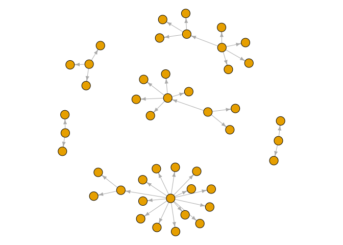

``` r
par(opar)
```

很简单，一幅网络图就绘制好了，**通过箭头就可以知道节点与节点之间的方向，也可以看出哪些人物是核心人物**。下面用圆形布局绘制网络图：

``` r
opar <- par(no.readonly = TRUE) 
par(mar = c(0,0,0,0)) 
#选择layout.circle布局，绘制无方向的网络图
g <- graph.data.frame(madmen, directed = FALSE) 
plot(g, layout = layout.circle,vertex.size = 8, vertex.label = NA) 
```

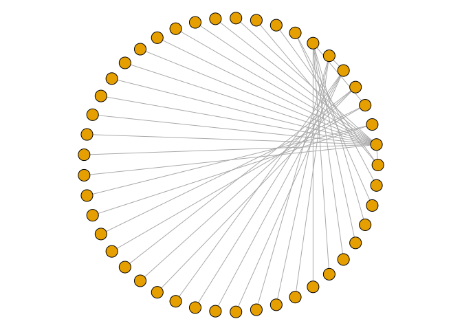

``` r
par(opar)
```

上面的两幅网络图能够很清晰的看出哪些节点之间是紧密联系的，哪些节点是核心节点，**但这里并没有具体显示这些节点都代表什么含义**，下面看看如何为节点**添加标签**：

``` r
#查看标签内容 
V(g)$name
```

    ##  [1] "Betty Draper"             "Don Draper"              
    ##  [3] "Harry Crane"              "Joan Holloway"           
    ##  [5] "Lane Pryce"               "Peggy Olson"             
    ##  [7] "Pete Campbell"            "Roger Sterling"          
    ##  [9] "Sal Romano"               "Henry Francis"           
    ## [11] "Random guy"               "Allison"                 
    ## [13] "Bethany Van Nuys"         "Bobbie Barrett"          
    ## [15] "Candace"                  "Doris"                   
    ## [17] "Faye Miller"              "Joy"                     
    ## [19] "Megan Calvet"             "Midge Daniels"           
    ## [21] "Rachel Menken"            "Shelly"                  
    ## [23] "Suzanne Farrell"          "Woman at the Clios party"
    ## [25] "Hildy"                    "Jennifer Crane"          
    ## [27] "Franklin"                 "Greg Harris"             
    ## [29] "Janine"                   "Rebecca Pryce"           
    ## [31] "Toni"                     "Abe Drexler"             
    ## [33] "Brooklyn College Student" "Duck Phillips"           
    ## [35] "Mark"                     "Gudrun"                  
    ## [37] "Playtex bra model"        "Trudy Campbell"          
    ## [39] "Ida Blankenship"          "Jane Siegel"             
    ## [41] "Mirabelle Ames"           "Mona Sterling"           
    ## [43] "Vicky"                    "Bellhop in Baltimore"    
    ## [45] "Kitty Romano"

``` r
#绘制带标签的节点 
opar <- par(no.readonly = TRUE) 
par(mar = c(0,0,0,0)) 
g <-graph.data.frame(madmen, directed = FALSE) 
plot(g, layout = layout.fruchterman.reingold, 
     vertex.size = 8, vertex.label = V(g)$name, 
     vertex.label.cex = 0.6, vertex.label.dist= 0.5) 
```


``` r
par(opar)
```

除此，我们还可以**在节点与节点之间的连线上做文章**，如设置连线的颜色、为某些特殊的连线加上标签、设置标签大小等。

``` r
#绘制带标签的节点 
opar <- par(no.readonly = TRUE) 
par(mar = c(0,0,0,0)) 
g <-graph.data.frame(madmen, directed = FALSE)
```

这里使用另外一种形式来修改连线之间的属性，即E(g)格式：

``` r
#将所有连线设置为黑色 
E(g)$color = 'black' 
#将指定连线设置为红色 E(g)[c(2,8,10)]$color = 'red'
#将指定连线的变迁设置为L1,L2,L3 E(g)[c(2,8,10)]$label = c('L1','L2','L3') 
#设置标签属性和连续属性
plot(g, layout = layout.fruchterman.reingold, 
     vertex.size = 8, vertex.label = V(g)$name, vertex.label.cex = 0.6, 
     vertex.label.color = 'black', vertex.label.dist = 0.5, 
     edge.label.cex = 0.8, edge.label.color = 'blue') 
```

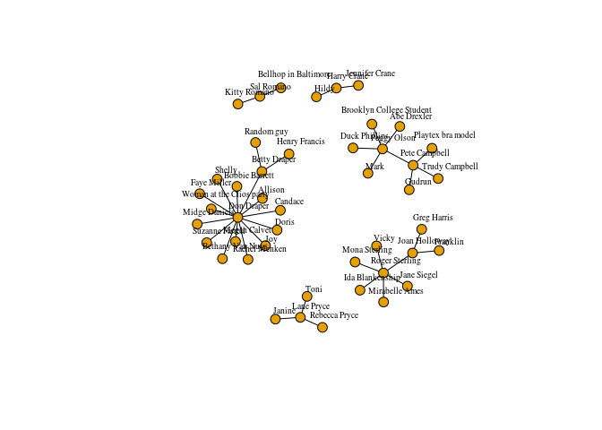

``` r
par(opar)
```

更多关于网络图的绘制可查看igragh包帮助文档，帮助文档中有非常丰富的函数，可以绘制各种布局的网络图等。
